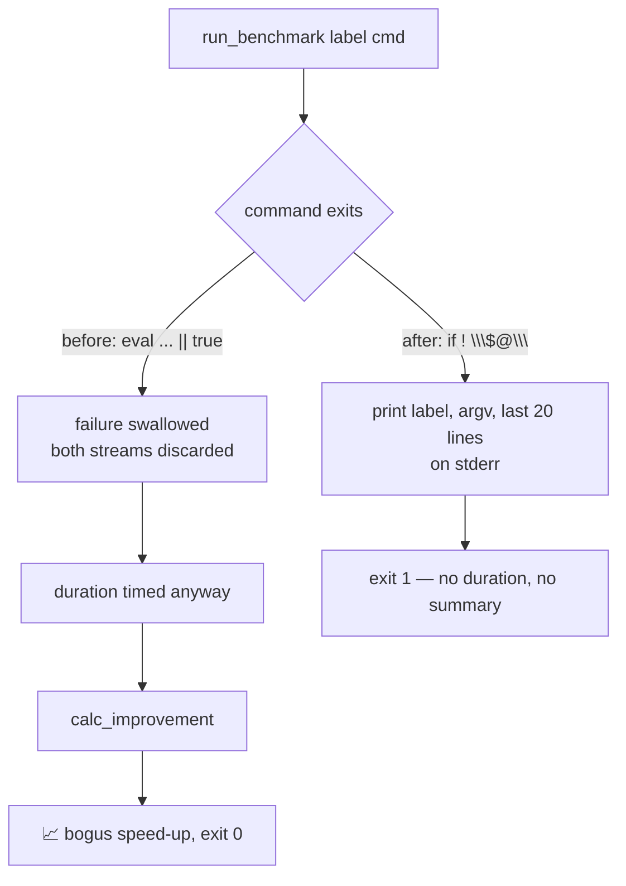

# PR Summary — Issue #2140

## Summary

`benchmark.sh::run_benchmark` ran its command as `eval "$cmd" > /dev/null 2>&1
|| true`. Under `set -euo pipefail` that reconciled a failure as success: a
compile error, a panicking suite or a missing `cargo` was *timed*, and the
elapsed time of a run that aborted in two seconds was fed to `calc_improvement`
and printed under "Improvement" — the script reported a large speed-up for work
that never happened. Both streams were discarded, so nothing said the suite had
failed.

`run_benchmark` now takes the command as arguments and invokes it as `"$@"` —
no `eval` remains in the file — and a non-zero exit aborts the benchmark,
naming the step, the failing command and the last 20 lines of its output on
stderr. No duration and no improvement figure are produced for a run that did
not complete. The two `cargo build --release -q 2>/dev/null` lines no longer
discard their diagnostics either, so a failed baseline build says why instead of
vanishing behind a benchmark number.

`docs/audits/security-sweep-chunk-16-build-scripts.md` — the chunk-16 sweep
record that filed this finding — now carries the fix in its findings table and
per-file detail, so the audit record and the shipped script agree.

Closes #2140.

## Evidence

This is a CLI/shell change with no web interface to screenshot. The evidence is
the regression test, which drives the **real** `benchmark.sh` in a `tempfile`
sandbox with stub `cargo`, `git` and `bc` on `PATH` (the stub `git` keeps the
script away from any real repository; the stub `bc` keeps the result independent
of whether the host has `bc` installed — this container does not).

Against the **unfixed** script (`git show 7d0c71a:benchmark.sh`), with a stub
`cargo` that succeeds for `build` and fails for `test`:

```
test a_failing_benchmark_command_fails_the_script_loudly ... FAILED
test benchmark_script_uses_no_eval ... FAILED
test a_successful_run_still_prints_the_summary ... ok
test result: FAILED. 1 passed; 2 failed
```

The failure output shows the defect exactly as the issue describes it — the
script exited `0` and printed:

```
📈 PERFORMANCE SUMMARY
Test                          Baseline      Current  Improvement
Unit tests                       1.50s        1.50s         1.5%
✅ Benchmark complete
```

…for a suite that never ran. After the fix: `cargo test --test
issue_2140_benchmark_failure_is_loud` → **3 passed**.

Control flow before and after:



## Reproduction

- **symptom** — a benchmarked suite that aborted (compile error, panicking test,
  missing `cargo`) was timed and its elapsed time reported as a speed-up under
  "Improvement", with the script exiting `0` and no sign the suite had failed
- **status** — `verified` — `tests/issue_2140_benchmark_failure_is_loud.rs::a_failing_benchmark_command_fails_the_script_loudly`
  was observed **failing against the unfixed script** (the pre-fix
  `benchmark.sh` restored from `7d0c71a` exited `0` and printed a `1.5%`
  improvement row) and **passing after the fix**
- **regression test** — `tests/issue_2140_benchmark_failure_is_loud.rs::a_failing_benchmark_command_fails_the_script_loudly`

**Original trigger closed, no trivial bypass.** The trigger was a benchmarked
command exiting non-zero. On the changed path that status is now checked
(`if ! "$@"`) rather than discarded by `|| true`, and the only exit from the
failure branch is `exit 1`. There is no equivalent bypass: `eval` is gone, so a
caller can no longer smuggle shell metacharacters through a single `"$cmd"`
string, and all four call sites carry an explicit `|| exit 1` in addition to
`set -e`, so the abort does not depend on the command-substitution form a future
caller happens to use. The only way back to the old behaviour is to reintroduce
`|| true` or `eval`, and the regression test fails on the first while
`benchmark_script_uses_no_eval` fails on the second.

## Acceptance Criteria

<!-- vibe-spec-review inputs="diff+issue-body" -->

- **met** — `benchmark.sh` contains no `eval`; `run_benchmark` invokes `"$@"` — evidence: `benchmark.sh` `run_benchmark` (`local label="$1"; shift`, `if ! "$@"`), all four call sites converted; `tests/issue_2140_benchmark_failure_is_loud.rs::benchmark_script_uses_no_eval` — reviewer: met
- **met** — a benchmarked command that exits non-zero makes `benchmark.sh` exit non-zero, naming the step; no duration or improvement figure is printed for it — evidence: `tests/issue_2140_benchmark_failure_is_loud.rs::a_failing_benchmark_command_fails_the_script_loudly` — reviewer: met — reason: the reviewer flagged a residual gap (the command's own diagnostics were still sent to `/dev/null`); that was fixed after the review — output now goes to an `mktemp` log and the last 20 lines are printed on failure, with a new assertion pinning it
- **met** — the regression test runs the real script with a failing stub `cargo` and asserts the non-zero exit; it fails against the unfixed script (stated in the PR summary) — evidence: `tests/issue_2140_benchmark_failure_is_loud.rs::a_failing_benchmark_command_fails_the_script_loudly`, red-against-unfixed output quoted above — reviewer: partial — reason: the reviewer marked it partial solely because this PR summary did not exist yet when it read the diff; the summary is this file and states the linkage
- **met** — `bash -n` and `shellcheck` stay clean on `benchmark.sh`; `./quality.sh` passes — evidence: `quality/bash_syntax.sh` and `quality/shellcheck.sh` both report `OK — 24 script(s) passed`; the full `./quality.sh` gate was run after the final edit — reviewer: partial — reason: the reviewer found `cargo fmt --all -- --check` failing on the new test file; `cargo fmt --all` was run and `--check` is now clean
- **unrequested** — `cargo build --release -q 2>/dev/null` → `cargo build --release -q` at both build sites — reviewer: unrequested — reason: the issue's "What is wrong" section names these lines as part of the same fail-silent defect ("discard the build diagnostics as well"), but no acceptance criterion asks for it; without it a failed baseline build still aborts in silence
- **unrequested** — the stub `bc` in the test sandbox — reviewer: unrequested — reason: the issue asked only for stub `cargo`/`git`, but `bc` is not installed in this container, so without the stub the happy-path test would fail for an unrelated reason
- **met** — "Add the fix to the findings table of `docs/audits/security-sweep-chunk-16-build-scripts.md`" (a task bullet, not an acceptance criterion) — evidence: the `## Findings` row for #2140 now records **fixed** with the `"$@"` invocation, the `exit 1` path and the guarding test name; the `### benchmark.sh` per-file finding carries a matching **Fixed** continuation, and the "Accepted with reason — `2>/dev/null` on `cargo build`" bullet is marked **Superseded** — reviewer: missing — reason: the reviewer read the branch before it was rebased onto `milestone/2083-…`, where `docs/audits/` does not exist; on the milestone base the document is present and has now been updated

## Standards Review

<!-- vibe-standards-review inputs="diff+CODING-STANDARDS.md" -->

- **violation** — source-grep test: `benchmark_script_uses_no_eval` matched the substring `"eval "` over the whole file, which CONTRIBUTING.md classifies as a "How" test — it both over-matched (any comment containing `eval `) and under-matched (`eval\t"$cmd"`) — evidence: `tests/issue_2140_benchmark_failure_is_loud.rs::benchmark_script_uses_no_eval` — reason: fixed here — the guard now strips comments and matches `eval` as a command word, so prose is ignored and tab-separated `eval` is caught. The behavioural coverage sits in the two tests that execute the real script; this remains the issue's requested one-line guard
- **violation** — missing PR summary (`docs/archive/pr-summaries/pr-summary-2140.md`), mandated by CONTRIBUTING.md and enforced by `scripts/check-pr-summary-location.sh` — evidence: absent from the diff the reviewer saw — reason: fixed here — this file
- **violation** — inaccurate comment: the test claimed `HOME` was set "so nothing prepends a real cargo ahead of the stubs", but `PATH` is set explicitly and `benchmark.sh` never derives `PATH` from `HOME` — evidence: `tests/issue_2140_benchmark_failure_is_loud.rs` `Sandbox::run` — reason: fixed here — the comment now states the real reason (isolating the run from the developer's environment)
- **violation** — `start=$(date +%s.%N)` is GNU-only; BSD `date` on macOS emits a literal `N` — evidence: `benchmark.sh` `run_benchmark` — reason: **no longer stands** — the issue scoped this out as a separate bug ("that is a separate plain bug, filed separately"), which is #2141; it landed on the milestone base as `c7f98e9` while this branch was open. The rebase merged the two: `run_benchmark` now reads its clock through #2141's `now_seconds()` helper and no `date +%s.%N` remains in the file. #2141's `bc`-presence check, duration-format guard, `BENCHMARK_SOURCE_ONLY` block and `calc_improvement` zero-baseline guard are all preserved alongside this change, and `tests/issue_2141_benchmark_portable_timing.rs` still passes (9 tests) against the merged script
- **violation** — `cleanup` still swallows a failed `git checkout` / `git stash pop`: it prints a warning and exits with the original code, so a run can end "successfully" parked on the baseline commit — evidence: `benchmark.sh` `cleanup` — reason: stands — pre-existing, untouched by this diff, and a different failure path (restore, not measurement) from the one #2140 scopes; changing the trap's exit status would alter how every benchmark run terminates, which belongs in its own issue
- **violation** (informational) — no `Cargo.toml` version bump — evidence: `Cargo.toml` unchanged — reason: stands — CI's `version-increment` job bumps the patch version on every PR, and the issue states version bumps are handled there
- **clean** — Australian English throughout both changed files (no `analyze`/`behavior`/`color`/`optimiz`/`favor` hits; the existing `optimisations` preserved); file sizes well under the repo target; integration test under `tests/` named `issue_<N>_<subject>.rs` per convention; tests drive the shipped entry point rather than a reimplementation, with no timing-threshold assertions and no `#[serial]` needed (each test owns a `TempDir` and passes explicit `PATH`/`HOME`); the happy-path test pins the positive precondition so the failure test cannot pass vacuously; new shell code is macOS bash 3.2-safe (`shift`, `"$@"`, `local`, `if ! cmd`, `case`); temp log allocated with `mktemp`, never a fixed path (Issue #1910); `bash -n` and ShellCheck clean; no new dependency (`tempfile` already in `[dev-dependencies]`); no `.github/` changes; `benchmark_compare.sh` and `quality.sh` carry no sibling `eval`/`|| true` left unfixed

## Test Plan

Added `tests/issue_2140_benchmark_failure_is_loud.rs` — three tests driving the
real `benchmark.sh` in a sandbox:

- `a_failing_benchmark_command_fails_the_script_loudly` — stub `cargo` succeeds
  for `build` and fails for `test`. Asserts a non-zero exit, that stderr names
  the step (`Unit tests`), the command (`cargo test`) and the command's own
  diagnostics, and that stdout carries neither an `Improvement` row nor
  `Benchmark complete`. **Fails against the unfixed script**, passes after the
  fix.
- `a_successful_run_still_prints_the_summary` — stub `cargo` succeeds
  throughout. Asserts a zero exit, the `PERFORMANCE SUMMARY` / `Improvement`
  table on stdout and a `Duration:` line per step on stderr, so the happy path
  is not regressed.
- `benchmark_script_uses_no_eval` — the requested one-line guard against the
  construct returning: `eval` as a command word on any non-comment line.

Also run: `cargo fmt --all -- --check`, `cargo clippy --tests --all-features --
-D warnings`, `./quality/bash_syntax.sh .`, `./quality/shellcheck.sh .`, and the
full `./quality.sh` gate.
