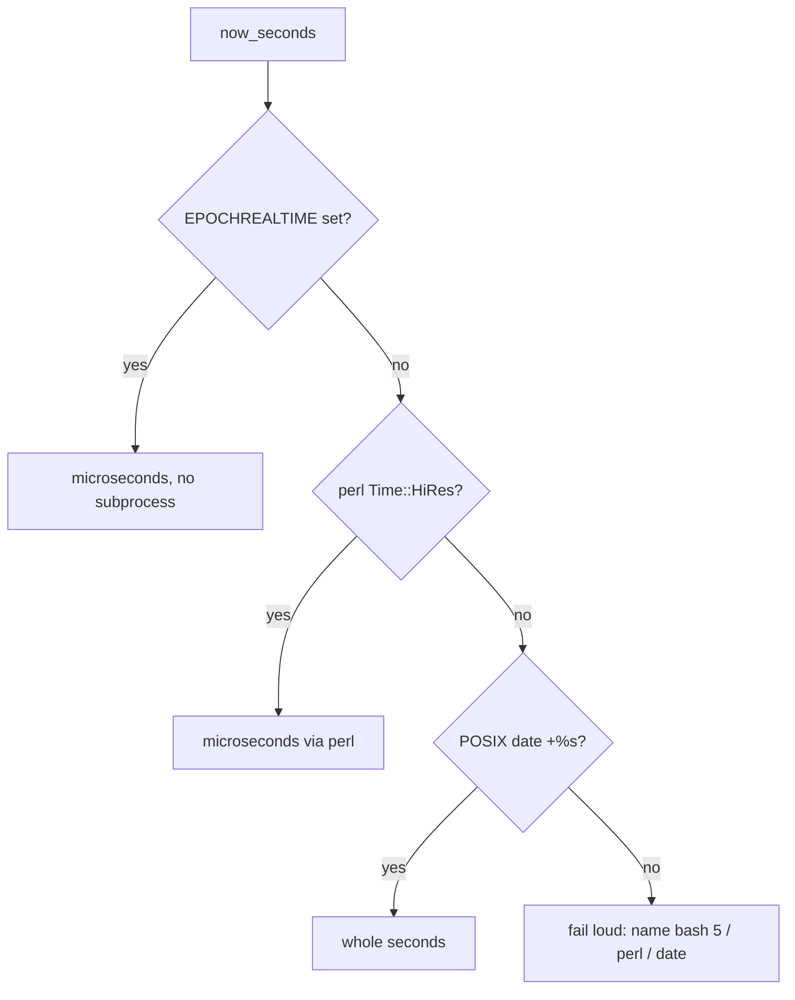

# PR Summary — Issue #2141

## Summary

`benchmark.sh` read the clock with `date +%s.%N`, a GNU extension. BSD `date`
— what macOS ships — emits the two characters verbatim, so every reading came
back as `1769040000.N`, the `bc` subtraction produced nothing, and the summary's
`printf "%11.2fs"` was handed an empty operand. The script is now portable
across macOS (bash 3.2, BSD userland), Ubuntu and AWS Linux. Closes #2141.

- `now_seconds()` reads `EPOCHREALTIME` (bash 5), then `perl`'s `Time::HiRes`,
  then POSIX `date +%s`, and fails loud naming all three when none is available.
- `run_benchmark()` names a missing `bc` instead of dying on its exit 127, and
  rejects a non-numeric duration rather than passing an empty string on to
  `printf`.
- `calc_improvement()` reports `N/A` on a zero baseline, which the whole-second
  fallback can legitimately read.
- `BENCHMARK_SOURCE_ONLY=1` lets the tests source the script and drive the real
  helper; it is honoured only when the script really is sourced, so an exported
  variable cannot break `./benchmark.sh`.



## Evidence

Backend/CLI change — no web interface to screenshot. The evidence is the
regression suite driving the real `benchmark.sh` helper (a stubbed BSD `date`
reproduces the macOS behaviour), plus the committed shell gates:

```text
$ cargo test --test issue_2141_benchmark_portable_timing
test result: ok. 9 passed; 0 failed; 0 ignored; 0 measured; 0 filtered out

$ ./quality/bash_syntax.sh .
bash-syntax: OK — 24 script(s) passed 'bash -n'

$ ./quality/shellcheck.sh .
shellcheck: OK — 24 script(s) passed ShellCheck
```

## Reproduction

- **symptom** — on a BSD-`date` host every timing read `1769040000.N`, so the
  `bc` subtraction returned nothing and the summary's `printf "%11.2fs"` was
  handed an empty operand
- **status** — `verified` — with the clock still read the GNU-only way
  (`now_seconds() { date +%s.%N; }`, test scaffolding otherwise in place) the
  suite failed 3 of 7: `macos_bsd_date_and_bash_3_2_still_time_the_run`,
  `whole_second_date_fallback_is_used_when_nothing_finer_exists` and
  `missing_clock_source_fails_loud_instead_of_returning_empty`. After the fix
  all 9 pass. The raw symptom was also observed directly: under a BSD `date`
  stub, `start=$(date +%s.%N)` returned `1790110705.N` and `duration` came back
  empty.
- **regression test** —
  `tests/issue_2141_benchmark_portable_timing.rs::macos_bsd_date_and_bash_3_2_still_time_the_run`

## Acceptance Criteria

<!-- vibe-spec-review inputs="diff+issue-body" -->

- **met** — `benchmark.sh` produces a numeric duration on both GNU and BSD
  `date` hosts, or fails loud naming the missing tool — evidence:
  `benchmark.sh:28-64` (clock ladder plus the loud failure) and
  `tests/issue_2141_benchmark_portable_timing.rs::run_benchmark_fails_loud_when_bc_is_missing`
  — reviewer: partial — reason: the reviewer reviewed the first commit, where a
  missing `bc` still died on bash's own exit 127; `run_benchmark` now checks for
  `bc` up front and names it.
- **met** — a test covers the elapsed-time helper's output shape — evidence:
  `tests/issue_2141_benchmark_portable_timing.rs::now_seconds_emits_a_number_printf_accepts`
  and `::now_seconds_readings_are_monotonic_epoch_seconds`, both sourcing the
  real script — reviewer: met
- **met** — `bash -n` and `shellcheck` stay clean; `./quality.sh` passes —
  evidence: `./quality/bash_syntax.sh .` and `./quality/shellcheck.sh .` both
  report 24 scripts OK; see the gate note below — reviewer: met
- **unrequested** — the `BENCHMARK_SOURCE_ONLY` seam and the move of the banner
  `echo`s below the function definitions — reviewer: unrequested — reason: the
  issue requires a test "exercising the real function", which needs the script
  to be sourceable without checking out git refs and stashing work.
- **unrequested** — `run_benchmark` validates the duration and names a missing
  `bc` — reviewer: unrequested — reason: the issue's own criterion is "produces
  a numeric duration … or fails loud naming the missing tool".
- **unrequested** — `calc_improvement` reports `N/A` on a zero baseline —
  reviewer: unrequested — reason: the new whole-second fallback can read a zero
  baseline, which would divide by zero in `bc`.
- **unrequested** — rustfmt reflow of pre-existing lines in the test file —
  reviewer: unrequested — reason: `cargo fmt --all`, which the quality gate
  runs, normalised lines the earlier checkpoint commit added.
- **unrequested** — the platform note in the script header — reviewer:
  unrequested — reason: the issue observes the header documents no platform
  limit; it now states the supported platforms.

## Standards Review

<!-- vibe-standards-review inputs="diff+CODING-STANDARDS.md" -->

- **violation** — the helper-only guard's bare `return 0` made an exported
  `BENCHMARK_SOURCE_ONLY` abort an executed `./benchmark.sh` with a bash
  internal message — evidence: `benchmark.sh:87` — reason: fixed here; the guard
  now also requires `"${BASH_SOURCE[0]}" != "$0"`, covered by
  `::an_exported_helper_flag_does_not_break_an_executed_run`.
- **violation** — the duration guard accepted digit/dot/minus soup (`1.2.3`,
  `--5`) and blamed `bc` for every failure — evidence: `benchmark.sh:74` —
  reason: fixed here; the value is matched against `^-?[0-9]+(\.[0-9]+)?$` and
  the message quotes what was actually read.
- **violation** — a wall-clock upper bound (`0.0..60.0`) asserted in a unit test
  — evidence: `tests/issue_2141_benchmark_portable_timing.rs:207` — reason:
  fixed here; only the "clock did not run backwards" bound remains.
- **violation** — no PR summary file — evidence:
  `docs/archive/pr-summaries/pr-summary-2141.md` — reason: fixed here.
- **violation** — `Cargo.toml` patch version not incremented — evidence:
  `Cargo.toml:3` — reason: stands; CI auto-increments on every pull request and
  CONTRIBUTING.md carves out the normal PR flow, so a manual bump would only
  conflict.
- **violation** — the `EPOCHREALTIME` comma-decimal branch has no test —
  evidence: `benchmark.sh:34` — reason: stands; bash ignores assignment to
  `EPOCHREALTIME`, so a comma-decimal locale cannot be injected into the helper
  from a test, and the branch is a single documented expansion.
- **clean** — Australian English throughout; macOS bash 3.2 portability of every
  new construct (`${var/,/.}`, `command -v`, `local`, `case`, `[[ =~ ]]`); no
  GNU-only flags; fail-loud on a missing clock source; tests drive the real
  script rather than grepping it; no hidden paths staged; no CI, manifest or
  dependency changes.

## Test Plan

`tests/issue_2141_benchmark_portable_timing.rs` (9 tests, all driving the real
`benchmark.sh`):

- `now_seconds_emits_a_number_printf_accepts` — the reading is a value `printf`
  accepts.
- `now_seconds_readings_are_monotonic_epoch_seconds` — two readings, both epoch
  seconds, never going backwards.
- `bsd_date_stub_reproduces_the_literal_n` — anti-vacuity guard: the stub really
  does emit `…N`.
- `macos_bsd_date_and_bash_3_2_still_time_the_run` — the regression test: BSD
  `date` plus a bash without `EPOCHREALTIME` still yields a clean numeric
  reading and a formatted duration.
- `whole_second_date_fallback_is_used_when_nothing_finer_exists` — POSIX
  `date +%s` alone is enough.
- `missing_clock_source_fails_loud_instead_of_returning_empty` — no clock source
  exits non-zero, writes nothing to stdout, and names the tools.
- `run_benchmark_fails_loud_when_bc_is_missing` — a missing `bc` is named rather
  than killing the run on exit 127.
- `sourcing_in_helper_mode_does_not_run_the_benchmark` — sourcing stops before
  the git checkout/stash path.
- `an_exported_helper_flag_does_not_break_an_executed_run` — an exported
  `BENCHMARK_SOURCE_ONLY` still runs the benchmark normally.
