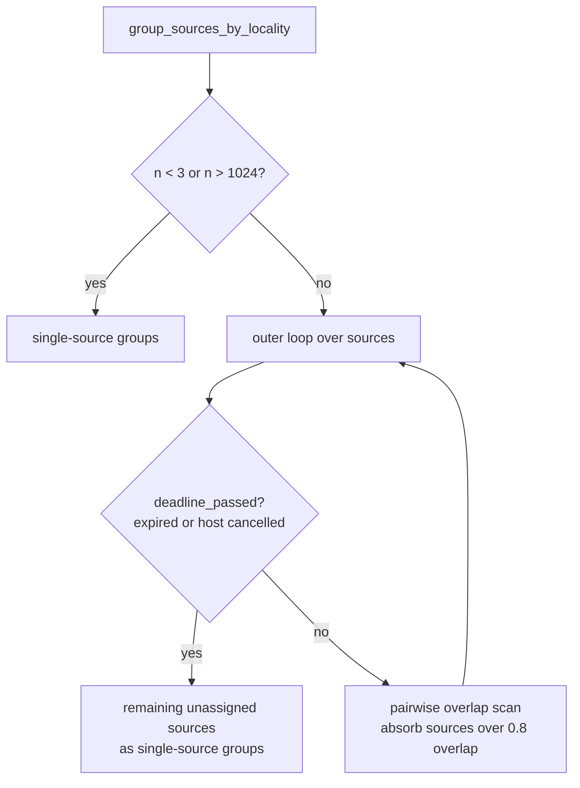

# Issue #2161 — bound and cancel the locality-grouping scan

Closes #2161

## Summary

`group_sources_by_locality` (`src/analysis/synapse/candidate_generation.rs`) ran a
pairwise O(n²) scan over every source neuron of a focus target with no cancellation
point inside it, so neither `analysisDeadlineMs` nor a host-requested shutdown
(`crate::cancellation::is_cancelled`, Issue #1047) could interrupt it once started.
With a caller-controlled source count and observation-index sets that overlap by
less than `MIN_LOCALITY_OVERLAP`, one analysis call could pin a rayon worker for
minutes to hours past its expired deadline (CWE-834, liveness DoS).

The fix applies both changes the issue suggested, each of which is independently
pinned by one of the new tests:

1. **Per-iteration cancellation.** `group_sources_by_locality` now takes the
   `deadline` and calls `deadline_passed` at the top of the outer loop. Because
   `deadline_passed` also reports the global cancellation flag, that one check
   honours both the deadline and an explicit host cancellation. On expiry the
   remaining unassigned sources are emitted as single-source groups.
2. **A ceiling on entering the scan.** `MAX_SOURCES_FOR_LOCALITY_SCAN` (1024)
   bounds the work for callers that supply no deadline at all, where the
   per-iteration check can never fire. Above it the scan is skipped entirely.

Both exits degrade to single-source groups — the documented no-overlap outcome —
so the grouping contract holds unchanged: **every source appears in exactly one
group**. Grouping is a sample-building optimisation only (Issue #221), so no
candidate's fate changes either way.



## Changes

- `src/analysis/synapse/candidate_generation.rs` — added
  `MAX_SOURCES_FOR_LOCALITY_SCAN` and the `single_source_groups` helper; threaded
  `deadline: &Option<SystemTime>` into `group_sources_by_locality`; merged the
  ceiling into the existing small-input early return; added the in-loop
  `deadline_passed` check.
- `src/analysis/synapse/target_analysis/statistics.rs` — passes `&ctx.deadline`
  from `build_helpful_work_items`.
- `src/analysis/neuron/mod.rs` — passes the `build_deadline(...)` value already in
  scope at that call site.
- `src/analysis/synapse/issue_2161_locality_cancellation_test.rs` — new
  regression tests (wired as a child module of `candidate_generation`, because
  `group_sources_by_locality` is `pub(crate)` and an integration test under
  `tests/` cannot reach it — this is why the tests do not live at the
  `tests/issue_2161_*.rs` path the issue suggested).
- `docs/ANALYSIS_DEEP_DIVE.md` — documented both bounds on the sample-locality
  bullet.
- `Cargo.toml` — `0.74.250` → `0.74.251`.

## Evidence

**Regression tests added (both in the branch diff):**

- `src/analysis/synapse/issue_2161_locality_cancellation_test.rs::expired_deadline_stops_locality_scan_without_dropping_sources`
- `src/analysis/synapse/issue_2161_locality_cancellation_test.rs::locality_grouping_cost_does_not_grow_quadratically`

Added `src/analysis/synapse/issue_2161_locality_cancellation_test.rs::expired_deadline_stops_locality_scan_without_dropping_sources`,
which reproduces the flaw, **fails against the unfixed code and passes after the
fix**. The same holds for `locality_grouping_cost_does_not_grow_quadratically`.

**RED — against the unfixed scan** (`cargo test --lib issue_2161`):

```text
panicked at src/analysis/synapse/issue_2161_locality_cancellation_test.rs:117:5:
assertion `left == right` failed: an expired deadline must abandon the pairwise scan and emit single-source groups
  left: 1
 right: 64

panicked at src/analysis/synapse/issue_2161_locality_cancellation_test.rs:149:5:
locality grouping cost grew faster than linearly: 263.111708ms at 1025 sources against 1.053766751s at 2050 sources

test result: FAILED. 0 passed; 2 failed; 0 ignored; 0 measured; 1590 filtered out; finished in 6.76s
```

A 4.0× cost for a 2× input is textbook quadratic growth, and with the deadline
long expired the scan still ran to completion and returned one collapsed group.

**GREEN — after the fix:**

```text
cargo test: 2 passed, 1590 filtered out (1 suite, 0.01s)
```

Runtime fell from 6.76s to 0.01s.

The two tests pin the two halves independently: the growth test calls
`group_sources_by_locality(sources, &None)` with **no deadline**, so only the
`MAX_SOURCES_FOR_LOCALITY_SCAN` ceiling can make it pass; the cancellation test
uses 64 sources — below the ceiling — so only the in-loop `deadline_passed` check
can make it pass. Neither half alone turns the suite green. The growth test
compares two readings of the same work (n and 2n) rather than a reading against a
wall-clock constant, so it stays green on a loaded or slower host.

Per Issue #1799, the cancellation test first asserts the positive precondition —
without a deadline the 64 identical-index sources really do collapse into a single
group — so the post-cancellation assertion is observing cancellation, not an inert
fixture.

## Trigger closed, no trivial bypass

The issue's trigger was: a creature with a large upstream neuron count, records
whose observation-index sets overlap by less than 0.8 so no source is absorbed,
and any `analysisDeadlineMs`. Every path into the scan is now bounded:

- `group_sources_by_locality` is the only function containing the pairwise scan,
  and it has exactly two callers — `statistics.rs::build_helpful_work_items` and
  `neuron/mod.rs` — both of which now pass a real deadline. The signature change
  is compiler-enforced: a new caller cannot omit it.
- Above 1024 sources the scan is never entered, whatever the deadline, so the
  unbounded-source-count half of the trigger no longer reaches quadratic code.
  This bound does not depend on `NEAT_AI_DISCOVERY_MAX_SOURCES_PER_TARGET`
  (Issue #1542), which is unset by default.
- At or below 1024 sources the worst case is bounded by ~1024²/2 overlap probes
  between two cancellation checks, and the check runs once per outer iteration,
  so an expired deadline or a host cancellation is honoured within one outer pass.
- Neither exit can drop or duplicate a source: both route through
  `single_source_groups`, and the cancellation path filters on the same `assigned`
  vector the scan maintains. The tests assert the exactly-one-group invariant on
  both paths.

No attacker-controlled value selects between the exits other than the source
count and the deadline, and both are bounded above.

## Audit ledger

The issue names `docs/audits/security-sweep-chunk-08b-synapse-scoring-recommendation.md`
as the ledger to update. **That file does not exist in this repository** — there
is no `docs/audits/` directory, and a repo-wide search for `*chunk-08*` returns
nothing. The ledger entry therefore could not be made here; this note records the
fact rather than leaving a silent omission.

## Security self-check

- Input validation: the new bound is itself a validation of a caller-controlled
  count at the point where it drives work.
- Secrets: none staged.
- Injection surface: unchanged — no new SQL, shell, filesystem or HTTP calls.
- Output encoding: unchanged.
- Authorisation: unchanged.
- Error handling: unchanged — no new error paths, and the degraded path returns a
  correct result rather than swallowing a fault.
- Dependencies: none added.
