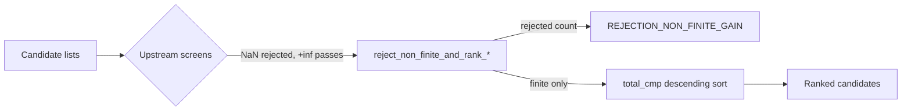

# PR Summary — Issue #2167

## Summary

`apply_post_processing` sorted its three candidate lists descending by
`expected_creature_score_gain` using `f32::total_cmp`. Under IEEE-754 totalOrder
every finite gain sits below `+∞`, which sits below a positive `NaN`, so a
descending sort promoted a non-finite gain to position 0 and displaced every
genuine candidate. The upstream screens did not stop it: they are *comparisons*
(`gain >= floor` for synapses, `gain > 0.0` for the coordinated list), and a
comparison is false for `NaN` but true for `+∞`.

The fix gates all three lists immediately before the sorts and — as in Issue
#1367 — **counts** the rejections rather than dropping them silently.

- Added `reject_non_finite_and_rank_synapse_candidates` and
  `reject_non_finite_and_rank_coordinated_candidates` to
  `src/analysis/synapse/post_processing.rs`. The coordinated helper delegates to
  the existing Issue #1367 gate,
  `analysis::candidate_aggregation::reject_non_finite_gains`. Both return the
  rejection count.
- `apply_post_processing` calls them in place of the three inline `sort_by`
  blocks and sums the drops with `saturating_add`.
- The total travels `PostProcessingMetrics.non_finite_gain_drops` →
  `MetadataParams.non_finite_gain_drops` → a
  `record_many_u32(REJECTION_NON_FINITE_GAIN, …)` entry in `build_metadata`, so
  a poisoned batch is distinguishable from a genuine drought.
- Defence in depth: `scale_by_error_fraction` now returns a neutral `0.0` for any
  non-finite input (previously `NaN <= EPSILON` was false, so a `NaN` total flowed
  into the division and `f32::clamp` propagated it into a candidate gain), and
  `compute_neuron_error_sq_map` screens each squared term and the accumulated
  total — a finite error above `√f32::MAX` (~1.84e19) squares to `+∞`, so an
  input-only filter is not sufficient.



Closes #2167

## Evidence

Backend Rust library change — there is no web interface to screenshot. The
evidence is the test suite, run against the unfixed and the fixed code.

**Security-Fix Evidence Contract**

1. **Test file added in this branch:**
   `tests/issue_2167_post_processing_non_finite_gain_ranking.rs` (6 tests).
2. **Test identifier:**
   `tests/issue_2167_post_processing_non_finite_gain_ranking.rs::ranking_synapse_candidates_drops_non_finite_gains_and_keeps_finite_order`
3. **Fails before, passes after.** The ranking test was run against the unfixed
   ranking path (sort only, no gate) and failed at line 90:

   ```text
   no non-finite gain may survive ranking, got
   ["nan", "pos-inf", "finite-2.0", "finite-0.5", "finite-0.25", "negative-zero", "neg-inf"]
   ```

   `NaN` first and `+∞` second — the reported vulnerability exactly. The
   breakdown test failed with `left: None, right: Some(4)` (rejections not
   counted), the coordinated test with `left: 0, right: 2`, and
   `scale_by_error_fraction_rejects_non_finite_inputs` with
   `NaN total must scale to a neutral 0.0, got NaN`. Against the fixed code all
   six pass: `cargo test: 6 passed (1 suite)`.
4. **Original trigger closed, no trivial bypass.** Every path into the three
   sorts now runs through the gate: the gate is applied inside the same function
   that performs the sort, on the same `&mut Vec`, with no branch between the
   `retain` and the `sort_by`. `f32::is_finite()` is false for `NaN`, `+∞` and
   `-∞` alike, so no non-finite encoding survives — not a signalling `NaN`, not a
   negative zero re-interpretation (`-0.0` *is* finite and is ranked last among
   the finite gains, which the test asserts). A caller cannot reach the sorts
   without the gate because the sorts no longer exist outside these two helpers.
   The remaining way to introduce a non-finite gain downstream was
   `scale_by_error_fraction`, now closed by its own explicit check, and its
   upstream feeder `compute_neuron_error_sq_map`, now screened at both the
   per-square and accumulated-total level.

Adjacent regression suites still pass unchanged:
`issue_2105_chunk_08b_synapse_post_processing_sweep`,
`issue_1367_non_finite_gain_rejection`,
`issue_1778_gain_floor_reachability_fix` — `18 passed (3 suites)`. No existing
test was removed, skipped or modified.

## Test Plan

- `cargo test --test issue_2167_post_processing_non_finite_gain_ranking` — 6 tests:
  - synapse ranking drops `+∞`/`NaN`/`-∞` and keeps the finite gains (including
    `-0.0`) in descending order;
  - coordinated ranking does the same through the shared #1367 gate;
  - the rejection count is recorded under `REJECTION_NON_FINITE_GAIN`;
  - a clean finite batch rejects nothing;
  - `scale_by_error_fraction` returns `0.0` for each of six non-finite input
    combinations;
  - `scale_by_error_fraction` still scales finite inputs (`1.0, 1.0, 4.0 → 0.25`).
- `cargo test --test issue_2105_chunk_08b_synapse_post_processing_sweep --test issue_1367_non_finite_gain_rejection --test issue_1778_gain_floor_reachability_fix` — 18 passed.
- `./quality.sh` — full gate run in the foreground.
