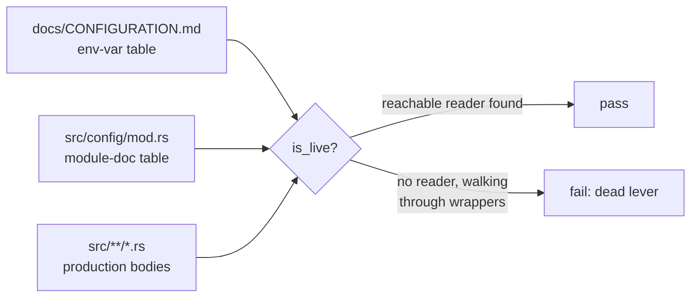

# Remove the dead outlier-analysis lever from `error_distribution.rs`

## Summary

`src/analysis/scoring/error_distribution.rs` carried an outlier/mode-detection
surface with no production caller, while `docs/CONFIGURATION.md` and the
`src/config/mod.rs` module-doc table advertised
`NEAT_AI_DISCOVERY_OUTLIER_ANALYSIS` and `NEAT_AI_DISCOVERY_OUTLIER_PERCENTILE`
as operator levers. An operator could set either during an incident and change
nothing — the dead-lever failure AGENTS.md § "Dead Levers" calls "worse than no
lever" (#1792, #1793, #1818).

This change takes the deletion branch the issue names as the default reading:
the component **and** its whole config surface go in one change, and a new
doc-parity gate stops the next dead lever being documented into existence.

Closes #2177.

Removed:

- **Helpers** in `error_distribution.rs` — `outlier_analysis_enabled`,
  `outlier_percentile_from_env`, `count_outliers`, `filter_outliers`,
  `has_significant_outliers`, `is_likely_bimodal`, `detect_error_modes`,
  `detect_modes_histogram`, `ErrorMode`, `OutlierReductionInfo`, and
  `get_percentile_threshold` (its only two callers were `count_outliers` and
  `filter_outliers`).
- **Wire field** `outlier_reduction_info` on the candidate JSON type in
  `src/ffi_types/candidates.rs`, plus every `None` assignment across the
  candidate-compression, synapse-gating and target-analysis construction sites.
  No writer could be named, so AGENTS.md requires deletion rather than "could be
  wired one day".
- **Config surface** — `config::outlier_analysis` / `config::outlier_percentile`
  in `src/config/user_facing.rs`, their rows in `docs/CONFIGURATION.md` and the
  `src/config/mod.rs` table, the stale `export NEAT_AI_DISCOVERY_OUTLIER_*`
  block in `docs/ANALYSIS_DEEP_DIVE.md`, and the `outlier_percentile_default_value`
  test.

Kept, and still exercised: `ErrorDistribution`, `from_samples`, `from_errors`
and `compute_percentiles` — `from_errors` is live via
`synapse/post_processing.rs::build_metadata` and
`neuron/post_processing.rs::build_neuron_results`.

The chunk-8b ledger
(`docs/audits/security-sweep-chunk-08b-synapse-scoring-recommendation.md`) and
its gate `tests/issue_2107_chunk_08b_scoring_sweep.rs` were reconciled in the
same change: the capacity row and `TRACED_SYMBOLS` entry for
`detect_modes_histogram` describe a symbol that no longer exists, and the
`scoring` outcome now records #2177 as its resolution.

## Evidence

Backend/library change — no web interface to screenshot. The evidence is the
new gate going red before the fix and green after, and the full quality gate.

### What the new gate enforces



`is_live` seeds from the functions that literally read the variable (directly or
via a module-level `&str` alias), then walks in-edges upward: a non-wrapper
caller proves liveness, a pure delegating wrapper keeps the climb going, and an
exhausted frontier means nothing reachable reads the lever.

### Red before, green after

Temporarily restoring one deleted row to `docs/CONFIGURATION.md` and running the
new test:

```text
test outlier_analysis_and_outlier_percentile_are_no_longer_documented ... FAILED
test every_documented_env_var_in_configuration_md_has_a_reachable_reader ... FAILED
docs/CONFIGURATION.md documents env var(s) with no reachable production reader
(dead levers): ["NEAT_AI_DISCOVERY_OUTLIER_ANALYSIS"]. Either wire a reader or
delete the row.
test result: FAILED. 2 passed; 2 failed
```

With the row removed again (the state this PR ships):

```text
test result: ok. 4 passed; 0 failed
```

### Quality gate

`./quality.sh` — `✅ All quality checks passed!`, including
`cargo clippy --all-targets --all-features -- -D warnings` clean.

One earlier gate run saw a single failure in
`analysis::gpu::queue::wedge_tests::an_abandoned_request_never_reaches_the_wedged_gpu`
— an unrelated GPU-queue timing test that this diff does not touch. It passed on
re-run in isolation and on the subsequent full gate run, so it is load-related
flakiness, not a regression from this change.

### Pre-existing dead levers disclosed, not swept in

Building the gate surfaced three env vars that are documented today with no
reachable reader: `NEAT_AI_DISCOVERY_LIB_PATH`, `NEAT_AI_DISCOVERY_PRELOAD_ALL`
and `NEAT_AI_DISCOVERY_NOVELTY_GAIN_RELAXATION`. They are **not** silently
ignored — they sit in an explicit `DISCLOSED_DEAD_LEVERS` allowlist at the top of
the test, with a comment naming the open issues that own them (#2122, #2123,
#2125, all verified open). No new follow-up was filed, because filing one would
duplicate those. Removing them is a separate change under those issues; this gate
stays scoped to the #2177 regression.

## Test Plan

### Added — `tests/issue_2177_outlier_lever_removed.rs`

- `every_documented_env_var_in_configuration_md_has_a_reachable_reader` — the
  general doc-parity gate over `docs/CONFIGURATION.md`.
- `every_documented_env_var_in_config_mod_table_has_a_reachable_reader` — the
  same gate over the `src/config/mod.rs` module-doc table.
- `outlier_analysis_and_outlier_percentile_are_no_longer_documented` — the
  specific #2177 regression: neither variable may reappear in either table.
- `error_distribution_from_errors_still_works_after_the_dead_lever_cleanup` —
  calls `ErrorDistribution::from_errors` with real data and asserts the
  statistics that the live `errorDistribution` metadata block depends on, so the
  deletion cannot quietly take the live half with it.

### Removed — documented, business-logic-driven

Every removal below tested a function or env var this change deletes; with the
production code gone the test cannot compile, let alone assert anything. They
are listed here rather than left commented out.

| File | Tests removed |
| --- | --- |
| `tests/scoring/issue_192_error_distribution_analysis.rs` | `test_error_distribution_outlier_count`, `test_detect_error_modes_bimodal`, `test_detect_error_modes_unimodal`, `test_outlier_analysis_disabled_by_default`, `test_outlier_percentile_default`, `test_candidate_includes_outlier_info_when_enabled` |
| `tests/infrastructure/issue_717_config_env_vars.rs` | `config_outlier_percentile_default`, `config_outlier_percentile_custom`, `config_outlier_percentile_invalid_falls_back_to_default`, `config_outlier_analysis_default_disabled`, `config_outlier_analysis_enabled` |
| `tests/issue_2006_numeric_env_override_trim.rs` | `outlier_percentile_keeps_trim_and_range_filter` |
| `tests/scoring/issue_1247_categorical_error_hardening.rs` | `is_likely_bimodal_does_not_panic_on_quantised_batch`, `detect_error_modes_finite_for_quantised_batch`, `outlier_counting_safe_on_constant_batch` |
| `src/config/mod.rs` | `outlier_percentile_default_value` |

`tests/scoring/issue_1247_categorical_error_hardening.rs` keeps both tests that
exercise the surviving `ErrorDistribution::from_samples` path, so the Issue #1247
hardening against the quantised `{0, 1}` regime is still covered.

### Verified

- `cargo test --test scoring --test infrastructure --test issue_1611_env_var_single_source --test issue_2006_numeric_env_override_trim --test issue_2177_outlier_lever_removed` — 492 passed, 0 failed.
- `./quality.sh` — all checks passed.
