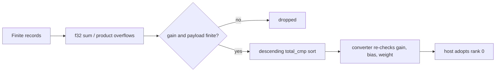

## Summary

Records that are entirely finite could still make four recommendation-core detectors produce an infinite (`+inf`) or NaN `estimated_improvement`, because their `f32` sums and products overflow. The descending `total_cmp` sort then put that candidate at rank 0. `output_bias_drift` could also emit a `SetBias` whose bias was non-finite. This PR rejects non-finite gains and parameters at each detector and at its `*_to_coordinated_candidates` converter. Closes #2182.

- **`output_bias_drift.rs`**: a non-finite `mean_error` is now rejected before it becomes `recommended_bias_delta`. A new `is_finite_candidate` check (gain finite, and `current_bias + delta` finite) filters the list before both sorts (`detect_output_bias_drift` and `detect_output_bias_drift_with_descriptor`). The converter applies the same check. This also closes two paths the issue does not name:
  - the capacity boost `*= CAPACITY_STARVED_GAIN_BOOST` can overflow a finite gain;
  - the synthesised delta `SAT − mean_activation` can be `+inf`.
- **`multi_hop.rs`**:
  - `compute_mean_abs_error` returns `0.0` when its sum overflows.
  - Both push sites reject a non-finite gain explicitly.
  - `find_three_hop_extensions` rejects a NaN correlation (from the issue comment). Its `abs() < threshold` filter used to keep NaN.
  - The list is filtered before the sort, and the converter skips non-finite gains.
- **`gradient_discovery.rs`**: the gain product is checked for finitude before the push. The converter skips any candidate with a non-finite gain or `SetWeight` value.
- **`fan_in.rs`** (named in the issue comments):
  - `compute_two_input_regression` range-checks the `f64` weights and improvement *before* the `as f32` cast, which would otherwise saturate to `±inf`.
  - `evaluate_fan_in_pair` rejects a non-finite `scaled_improvement`.
  - The converter skips non-finite gains and weights.
- **`output_competition.rs`** (the fifth detector, from the issue comments): already closed on this branch by #2185. `co_activation` returns `None` for a non-finite score, and the gain is clamped to `[0, COMPETITION_GAIN_SCALE]`. No change was needed.

## Evidence

This is a backend-only change with no UI. The regression tests are listed in the Test Plan below.

**The original trigger is closed, and there is no trivial bypass.** Every candidate list is now filtered on `estimated_improvement.is_finite()` immediately before its `total_cmp` sort, and each converter checks again before its own re-sort. A `+inf` or NaN value can therefore never reach a ranked position, whichever accumulator produced it. The earlier `<= 0.0` and `< MIN_*` gates, which a non-finite value slips past, are no longer relied on. The emitted `SetBias` and `SetWeight` values, and the `AddSynapse` weights from fan-in, are checked for finitude where they are computed. So an overflow in the parameter itself (for example `current_bias + delta`) is rejected too, and not only an overflow in the gain.

Regression linkage: I added `tests/issue_2182_recommendation_core_non_finite_gain_ranking.rs`. All 7 of its tests failed against the unfixed code (the honest candidate was not at rank 0, or a non-finite bias was emitted), and all 7 pass after the fix. For example, `tests/issue_2182_recommendation_core_non_finite_gain_ranking.rs::output_bias_drift_drops_an_overflowed_mean_error_and_ranks_the_honest_candidate_first` reproduces the issue's first table row.

## Test Plan

Each test builds only finite records, which pass the FFI checks from #2132/#2134/#2135. It asserts that the honest candidate is at rank 0, that no non-finite gain appears, and that the coordinated payload's `bias` and `weight` values are finite:

- `tests/issue_2182_recommendation_core_non_finite_gain_ranking.rs::output_bias_drift_drops_an_overflowed_mean_error_and_ranks_the_honest_candidate_first`
- `tests/issue_2182_recommendation_core_non_finite_gain_ranking.rs::output_bias_drift_never_emits_a_set_bias_that_overflows_the_current_bias`
- `tests/issue_2182_recommendation_core_non_finite_gain_ranking.rs::output_bias_drift_with_descriptor_drops_a_non_finite_synthesised_bias`
- `tests/issue_2182_recommendation_core_non_finite_gain_ranking.rs::multi_hop_drops_an_overflowed_mean_abs_error_and_ranks_the_honest_candidate_first`
- `tests/issue_2182_recommendation_core_non_finite_gain_ranking.rs::multi_hop_three_hop_drops_a_nan_source_intermediate_correlation`
- `tests/issue_2182_recommendation_core_non_finite_gain_ranking.rs::gradient_drops_an_overflowed_improvement_and_ranks_the_honest_candidate_first`
- `tests/issue_2182_recommendation_core_non_finite_gain_ranking.rs::fan_in_drops_an_overflowed_improvement_and_ranks_the_honest_candidate_first`

What was run:

- `cargo fmt` — clean.
- `cargo clippy --lib --test issue_2182_… -- -D warnings` — clean.
- `cargo test --test recommendation --test detection --test analysis` — 1,404 passed.
- `cargo test --lib recommendation` — 25 passed.

<!-- vibe-quality-gate-skipped reason="budget: ./quality.sh hit its 590s cap on a cold --all-features dependency build before reaching its own checks; targeted fmt/clippy/tests above pass, CI runs the full gate" -->
I did not complete the full `./quality.sh` in this run: it reached its 590s timeout while still compiling dependencies for its cold `--all-features` build. The targeted checks listed above all pass, and CI runs the full gate on the PR.

🤖 Generated with [Claude Code](https://claude.com/claude-code)
