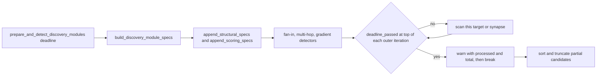

## Summary

Three recommendation-core detectors scanned every target or synapse without checking the discovery deadline or global cancellation (CWE-834). A large creature could therefore keep a worker busy after the deadline had passed or a cancellation was requested. Each detector now takes `deadline: &Option<SystemTime>` and checks `deadline_passed(deadline)` at the top of every outer iteration. Closes #2183.

- **`fan_in.rs::detect_fan_in_candidates`**: checks once per target neuron.
- **`multi_hop.rs::detect_multi_hop_candidates`**: checks once per target neuron.
- **`gradient_discovery.rs::detect_gradient_candidates`**: checks once per synapse.
- **When the check fires**: the loop `break`s and the detector returns the candidates found so far, still sorted and truncated as usual. `deadline_passed` checks `crate::cancellation::is_cancelled()` first, so global cancellation (#1047) is covered as well.
- **The early return is reported**: it logs a `tracing::warn!` with `detector`, `processed` and `total`, so a truncated scan can be told apart from a complete one.
- **Threading the deadline**: contrary to the issue text, the deadline was not in scope at the spec sites, so it is passed down to them.
  - `build_discovery_module_specs` gains a `deadline: Option<SystemTime>` parameter and forwards it to `append_structural_specs` and `append_scoring_specs`.
  - `prepare_and_detect_discovery_modules` passes its existing deadline in.
  - `SystemTime` is `Copy`, so the `discovery_spec!` closures capture it and pass `&deadline` without any change to the macro.
- **Existing callers**: seven test files call these detectors directly and now pass `&None`, which keeps the previous unbounded behaviour.
- **Left alone**:
  - `output_competition.rs` is out of scope, as the issue says.
  - The rows in `docs/audits/security-sweep-chunk-08b-synapse-scoring-recommendation.md` stay `pending`. That ledger is maintained by the chunk-08b sweep, which confirms each row when it re-audits. Editing it here would also mean changing its scaffold tests (#2103/#2104).

## Evidence

This is a backend-only change with no UI.

**The original trigger is closed, and there is no trivial bypass.** The check runs before any work in each outer iteration, which is the only loop in these detectors that grows with creature size. So once the deadline passes or cancellation is requested, at most one more target or synapse is scanned. The only way to skip the check is to pass `&None`, which means no deadline was set. Production goes through `prepare_and_detect_discovery_modules`, which always passes the real deadline.

Regression linkage (TDD): I added three regression tests, one per detector. Each reproduces the flaw, fails against the unfixed code and passes after the fix:

- Added `tests/issue_2183_recommendation_core_deadline.rs::fan_in_elapsed_deadline_returns_no_candidates`, which reproduces the uncancellable fan-in scan. It fails against the unfixed code and passes after the fix.
- Added `tests/issue_2183_recommendation_core_deadline.rs::multi_hop_elapsed_deadline_returns_no_candidates`, which reproduces the uncancellable multi-hop scan. It fails against the unfixed code and passes after the fix.
- Added `tests/issue_2183_recommendation_core_deadline.rs::gradient_elapsed_deadline_returns_no_candidates`, which reproduces the uncancellable gradient scan. It fails against the unfixed code and passes after the fix.

Here, "unfixed code" means the scan loops with the `deadline_passed(deadline)` check neutralised (`if false && deadline_passed(deadline)`), so the deadline is accepted but ignored as it was before this change. Run that way, `cargo test --test issue_2183_recommendation_core_deadline` gave `3 passed; 3 failed`, and the failures were exactly these three tests: each scan still returned candidates after the deadline had passed. With the fix restored, the run gave `6 passed; 0 failed`. The three `*_far_future_deadline_matches_no_deadline` tests pass both ways. They are guards against a scan that stops too early, not reproductions of this flaw.

## Test Plan

Each fixture yields candidates on an unbounded scan (asserted). An elapsed deadline must return no candidates. A far-future deadline must give the same structural result as `None`.

- `tests/issue_2183_recommendation_core_deadline.rs::multi_hop_elapsed_deadline_returns_no_candidates`
- `tests/issue_2183_recommendation_core_deadline.rs::multi_hop_far_future_deadline_matches_no_deadline`
- `tests/issue_2183_recommendation_core_deadline.rs::gradient_elapsed_deadline_returns_no_candidates`
- `tests/issue_2183_recommendation_core_deadline.rs::gradient_far_future_deadline_matches_no_deadline`
- `tests/issue_2183_recommendation_core_deadline.rs::fan_in_elapsed_deadline_returns_no_candidates`
- `tests/issue_2183_recommendation_core_deadline.rs::fan_in_far_future_deadline_matches_no_deadline`

The far-future tests compare UUIDs, paths and sample counts, not scores. Fan-in sums in `HashMap` iteration order, so its scores can differ in the last digit between two identical scans.

What was run:

- `cargo fmt` — clean.
- `cargo clippy --all-targets -- -D warnings` — clean.
- `cargo test --test issue_2183_recommendation_core_deadline` — 6 passed.
- `cargo test --test recommendation --test detection` — 752 passed.
- `cargo test --test issue_2182_recommendation_core_non_finite_gain_ranking --lib module_dispatch_specs` — 6 passed.

QUALITY_GATE_PLACEHOLDER

ACCEPTANCE_PLACEHOLDER

STANDARDS_PLACEHOLDER
