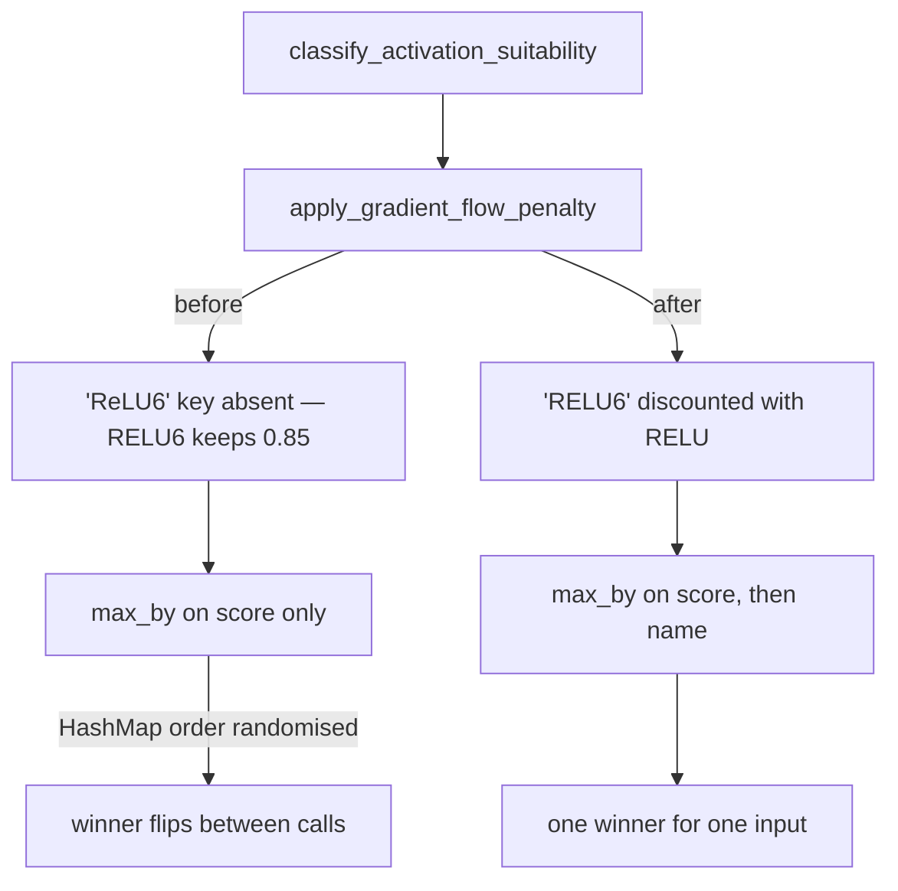

# Activation recommendation ranking: deterministic tie-break, live RELU6 penalty (#2184)

## Summary

Closes #2184.

Two ranking defects in `src/analysis/recommendation/activation_recommendation.rs`
made the emitted `changeSquash` recommendation unstable or wrong. Neither is a
security finding — the score space is entirely compile-time constants, so no
untrusted value reaches either site — but both change what the host is told to do.

**1. The best-activation pick was not deterministic.**
`recommend_activation_function` chose the winner with
`suitability.iter().max_by(|a, b| a.1.total_cmp(b.1))`. `suitability` is a
`HashMap<String, f32>`, `Iterator::max_by` keeps the **last** maximal element, and
`HashMap` iteration order is randomised per map by `RandomState` — so a tie on the
maximum score resolved differently from call to call for byte-identical input. The
tie is reachable: for `InputDistributionClass::Bimodal` the map holds
`TANH = 0.7` and `HARD_TANH = 0.7`, and `apply_gradient_flow_penalty` only separates
them when the distribution sits far from zero. Fixed by breaking the tie on the
activation name:

```rust
.max_by(|a, b| a.1.total_cmp(b.1).then_with(|| a.0.cmp(b.0)))
```

Keys are unique, so `(score, name)` is a total order and the maximum is unique:
highest score wins, equal scores go to the lexicographically greatest name. For the
bimodal tie that is **TANH**, which is the file's own first-listed
`BOUNDED_BIPOLAR_FAMILY` preference and the value the existing suite already expects.

**2. The RELU6 gradient-flow penalty never applied.**
`apply_gradient_flow_penalty` looked the score up as `scores.get_mut("ReLU6")`. Every
insertion site spells the key `"RELU6"`, and squash names are normalised to uppercase
at deserialisation (Issue #753), so the mixed-case key cannot exist and the branch was
dead. RELU6 kept its full `0.85` sparse score even when most observed inputs were
negative — exactly the case the penalty exists to discourage — while RELU was
discounted to `0.45`, so the dead branch actively flipped the recommendation. Fixed by
spelling the key `"RELU6"`, matching every other lookup in the file.

A visible consequence, and the correct one: under `Sparse` with a negative-heavy
distribution, RELU (`0.675`) and RELU6 (`0.6375`) are now both discounted, so the map
maximum becomes **ELU `0.8`** — the activation that actually handles negative inputs.
No existing test depended on the old behaviour; the `recommendation`, `activation` and
`detection` suites (865 tests) pass unchanged.



### Deliberate no-change decisions

- **`recommend_activation_function_for_role` needed no behaviour change.** The issue
  notes it "inherits the same arbitrary tie-break". On inspection it does not:
  `family_scores.sort_by(...)` is a **stable** sort over a fixed declared
  `family_candidates` list, so equal scores already keep the family's own preference
  order deterministically. Restructuring it would be an out-of-scope change with
  regression risk, so it got a documenting comment only.
- **The chunk 8b ledger row was left `pending`.**
  `docs/audits/security-sweep-chunk-08b-synapse-scoring-recommendation.md` states each
  `###` section is edited only by the audit sub-issue that owns it, and the whole
  `recommendation core` section is still `pending`. Recording an outcome on the
  `activation_recommendation.rs` row would claim a sweep for all five defect classes
  that this PR did not perform, and would conflict with the owning sub-issue's PR.

## Evidence

This is a library-internal ranking change with no UI surface, so there is nothing to
screenshot. The evidence is the test output below.

**Before the fix** — both regression tests fail against the unfixed code:

```text
---- relu6_is_penalised_when_inputs_are_negative_heavy stdout ----
thread 'relu6_is_penalised_when_inputs_are_negative_heavy' panicked at tests/issue_2184_activation_recommendation_ranking.rs:134:5:
RELU6 must be discounted, not left at its unpenalised 0.85, got 0.85

---- bimodal_recommendation_does_not_vary_between_calls stdout ----
thread 'bimodal_recommendation_does_not_vary_between_calls' panicked at tests/issue_2184_activation_recommendation_ranking.rs:89:5:
assertion `left == right` failed: recommended_squash must be identical across calls for identical input, saw {"HARD_TANH", "TANH"}
  left: 2
 right: 1
```

The determinism failure is the defect itself: 200 in-process calls on one byte-identical
record set produced two different recommendations.

**After the fix:**

```text
$ cargo test --test issue_2184_activation_recommendation_ranking
cargo test: 2 passed (1 suite, 0.00s)

$ cargo test --lib activation_recommendation
cargo test: 7 passed, 1587 filtered out (1 suite, 0.00s)

$ cargo test --test recommendation --test activation --test detection
cargo test: 865 passed (3 suites, 0.07s)
```

## Reproduction

- **symptom** — for one byte-identical bimodal record set, `recommend_activation_function`
  returned `TANH` on some calls and `HARD_TANH` on others, with a different
  `expected_creature_score_gain` attached; and for a sparse, negative-heavy distribution
  RELU6 kept its unpenalised `0.85` score while RELU was discounted, so RELU6 won a
  recommendation the gradient-flow penalty was written to deny it.
- **status** — `verified` — the regression test was observed failing against the unfixed
  code and passing after the fix
- **regression test** —
  `tests/issue_2184_activation_recommendation_ranking.rs::bimodal_recommendation_does_not_vary_between_calls`
  and
  `tests/issue_2184_activation_recommendation_ranking.rs::relu6_is_penalised_when_inputs_are_negative_heavy`

## Test Plan

New file `tests/issue_2184_activation_recommendation_ranking.rs`, two tests, both
calling the real public functions with real record data — no source-text inspection.
Each pins its positive preconditions first so it cannot pass vacuously (Issue #1799).

1. **`bimodal_recommendation_does_not_vary_between_calls`** — builds 100 records
   alternating ±2.0, asserts the distribution classifies as `Bimodal`, that `TANH` and
   `HARD_TANH` are both scored, that they tie, and that the tie is on the map maximum.
   Then calls `recommend_activation_function` 200 times, collecting `recommended_squash`
   into a `BTreeSet`, and asserts exactly one distinct value, equal to `TANH`. Each call
   builds a fresh `HashMap`, so each call gets a fresh iteration order — this is what
   caught the flip.
2. **`relu6_is_penalised_when_inputs_are_negative_heavy`** — constructs a `Sparse`,
   negative-heavy `InputDistribution` directly, asserts RELU is penalised below its
   unpenalised `0.9` and that `"ReLU6"` is genuinely absent from the key space
   (the Issue #753 precondition that made the old branch dead), then asserts RELU6 is
   below its unpenalised `0.85` and took the **same** discount factor as RELU. Asserting
   the ratio rather than a magic number keeps the test honest if the penalty curve is
   ever retuned.

Regression surfaces re-run green: the in-file `mod tests` (7), and the `recommendation`,
`activation` and `detection` suites (865), which between them cover
`issue_431_activation_recommendation`, `issue_1313_role_aware_output_squash`,
`issue_788_high_error_squash_exploration`, `issue_417_increase_change_squash_rate` and
`issue_545_output_squash_mismatch`.

Full `./quality.sh` run at the end of the change.
