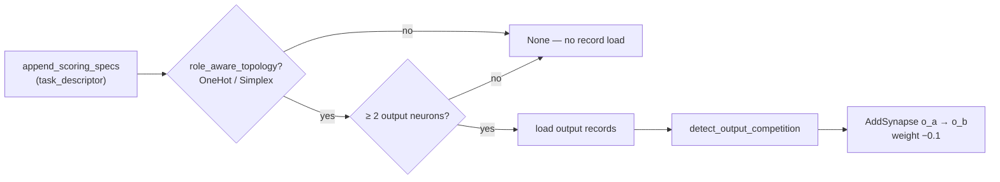

# Wire up the output-competition recommender (Issue #2185)

Closes #2185

## Summary

`src/analysis/recommendation/output_competition.rs` (added by Issue #1321) had
no production caller: no `discovery_spec!` entry existed, so
`detect_output_competition` was reached only from its own `#[cfg(test)] mod
tests` and `tests/recommendation/issue_1321_output_competition_lateral_inhibition.rs`.
The PR summary for #1321 documents it as a live recommender, so it read as
shipped behaviour while proposing nothing.

Issue #2185 offered two ways forward — wire it up, or delete it. **Wired it
up**, because AGENTS.md § *Dead Levers* only permits deletion when no concrete
writer can be named, and here one can: `append_scoring_specs` is the single
spec group that receives `task_descriptor`, already loads output records via
`cache.load_records_for_neuron_types(&creature, &["output"])`, and already
hosts the sibling role-aware spec `output_bias_drift_detection`. Nothing needed
inventing — the inbound surface the detector is keyed on was already there.

The issue required the non-finite accumulator hazard to be closed *in the same
change* if the module were wired up. It is.



### Changes

- **`scoring_specs.rs`** — new `custom:`-arm spec
  `"output competition detection"` / `"output_competition_detection"`,
  inserted before the `batch_successful_enabled()` block. The topology and
  output-count pre-checks run *before* the record load, so descriptors that
  can emit nothing pay nothing.
- **`output_competition.rs`** — `role_aware_topology` is now `pub` so the
  dispatcher applies the module's own gate rather than duplicating a
  `matches!` at the call site (one source of truth).
- **`output_competition.rs`** — arithmetic hardening. Activations come from
  recorded parquet the analyser does not author:
  - non-finite activations are skipped during accumulation;
  - a non-finite mean returns `None` (finite terms can still overflow the
    `f32` accumulator);
  - `estimated_improvement` is clamped to `[0.0, COMPETITION_GAIN_SCALE]`, so
    an unbounded squash cannot lift one pair above the documented ceiling.

  Without these, `co_activation`'s `sum_min` could reach `+inf` and the
  descending `total_cmp` sort would rank the poisoned pair ahead of every
  genuine competitor — the sibling ranking finding recorded in
  `docs/audits/security-sweep-chunk-08b-synapse-scoring-recommendation.md`.
- **`output_competition.rs`** — fixed a mis-indented `constant_neuron_bias_fold`
  field in `output_competition_to_coordinated_candidates`.
- **`docs/FFI_API.md`** — the dispatch diagram's module count 48 → 49.

### Modified existing test — documented deliberately

`module_dispatch_specs/mod.rs::test_build_discovery_module_specs_produces_all_modules`
asserts the exact registry size. Registering a module necessarily changes it,
so `48` became `49` with an Issue #2185 note in the comment. No test was
removed, weakened or commented out; this is a count contract following the
thing it counts.

## Evidence

Backend/FFI library change — there is no web interface to screenshot, so the
evidence is the red→green test transcript.

**Before (red, as written TDD-first).** `cargo test --test recommendation issue_2185`
— 1 passed, 4 failed:

```text
an_overflowing_accumulator_cannot_produce_a_candidate
  OutputCompetitionCandidate { … co_activation_score: inf, estimated_improvement: inf }
a_poisoned_pair_cannot_outrank_a_genuine_competitor
  co-activation score must be finite, got inf for big-a ↔ big-b
coordinated_candidates_carry_a_bounded_expected_gain
  expected gain must be finite and bounded, got inf
non_finite_activations_are_ignored
  candidate output-a ↔ bad formed with co_activation_score: 0.8500002
ordinary_co_firing_outputs_still_score_as_before ... ok   (regression guard)
```

`cargo test --lib output_competition` — 3 passed, 2 failed, both with
`output competition must be registered as a discovery module`: the registry
genuinely had no spec.

**After (green).**

```text
cargo test --lib output_competition            5 passed
cargo test --test recommendation issue_2185    5 passed
cargo test --test recommendation issue_1321   11 passed
cargo test --lib module_dispatch               6 passed
```

The eleven pre-existing #1321 tests pass unchanged: their fixtures accumulate
finite sums, and the disjoint-firing fixture never puts both members above the
co-activation threshold, so the new guards do not alter their outcomes.

## Test Plan

New in-crate registry tests (`module_dispatch_specs/mod.rs`) — these must live
in-crate because `build_discovery_module_specs` is `pub(crate)`:

- `output_competition_is_dispatched_under_a_one_hot_descriptor` — a two-output
  creature whose outputs co-fire on 40 observations under a
  `CATEGORICAL_ERROR` (OneHot) descriptor yields exactly one candidate
  carrying one `AddSynapse { o1 → o2 }` with a negative weight. This is the
  test that fails against the unwired code.
- `output_competition_stays_silent_under_a_neutral_descriptor` — the same
  creature under `TaskDescriptor::neutral()` produces `None`, proving the
  dispatcher honours the module's topology gate.

New behavioural tests (`tests/recommendation/issue_2185_output_competition_non_finite.rs`):

- `an_overflowing_accumulator_cannot_produce_a_candidate` — both members of a
  pair carry `f32::MAX`-scale activations; the mean overflows and no candidate
  may be emitted.
- `a_poisoned_pair_cannot_outrank_a_genuine_competitor` — a poisoned pair and
  a genuine competitor in one creature; every surviving score must be finite,
  so ranking cannot be hijacked.
- `non_finite_activations_are_ignored` — `inf` / `NaN` activations never form
  a candidate.
- `coordinated_candidates_carry_a_bounded_expected_gain` — every
  `expected_creature_score_gain` is finite and within the documented ceiling.
- `ordinary_co_firing_outputs_still_score_as_before` — regression guard: an
  ordinary competing pair still scores ≈ 0.80 over 40 samples with an
  improvement of ≈ 0.008.

Full `./quality.sh` run (fmt, clippy `-D warnings`, tests, SAST) passed.
