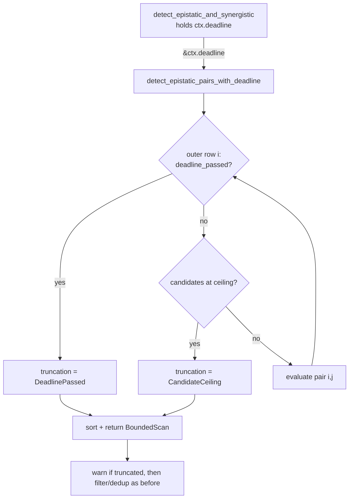

## Summary

The epistatic pair scan (`epistatic/candidate_generation.rs::detect_epistatic_pairs`)
ran an O(n²) loop over one target's source contributions with no deadline, no
cancellation check and no ceiling on emitted candidates. The deadline was
already held one frame up in
`synapse/target_analysis/candidate_selection.rs::detect_epistatic_and_synergistic`
and was simply not passed down. Closes #2190.

- New `detect_epistatic_pairs_with_deadline` takes the `Option<SystemTime>`
  deadline and checks `utils::deadline_passed` at the top of every outer `i`
  row. That call also reports the global cancellation flag (Issue #1047), so
  host shutdown is covered too.
- New `MAX_EPISTATIC_PAIR_CANDIDATES` (1,024) stops the scan once that many
  pairs have been emitted. Memory can no longer grow quadratically before
  `deduplicate_by_dominant_neuron` runs. The value sits above today's yield
  (it takes 46 valid sources to exceed it).
- New `detect_synergistic_candidates_with_deadline` checks the same deadline
  before each complement source (the issue's step 1 threads it into both
  detectors).
- Both return `BoundedScan { candidates, truncation: Option<ScanTruncation> }`.
  `detect_epistatic_and_synergistic` passes `&ctx.deadline` and logs a
  `Candidate scan stopped early` warning with the target and the reason, so a
  truncated scan is never presented as a complete one.
- The existing `detect_epistatic_pairs` / `detect_synergistic_candidates`
  signatures stay as thin wrappers (`&None` deadline), so the ~30 existing test
  call sites are untouched. The wrappers still honour cancellation and the
  ceiling. The production caller uses only the deadline variants.
- Ledger: the fix is recorded under *Related remediations* in
  `docs/audits/security-sweep-chunk-08b-synapse-scoring-recommendation.md`.
  On `Develop` every row of the `recommendation batch_successful + epistatic`
  table still reads `pending`. That section's sweep (#2109, PR #2193) merged
  into `milestone/2083-…`, which already rewrites the rows and lists #2190.
  Editing the same rows here would conflict with that branch, so this PR
  appends only to a section the milestone branch leaves untouched.
- `tests/issue_2109_chunk_08b_batch_successful_epistatic_sweep.rs` also lives
  only on that milestone branch. Its 66- and 276-pair measurements (12 and 24
  sources) stay below the 1,024 ceiling, so it needs no change.
- `docs/ANALYSIS_DEEP_DIVE.md` documents the bounds. The version bump is
  left to CI's `version-increment` job. The first PR (#2201) conflicted on a
  hand-bumped `Cargo.toml` version, so this branch keeps Develop's version.

## Evidence

This is a backend-only change with no UI.

Regression tests in `tests/issue_2190_epistatic_pair_scan_deadline.rs` use a
fixture of `n` pairwise fully complementary sources. Every one of the
`n(n-1)/2` pairs qualifies, so a full scan is plainly visible:

- `tests/issue_2190_epistatic_pair_scan_deadline.rs::elapsed_deadline_stops_the_epistatic_pair_scan_before_any_pair`:
  24 sources plus a `UNIX_EPOCH` deadline give zero pairs and `DeadlinePassed`.
  An unguarded scan would return 276.
- `tests/issue_2190_epistatic_pair_scan_deadline.rs::future_deadline_yields_every_pair_the_unbounded_scan_yields`:
  with a deadline a day ahead, the same input yields all 276 pairs, the same
  set as `detect_epistatic_pairs`, and no truncation. This shows the early
  return is not a behaviour change.
- `tests/issue_2190_epistatic_pair_scan_deadline.rs::epistatic_pair_scan_stops_at_the_candidate_ceiling_and_reports_it`:
  48 sources (1,128 possible pairs) give exactly 1,024 pairs and
  `CandidateCeiling`.
- `tests/issue_2190_epistatic_pair_scan_deadline.rs::candidate_ceiling_not_reported_when_the_scan_completes`
  and `::too_few_sources_is_not_a_truncation_even_past_the_deadline` check
  that a complete scan is never reported as truncated.
- `tests/issue_2190_epistatic_pair_scan_deadline.rs::elapsed_deadline_stops_the_synergistic_scan`
  and `::future_deadline_synergistic_scan_matches_the_unbounded_scan` cover the
  synergistic detector.

**Red/green linkage.** Added
`tests/issue_2190_epistatic_pair_scan_deadline.rs::elapsed_deadline_stops_the_epistatic_pair_scan_before_any_pair`,
which reproduces the flaw (a pair scan that ignores an already-elapsed
deadline). It fails against the unfixed code and passes after the fix. Added
`tests/issue_2190_epistatic_pair_scan_deadline.rs::epistatic_pair_scan_stops_at_the_candidate_ceiling_and_reports_it`,
which reproduces the unbounded candidate growth. It also fails against the
unfixed code and passes after the fix.

How this was checked: I neutralised the outer-row `deadline_passed` check and
the `MAX_EPISTATIC_PAIR_CANDIDATES` ceiling in
`detect_epistatic_pairs_with_deadline`, restoring the unfixed scan loop. Both
tests then failed:

- `elapsed_deadline_stops_the_epistatic_pair_scan_before_any_pair` panicked at
  `tests/issue_2190_epistatic_pair_scan_deadline.rs:67`. The scan ran to
  completion and reported no `DeadlinePassed` truncation.
- `epistatic_pair_scan_stops_at_the_candidate_ceiling_and_reports_it` panicked
  at line 104. The scan emitted every pair and reported no `CandidateCeiling`
  truncation.

With the guards restored, all 7 tests pass. Against the literal pre-fix tree
the test file also fails to compile, because the deadline-taking entry points
do not exist there.

**Original trigger is closed.** The trigger was a large caller-supplied
creature driving `n²/2` pair evaluations inside `detect_epistatic_pairs` with
nothing to interrupt them. The only production caller,
`detect_epistatic_and_synergistic`, now calls
`detect_epistatic_pairs_with_deadline(…, &ctx.deadline)`. That scan re-checks
`deadline_passed` (deadline or cancellation) before every outer row, so once
the deadline passes the overrun is at most one row of `n` pair evaluations.
The emitted vector is also capped at 1,024 whatever the deadline. No other
production path reaches the pair loop. The legacy wrapper is used only by tests
and still honours cancellation and the ceiling, so there is no trivial bypass.

## Test Plan

- Added `tests/issue_2190_epistatic_pair_scan_deadline.rs` (7 tests).
- Ran the existing `analysis` and `synapse` integration suites, which cover the
  epistatic, synergistic, #508, #731, #897 and #906 behaviour: 652 + 171 pass.
- Ran `cargo clippy --all-targets` (clean) and `./quality.sh`.
