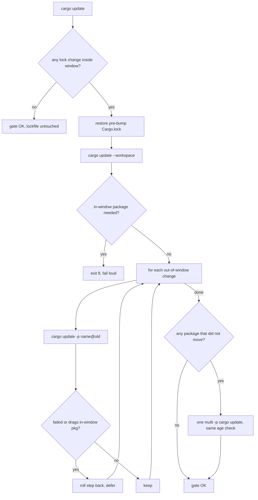

## Summary

`./bump-deps.sh` exited 8 on every run (`could not pin js-sys back to 0.3.105`),
so dependency bumps were disabled. Closes #2202.

**Root cause:** the lockfile quarantine gate pinned each in-window package back
on its own with `cargo update -p name@new --precise old`. Lockstep releases
(wasm-bindgen / js-sys / web-sys / wasm-bindgen-futures, zerocopy /
zerocopy-derive) require each other with exact `=` versions. Pinning one of
them therefore conflicts with a partner that still needs the new version, and
`--precise` cannot be combined with `--recursive`.

**Fix:** the new `bump_deps::reapply_safe_lock_changes` never tries to pin a
single package back. It works like this:

1. Roll `Cargo.lock` back to its pre-bump state.
2. Resolve only what the bumped manifests strictly need (`cargo update --workspace`).
   If that alone needs an in-quarantine package, exit 8.
3. Re-apply each out-of-window change one package at a time with
   `cargo update -p name@old`. Roll back any step that fails or drags in an
   in-quarantine package; that change is deferred to a later run.
4. A lone `cargo update -p js-sys@old` exits 0 **without moving anything** while
   its exact-pinned partners stay locked. Packages that did not move are
   re-applied together in one `cargo update -p a@x -p b@y …` step, with the
   same age check. A package that still does not move is held by a locked
   (in-quarantine) partner and is reported as deferred, never as re-applied.

Lockstep partners move together or not at all, and the in-window versions stay
out.



### What changed

- `bump-deps.sh` has the new `reapply_safe_lock_changes` (plus
  `reapply_stuck_lock_changes` for lockstep families, and two helpers,
  `list_lock_removals` and `describe_lock_plan`), wired into phase 3a. The header
  and the `--help` exit-8 text are updated.
- `tests/bump_deps_test.sh` gains Tests 26–29, which run against a stub `cargo`.
- `AGENTS.md`'s "Dependency Bumps" section records the rollback approach and
  warns against going back to `--precise`.
- `Cargo.lock` carries the out-of-window refresh from a real run of the fixed
  script. The in-window zerocopy pair (0.8.59, 22h old) stays at 0.8.56.

## Evidence

A real `./bump-deps.sh < /dev/null` run exits **0**. Right now the in-window
lockstep pair is zerocopy/zerocopy-derive, and it is held back together:

```text
🛡️  Lockfile quarantine gate (window=24h)…
   🚧 zerocopy 0.8.56 → 0.8.59 (publish age 22h < 24h) — held back
   🚧 zerocopy-derive 0.8.56 → 0.8.59 (publish age 22h < 24h) — held back
   ✅ js-sys 0.3.105 → 0.3.106 re-applied
   ✅ wasm-bindgen 0.2.128 → 0.2.129 re-applied
   ✅ wasm-bindgen-futures 0.4.78 → 0.4.79 re-applied
   ✅ wasm-bindgen-macro 0.2.128 → 0.2.129 re-applied
   ✅ wasm-bindgen-macro-support 0.2.128 → 0.2.129 re-applied
   ✅ wasm-bindgen-shared 0.2.128 → 0.2.129 re-applied
   ✅ web-sys 0.3.105 → 0.3.106 re-applied
   lockfile quarantine gate OK (held back=2, deferred=0)
✅ bump-deps: no bumps (quarantined=0, lock_pinned_back=2, audit_run=1)
```

`bash tests/bump_deps_test.sh < /dev/null` gives `Passed: 107, Failed: 0`. The resulting `Cargo.lock` has
js-sys 0.3.106, wasm-bindgen 0.2.129 and zerocopy 0.8.56.

## Test Plan

- [x] Test 26 (regression for #2202) checks that lockstep in-window releases
      stay held back. It also checks these outcomes:
      - A safe bump that drags in a young partner is deferred.
      - A safe independent bump and a safe lockstep pair are both kept.
      - A bump that pulls in a young new package is deferred.
      - A cargo failure is reported with its reason.
      - The final lockfile has nothing inside the window.
      Against the unfixed script it fails: the function does not exist.
- [x] Test 27 checks that a fully aged refresh is a no-op: no cargo calls, and
      the lockfile is byte-identical.
- [x] Test 28 checks that the run fails loud (non-zero, naming the package)
      when the bumped manifests cannot resolve without an in-quarantine package.
- [x] Test 29 checks that a safe lockstep family, whose lone steps are cargo
      no-ops, is re-applied together. A package held by an in-quarantine
      partner is reported rejected, never kept. Before the fix it failed
      with 5 assertions, matching the false "re-applied" lines of a real run.
- [x] `quality/shellcheck.sh .` and `quality/bash_syntax.sh .` pass.
- [x] A real `./bump-deps.sh` run exits 0.
- [ ] `./quality.sh` passes (see the PR checks).

## Security self-check

- [x] No secrets or hidden files staged.
- [x] Cargo is invoked with argv arrays, not with strings built from input.
- [x] In-quarantine versions are never accepted. Any failure to hold them back
      exits 8.

🤖 Generated with [Claude Code](https://claude.com/claude-code)
