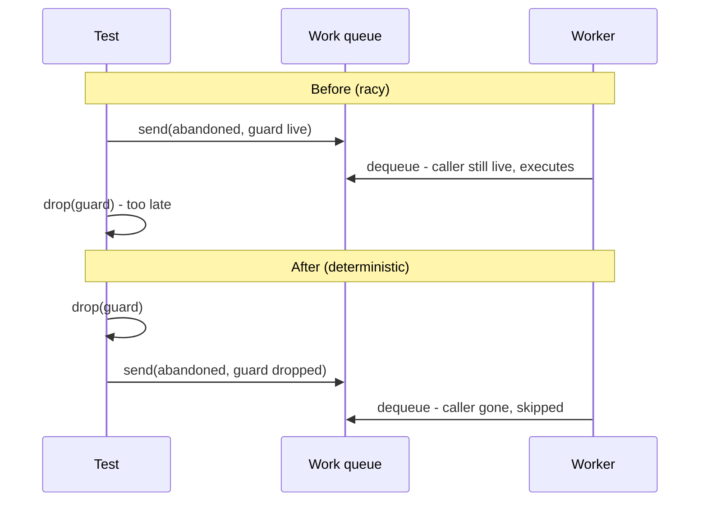

## Summary

Makes `an_abandoned_request_never_reaches_the_wedged_gpu` deterministic. Closes #2206.

The test enqueued the abandoned request and only then dropped its caller guard.
The worker could dequeue and execute the request in that gap, so the probe
intermittently counted 2 device calls instead of 1.

### What changed

- `src/analysis/gpu/queue/wedge_tests.rs`:
  - `WedgedGpu::submit` now delegates to a new shared `enqueue` helper.
  - A new `WedgedGpu::submit_abandoned` drops the guard **before** the send.
  - The test uses `submit_abandoned`. Its assertions are unchanged, and it adds no sleeps.

This is a test-only change; production code is untouched.

## Evidence

This change is backend-only, so there is no visual surface.

- The ordering is now deterministic by construction: the request carries a dead
  `CallerLiveness` before it can reach the queue.
- The test binary ran `an_abandoned_request_never_reaches_the_wedged_gpu` 300
  times in a row with **0 failures**.
- All 8 `wedge_tests` pass.

## Test Plan

- [x] `cargo test --lib wedge_tests`: 8 passed.
- [x] The target test ran 300 times via the test binary with 0 failures.
- [x] `cargo fmt --check` and `cargo clippy --all-targets -- -D warnings` are clean.
- [x] `cargo test --lib --tests --all-features -- --test-threads=2` passed on its own (419s).
- [ ] `./quality.sh`: see the PR description for the result.
