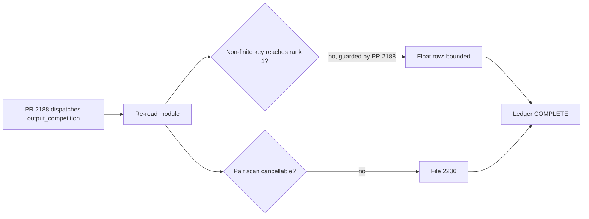

# PR summary — Issue #2210

## Summary

Finalises the chunk 8b sweep record
(`docs/audits/security-sweep-chunk-08b-synapse-scoring-recommendation.md`).
Closes #2210.

- **`output_competition.rs` re-verdict.** PR #2188 dispatches the module from
  `scoring_specs.rs`, so the four rows that called it unreachable are
  rewritten. `co_activation`'s `sum_min` can overflow to `+inf`, never NaN,
  because every term is `min(a, b) > 0.5`. PR #2188's own `!score.is_finite()`
  rejection and `estimated_improvement` clamp keep every ranked key finite, so
  nothing reaches rank 1. #2182's fix (PR #2199) does not touch this file. The
  O(outputs²) pair scan, which rebuilds a `HashMap` for every pair, has no
  deadline and #2183's fix did not reach it. It is filed as **#2236**
  (`security`, `lang:rust`, `severity:medium`, `confidence:high`, with a
  failing-first `tests/issue_<n>_output_competition_deadline.rs`
  requirement).
- **Regex reconciliation.** Both regexes were re-run against the current tree
  and every production hit was checked against a table row:
  - Stale capacity rows now give the real expressions:
    `statistics.rs::filter_and_load_sources` ×2, `::prepare_harmful_samples`
    and `evaluation.rs::process_harmful_batch_from_prepared`.
  - New float rows cover the `post_processing.rs::reject_non_finite_and_rank_*`
    sorts that the #2167 fix introduced.
  - The epistatic rows now cite the `*_with_deadline` symbols where the sorts
    moved under #2190, and the deduplication row names `cmp_epistatic` /
    `cmp_synergistic`.
  - Each table now ends with a **Regex reconciliation** note. It lists the
    rows that cover several sites, the non-site hits (literal `vec![x];`,
    test code) and rows describing code that has since been deleted or fixed.
- **Status.** The heading now reads `### Sweep status — COMPLETE`. The
  "as they are swept" placeholder is gone. The #2185, #2191 and #2192 states
  are corrected to closed, and a one-line label audit is recorded.
- **Label audit.** All nine findings plus #2236 carry the four labels and state
  the failing-first test. No label needed editing.
- **Index.** Chunk `8b` `last_swept` `2026-09-23` and `baseline_commit`
  `b85a551…` already equal the record. They are unchanged and now pinned by
  the test.
- **Gate fix.** Backticks were added to one doc comment in
  `tests/issue_2108_chunk_08b_recommendation_core_sweep.rs`, because
  `clippy::doc_markdown` failed `./quality.sh` on it.

## Evidence

This is a docs and test change with no UI. Evidence:

- `tests/issue_2210_chunk_08b_finalisation.rs` fails three of its five tests
  against the unfinalised ledger: the status heading, the missing
  reconciliation notes and the `output_competition.rs` "unreachable" rows. All
  five pass after the change.
- `tests/issue_2088_*` and `tests/issue_2103_*` to `tests/issue_2109_*` still
  pass.

## Test Plan

- Added `tests/issue_2210_chunk_08b_finalisation.rs`. It checks:
  - (a) zero `pending` rows and 60 file rows, each with an outcome and a
    reason;
  - (b) no `IN PROGRESS` status and no placeholder;
  - (c) every production capacity or comparator file is cited in its table,
    with the detector pinned first;
  - (d) no `output_competition.rs` row says unreachable while it is
    dispatched, and #2236 is listed with its labels;
  - (e) the index entry equals the record.
- Row count is 60, not the 59 the issue states:
  `issue_2169_structural_patterns_cancellation_test.rs` (Issue #2221) landed
  after planning. `tests/issue_2103_*` already pins 60.
