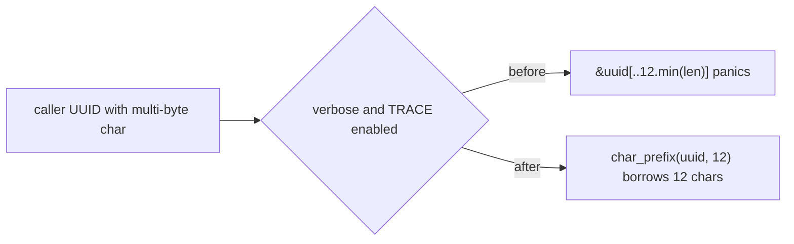

# PR Summary — Issue #2219

## Summary

Closes #2219 (part of #2168).

Two verbose-gated log lines cut caller-supplied neuron UUIDs with a byte-index
slice, `&uuid[..12.min(uuid.len())]`. That slice panics when byte 12 falls
inside a multi-byte character. A panic in a rayon worker that unwinds past
`extern "C"` aborts the host process (CWE-248).

- Added `analysis::utils::char_prefix(s, max_chars)`, which takes a char-safe
  prefix. It sits next to `verbose_enabled()`.
- `synapse/post_processing.rs::apply_impact_to_helpful` now logs through the
  helper. So does its sibling `neuron/post_processing.rs::apply_impact_discounting`,
  which has the same root cause.
- `apply_impact_to_helpful` is now `#[doc(hidden)] pub` so the integration test
  can call it directly, as the issue requires.
- Recorded the fix in the #2168 paragraph of the chunk-08b audit ledger.
- `Cargo.toml` is not bumped by hand; CI does that.

## Evidence

This is a backend-only change, so the evidence is test output.
`cargo test --test issue_2168_uuid_log_truncation_char_boundary`:

- On the unfixed code, 6 tests passed and 2 failed:
  - The regression test panicked at `src/analysis/synapse/post_processing.rs:328:55`
    with `end byte index 12 is not a char boundary; it is inside 'é' (bytes 11..13 …)`.
  - The source scan flagged `neuron/post_processing.rs:338` and
    `synapse/post_processing.rs:328`.
- After the fix, all 8 tests pass.
- `cargo clippy --all-targets -- -D warnings` is clean, and so is `./quality.sh`.

## Reproduction

- **Symptom:** a UUID whose byte 12 is inside a multi-byte character (e.g.
  `aaaaaaaaaaaé-rest`) panics the verbose debug log in `apply_impact_to_helpful`.
- **Status:** `verified`. The regression test failed with the panic above before
  the fix and passes after it.
- **Regression test:**
  `tests/issue_2168_uuid_log_truncation_char_boundary.rs::verbose_impact_log_does_not_panic_on_multibyte_uuid`
  reproduces #2168. It sets `NEAT_AI_DISCOVERY_VERBOSE`, asserts
  `verbose_enabled()`, and installs a global TRACE subscriber so the log fields
  are actually evaluated. It then calls `apply_impact_to_helpful` with the
  multi-byte UUID mapped to `hidden`.
- **File name:** the test file keeps the name the issue mandates. The repo's
  security-fix gate may only recognise `*_test.rs` files.

## Acceptance Criteria

<!-- vibe-spec-review inputs="diff+issue-body" -->

- `char_prefix("aaaaaaaaaaaé-rest", 12)` returns 12 chars / 13 bytes — reviewer: met
- ASCII input of 12 or more chars returns its first 12 chars — reviewer: met
- Short input returns whole, empty returns empty, and 20 emoji return 12 — reviewer: met
- The regression test uses verbose plus a global TRACE subscriber and panics on the unfixed code — reviewer: partial
  - reason: the reviewer only had the diff. The red run is recorded under Evidence, where it panicked at `post_processing.rs:328:55`.
- No `[..N.min(` byte slices remain under `src/`, and the scan test enforces it — reviewer: met
- Both former sites use `char_prefix` — reviewer: met
- The audit ledger records the fix — reviewer: met
- `./quality.sh` passes — reviewer: partial
  - reason: the reviewer could not see this from the diff. The full gate ran and passed locally before push.
- The extra `#[must_use]` and the hand-written regex-equivalent matcher with its self-test — reviewer: unrequested
  - reason: `regex` is not a dependency, and the matcher's self-test pins it to the mandated pattern.

## Standards Review

<!-- vibe-standards-review inputs="diff+CODING-STANDARDS.md" -->

This repo has no `CODING-STANDARDS.md`, so the reviewer used `CONTRIBUTING.md` and `AGENTS.md`.

- **blocker:** `apply_impact_to_helpful` became public for testing, which CONTRIBUTING "Test Organisation" forbids.
  - reason: I disagree. Issue #2219, requirement 4, explicitly mandates `#[doc(hidden)] pub`, following the precedent of `analyze_synapses_with_cache`. The public entry points need a GPU work queue, so they are not a reliable CI path. The more specific instruction wins.
- **minor:** the neuron-path fix has no behavioural test.
  - reason: the issue only asks for the source scan to cover it, and the scan flagged the old code. A behavioural test would mean making a second private function public, which is out of scope.
- **minor:** the PR summary was missing. Fixed: this file.
- **nit:** the source-scan test goes against the no-grep doctrine.
  - reason: the issue mandates it. It catches only literal digit bounds, which is the exact bug shape.
- **nit:** the test file name does not match the `*_test.rs` pattern.
  - reason: the issue mandates the name. Noted under Reproduction.
- **Clean:**
  - Australian English
  - comment concision
  - a `// SAFETY:` comment on the one `unsafe` block
  - no manual `Cargo.toml` bump
  - no new dependencies
  - no Mermaid violations

## Test Plan

- [x] Red: the regression test and the scan fail on the unfixed code.
- [x] Green: `cargo test --test issue_2168_uuid_log_truncation_char_boundary` passes 8 of 8.
- [x] `cargo clippy --all-targets -- -D warnings`
- [x] `./quality.sh`
