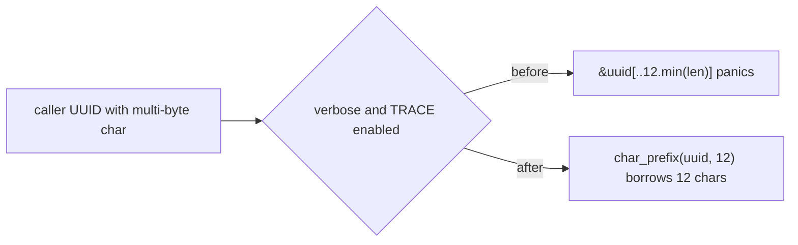

# PR Summary — Issue #2219

## Summary

Closes #2219 (part of #2168).

Two verbose-gated log lines cut caller-supplied neuron UUIDs with a byte-index
slice, `&uuid[..12.min(uuid.len())]`. That slice panics when byte 12 falls
inside a multi-byte character. A panic in a rayon worker that unwinds past
`extern "C"` aborts the host process (CWE-248).

- Added `analysis::utils::char_prefix(s, max_chars)`, which takes a char-safe
  prefix. It sits next to `verbose_enabled()`.
- `synapse/post_processing.rs::apply_impact_to_helpful` now logs through the
  helper. So does its sibling `neuron/post_processing.rs::apply_impact_discounting`,
  which has the same root cause.
- `apply_impact_to_helpful` is now `#[doc(hidden)] pub` so the integration test
  can call it directly, as the issue requires.
- Recorded the fix in the #2168 paragraph of the chunk-08b audit ledger.
- `Cargo.toml` is not bumped by hand; CI does that.

## Evidence

This is a backend-only change, so the evidence is test output.
`cargo test --test issue_2168_uuid_log_truncation_char_boundary`:

- On the unfixed code, 6 tests passed and 2 failed:
  - The regression test panicked at `src/analysis/synapse/post_processing.rs:328:55`
    with `end byte index 12 is not a char boundary; it is inside 'é' (bytes 11..13 …)`.
  - The source scan flagged `neuron/post_processing.rs:338` and
    `synapse/post_processing.rs:328`.
- After the fix, all 8 tests pass.
- `cargo clippy --all-targets -- -D warnings` is clean, and so is `./quality.sh`.

## Reproduction

- **Symptom:** a UUID whose byte 12 is inside a multi-byte character (e.g.
  `aaaaaaaaaaaé-rest`) panics the verbose debug log in `apply_impact_to_helpful`.
- **Status:** `verified`. The regression test failed with the panic above before
  the fix and passes after it.
- **Regression test:**
  `tests/issue_2168_uuid_log_truncation_char_boundary.rs::verbose_impact_log_does_not_panic_on_multibyte_uuid`
  reproduces #2168. It sets `NEAT_AI_DISCOVERY_VERBOSE`, asserts
  `verbose_enabled()`, and installs a global TRACE subscriber so the log fields
  are actually evaluated. It then calls `apply_impact_to_helpful` with the
  multi-byte UUID mapped to `hidden`.
- **File name:** the test file keeps the name the issue mandates. The repo's
  security-fix gate may only recognise `*_test.rs` files.

## Acceptance Criteria

<!-- vibe-spec-review inputs="diff+issue-body" -->

- **met** — `char_prefix("aaaaaaaaaaaé-rest", 12)` returns `"aaaaaaaaaaaé"` (12 chars, 13 bytes) and does not panic — evidence: `tests/issue_2168_uuid_log_truncation_char_boundary.rs::char_prefix_keeps_a_multibyte_char_straddling_byte_twelve` — reviewer: met
- **met** — An ASCII string of 12 or more chars yields exactly its first 12 chars — evidence: `tests/issue_2168_uuid_log_truncation_char_boundary.rs::char_prefix_takes_first_twelve_ascii_chars` — reviewer: met
- **met** — Short input is returned whole, empty returns `""`, and 20 emoji return the first 12 — evidence: `tests/issue_2168_uuid_log_truncation_char_boundary.rs::char_prefix_returns_short_string_whole`, `::char_prefix_of_empty_is_empty`, `::char_prefix_counts_emoji_as_single_chars` — reviewer: met
- **partial** — The regression test asserts `verbose_enabled()`, runs with a global TRACE subscriber, panics on the unfixed code and passes after the fix — evidence: `tests/issue_2168_uuid_log_truncation_char_boundary.rs::verbose_impact_log_does_not_panic_on_multibyte_uuid` — reviewer: partial — reason: the reviewer confirmed the full setup from the diff, but the red/green run cannot be seen there. The red run is recorded under Evidence (it panicked in `synapse::post_processing::apply_impact_to_helpful` on the `é` char boundary).
- **met** — The source-scan test finds no `[..N.min(` byte slice under `src/` — evidence: `tests/issue_2168_uuid_log_truncation_char_boundary.rs::no_byte_index_min_slices_remain_in_src` — reviewer: met
- **met** — Both former sites use the helper — evidence: `src/analysis/synapse/post_processing.rs::apply_impact_to_helpful`, `src/analysis/neuron/post_processing.rs::apply_impact_discounting` — reviewer: met
- **met** — The ledger's #2168 paragraph records the fix — evidence: `docs/audits/security-sweep-chunk-08b-synapse-scoring-recommendation.md` ("Panic class — the UTF-8 slice (#2168)" paragraph) — reviewer: met
- **partial** — `./quality.sh` passes (fmt, clippy, `cargo test`) — evidence: `./quality.sh` run under Evidence and Test Plan — reviewer: partial — reason: the reviewer could not confirm a run outcome from the diff. The full gate ran and passed locally before push.
- **unrequested** — `#[must_use]` on `char_prefix` — evidence: `src/analysis/utils/mod.rs::char_prefix` — reviewer: unrequested — reason: harmless, and in line with clippy's pedantic lint.
- **unrequested** — The hand-written matcher and its self-test `byte_min_slice_matcher_matches_the_regex_shape` — evidence: `tests/issue_2168_uuid_log_truncation_char_boundary.rs::byte_min_slice_matcher_matches_the_regex_shape` — reviewer: unrequested — reason: `regex` is not a dependency, and the self-test pins the matcher to the mandated pattern.
- **unrequested** — The regression test also asserts `expected_creature_score_gain.is_finite()` — evidence: `tests/issue_2168_uuid_log_truncation_char_boundary.rs::verbose_impact_log_does_not_panic_on_multibyte_uuid` — reviewer: unrequested — reason: slightly stronger than "returns normally", not a deviation.

## Standards Review

<!-- vibe-standards-review inputs="diff+CODING-STANDARDS.md" -->

This repo has no `CODING-STANDARDS.md`, so the reviewer used `CONTRIBUTING.md` and `AGENTS.md`. There are no blockers.

- **violation** — CONTRIBUTING "Test Organisation": tests that change environment variables should be `#[serial]` (minor) — evidence: `tests/issue_2168_uuid_log_truncation_char_boundary.rs::verbose_impact_log_does_not_panic_on_multibyte_uuid` — reason: stands. The `// SAFETY:` claim holds today because no other test in this binary reads the environment. The code already passed the gate, and this retry only changes documentation.
- **violation** — CONTRIBUTING "Test Organisation" ("Do not make APIs public just for testing") (minor, issue-mandated) — evidence: `src/analysis/synapse/post_processing.rs::apply_impact_to_helpful` — reason: stands. Issue #2219 requirement 4 mandates `#[doc(hidden)] pub`, following the `analyze_synapses_with_cache` precedent.
- **violation** — CONTRIBUTING "Cite Code by Symbol, Never by Line Number" (nit) — evidence: `docs/archive/pr-summaries/pr-summary-2219.md` (Evidence section) — reason: stands. The line numbers are quoted verbatim from the red-run panic and scan output as evidence. They are not code citations.
- **violation** — CONTRIBUTING "An Assertion That Holds Either Way Is Not Coverage" (nit) — evidence: `tests/issue_2168_uuid_log_truncation_char_boundary.rs::verbose_impact_log_does_not_panic_on_multibyte_uuid` — reason: stands. The real check is "returns without panicking", which failed on the unfixed code. An `assert!(tracing::enabled!(...))` pin is a possible follow-up.
- **violation** — CONTRIBUTING "Test Outcomes, Not Implementation" (nit, issue-mandated) — evidence: `tests/issue_2168_uuid_log_truncation_char_boundary.rs::no_byte_index_min_slices_remain_in_src` — reason: stands. Issue requirement 5 mandates the source scan as the guard on the neuron site.
- **violation** — Test file name does not end in `_test.rs` (nit, issue-mandated name) — evidence: `tests/issue_2168_uuid_log_truncation_char_boundary.rs` — reason: stands. The issue mandates the name, and the file sits under `tests/`.
- **clean** — Australian English, no manual `Cargo.toml` bump, no CI or script changes, no new dependencies, symbol-cited ledger sentence confined to the #2168 paragraph, rustfmt-shaped formatting, KISS/DRY helper design, a `// SAFETY:` comment on the one `unsafe` block, test placement as its own binary, no Mermaid `;` violations, and FFI and domain invariants unaffected.

## Test Plan

- [x] Red: the regression test and the scan fail on the unfixed code.
- [x] Green: `cargo test --test issue_2168_uuid_log_truncation_char_boundary` passes 8 of 8.
- [x] `cargo clippy --all-targets -- -D warnings`
- [x] `./quality.sh`
