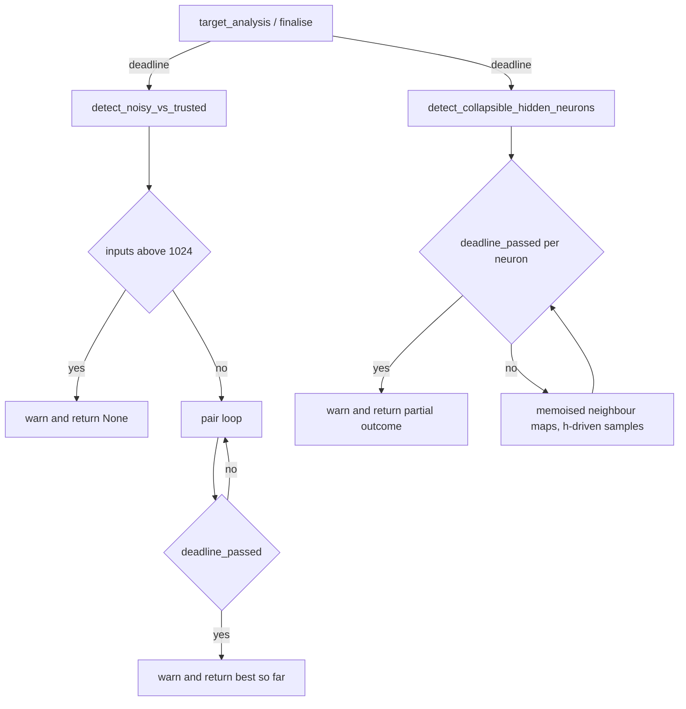

# PR Summary — Issue #2221

## Summary

Closes #2221 (part of #2169).

Neither structural-pattern detector in `src/analysis/synapse/structural_patterns.rs`
checked the analysis deadline. `detect_noisy_vs_trusted` scanned every pair of a
target's incoming inputs (quadratic in fan-in). `detect_collapsible_hidden_neurons`
rebuilt the neighbours' maps for every hidden neuron, so its cost was hidden
neurons × records. A hostile creature could therefore pin a worker past
`analysis_deadline_ms` and `cancel_discovery_session`.

- **Deadline threading:** both detectors now take `deadline: &Option<SystemTime>`.
  - `target_analysis/mod.rs` passes `&ctx.deadline`.
  - `FinaliseParams` gains a `deadline` field, which `orchestration.rs` fills.
- **Noisy-vs-trusted:** `MAX_INCOMING_INPUTS_FOR_NOISY_SCAN = 1024`.
  - Above the cap, it logs one `warn!` and returns `None`.
  - Inside the pair loop, `deadline_passed` is checked after the cheap filters. On expiry it logs one `warn!` and returns the best pair found so far.
- **Collapse:** `deadline_passed` is checked per hidden neuron. On expiry it logs one `warn!` and returns the outcome built so far, including the drop count.
  - Neighbour activation maps are memoised by UUID.
  - The sample loop is driven by `h`'s records, which removes the product cost.
- **Tests:** a new in-crate regression file with 7 `#[serial]` tests.
- **Ledger:** rows, capacity sites and the remediation note in the chunk-08b ledger. `POST_PROCESSING_FILES` goes from 4 to 5 and `EXPECTED_FILE_COUNT` from 59 to 60.
- **Docs:** one line in `docs/ANALYSIS_DEEP_DIVE.md`.
- `Cargo.toml` is not bumped by hand; CI does that.

## Evidence

This is a backend-only change, so the evidence is test output.

- **Before the fix,** the growth tests failed. Each takes the minimum of 5 runs, and the bound is `t_large <= t_small * 3`:
  - noisy growth: 5.41 ms at 1025 inputs vs 20.62 ms at 2050 (about 3.8×);
  - collapse growth: 1.19 s at 256 × 8192 vs 4.83 s at 512 × 16384 (about 4.1×).
- **After the fix,** all 7 tests in `issue_2169_test` pass in 0.20 s.
- The ledger suites `tests/issue_2103_*`, `tests/issue_2104_*` and `tests/issue_2105_*` pass.
- `./quality.sh` exits 0.

## Reproduction

- **Symptom:** a creature with a wide fan-in, or many 1-in/1-out hidden neurons with long record lists, keeps the structural-pattern scans running past the deadline and past `cancel_discovery_session`.
- **Status:** `verified`. The growth regression tests failed on the unfixed code with the timings above, and they pass after the fix.
- **Regression tests:** these tests in `src/analysis/synapse/issue_2169_structural_patterns_cancellation_test.rs` reproduce #2169:
  - `noisy_vs_trusted_cost_does_not_grow_quadratically`
  - `collapse_cost_does_not_grow_with_hidden_times_records`
- **Cap:** `noisy_vs_trusted_is_skipped_above_the_incoming_input_cap` pins both sides of the 1024 cap: a pair at the cap, none one past it.
- **Cancellation:** `expired_deadline_stops_noisy_vs_trusted_scan` and its collapse counterpart pin the deadline exits. Each first asserts its precondition (#1799).
- **Test file:** it is in-crate because the detectors are `pub(crate)`. It sits beside the #2161 precedent.

## Acceptance Criteria

<!-- vibe-spec-review inputs="diff+issue-body" -->

SPEC_PLACEHOLDER

## Standards Review

<!-- vibe-standards-review inputs="diff+CODING-STANDARDS.md" -->

This repo has no `CODING-STANDARDS.md`, so the reviewer used `CONTRIBUTING.md` and `AGENTS.md`.

STANDARDS_PLACEHOLDER

## Test Plan

- [x] Red: the growth tests fail on the unfixed code.
- [x] Green: all 7 `issue_2169_test` tests pass.
- [x] The existing `structural_patterns` tests pass, with only `&None` added.
- [x] The ledger suites (`issue_2103`, `issue_2104`, `issue_2105`) pass.
- [x] `cargo clippy --all-targets -- -D warnings`
- [x] `./quality.sh`
