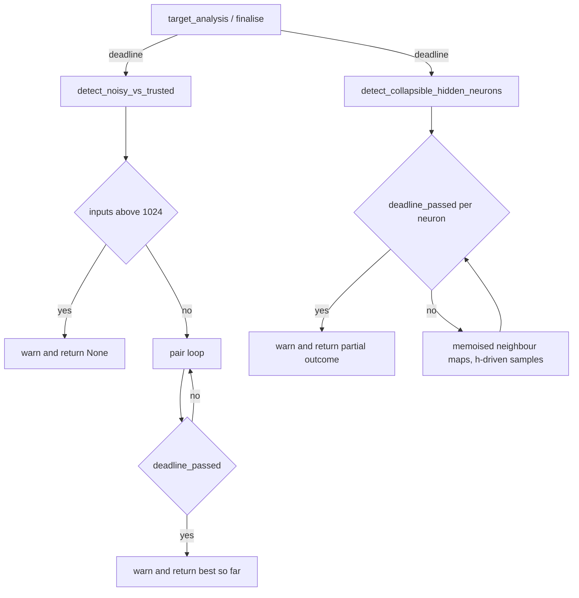

# PR Summary — Issue #2221

## Summary

Closes #2221 (part of #2169).

Neither structural-pattern detector in `src/analysis/synapse/structural_patterns.rs`
checked the analysis deadline. `detect_noisy_vs_trusted` scanned every pair of a
target's incoming inputs (quadratic in fan-in). `detect_collapsible_hidden_neurons`
rebuilt the neighbours' maps for every hidden neuron, so its cost was hidden
neurons × records. A hostile creature could therefore pin a worker past
`analysis_deadline_ms` and `cancel_discovery_session`.

- **Deadline threading:** both detectors now take `deadline: &Option<SystemTime>`.
  - `target_analysis/mod.rs` passes `&ctx.deadline`.
  - `FinaliseParams` gains a `deadline` field, which `orchestration.rs` fills.
- **Noisy-vs-trusted:** `MAX_INCOMING_INPUTS_FOR_NOISY_SCAN = 1024`.
  - Above the cap, it logs one `warn!` and returns `None`.
  - Inside the pair loop, `deadline_passed` is checked after the cheap filters. On expiry it logs one `warn!` and returns the best pair found so far.
- **Collapse:** `deadline_passed` is checked per hidden neuron. On expiry it logs one `warn!` and returns the outcome built so far, including the drop count.
  - Neighbour activation maps are memoised by UUID.
  - The sample loop is driven by `h`'s records, which removes the product cost.
- **Tests:** a new in-crate regression file with 7 `#[serial]` tests.
- **Ledger:** rows, capacity sites and the remediation note in the chunk-08b ledger. `POST_PROCESSING_FILES` goes from 4 to 5 and `EXPECTED_FILE_COUNT` from 59 to 60.
- **Docs:** one line in `docs/ANALYSIS_DEEP_DIVE.md`.
- `Cargo.toml` is not bumped by hand; CI does that.

## Evidence

This is a backend-only change, so the evidence is test output.

- **Before the fix,** the growth tests failed. Each takes the minimum of 5 runs, and the bound is `t_large <= t_small * 3`:
  - noisy growth: 5.41 ms at 1025 inputs vs 20.62 ms at 2050 (about 3.8×);
  - collapse growth: 1.19 s at 256 × 8192 vs 4.83 s at 512 × 16384 (about 4.1×).
- **After the fix,** all 7 tests in `issue_2169_test` pass in 0.20 s.
- The ledger suites `tests/issue_2103_*`, `tests/issue_2104_*` and `tests/issue_2105_*` pass.
- `./quality.sh` exits 0.

## Reproduction

- **Symptom:** a creature with a wide fan-in, or many 1-in/1-out hidden neurons with long record lists, keeps the structural-pattern scans running past the deadline and past `cancel_discovery_session`.
- **Status:** `verified`. The growth regression tests failed on the unfixed code with the timings above, and they pass after the fix.
- **Regression tests:** these tests in `src/analysis/synapse/issue_2169_structural_patterns_cancellation_test.rs` reproduce #2169:
  - `noisy_vs_trusted_cost_does_not_grow_quadratically`
  - `collapse_cost_does_not_grow_with_hidden_times_records`
- **Cap:** `noisy_vs_trusted_is_skipped_above_the_incoming_input_cap` pins both sides of the 1024 cap: a pair at the cap, none one past it.
- **Cancellation:** `expired_deadline_stops_noisy_vs_trusted_scan` and its collapse counterpart pin the deadline exits. Each first asserts its precondition (#1799).
- **Test file:** it is in-crate because the detectors are `pub(crate)`. It sits beside the #2161 precedent.

## Acceptance Criteria

<!-- vibe-spec-review inputs="diff+issue-body" -->

- **met** — the deadline reaches both detectors from every call site — evidence: `results.rs::FinaliseParams`, `orchestration.rs`, `target_analysis/mod.rs` — reviewer: met — reason: all three callers pass the deadline, and no other callers exist.
- **met** — a documented cap constant for the noisy scan — evidence: `structural_patterns.rs::MAX_INCOMING_INPUTS_FOR_NOISY_SCAN` — reviewer: met — reason: its doc comment gives the O(n²) reasoning.
- **met** — above the cap, one `warn!` and `None` — evidence: `structural_patterns.rs::detect_noisy_vs_trusted`, `issue_2169_test::noisy_vs_trusted_is_skipped_above_the_incoming_input_cap` — reviewer: met — reason: the reviewer noted that no test covered the cap, so a test was added for the at-cap (`Some`) and one-past (`None`) cases.
- **met** — a deadline check inside the pair loop that returns the best pair so far — evidence: `structural_patterns.rs::detect_noisy_vs_trusted`, `issue_2169_test::expired_deadline_stops_noisy_vs_trusted_scan` — reviewer: met — reason: the check runs after the cheap filters and before the expensive work, and it also honours cancellation.
- **met** — a deadline check in the collapse scan that returns a partial outcome — evidence: `structural_patterns.rs::detect_collapsible_hidden_neurons`, `issue_2169_test::expired_deadline_stops_collapse_scan` — reviewer: met — reason: the check runs per neuron, and the drops counted so far are kept.
- **met** — memoisation removes the hidden × records cost — evidence: `issue_2169_test::collapse_cost_does_not_grow_with_hidden_times_records` — reviewer: met — reason: neighbour maps are built once per call, and the sample walk is driven by the hidden neuron's own records.
- **met** — no cap on the collapse side — evidence: `structural_patterns.rs::detect_collapsible_hidden_neurons` — reviewer: met — reason: only the deadline bounds the collapse scan.
- **met** — regression tests fail before the fix and pass after — evidence: `issue_2169_test::noisy_vs_trusted_cost_does_not_grow_quadratically` and the other tests in the file — reviewer: met — reason: 4 tests failed on the unfixed code and all pass on the fixed code. Caveat: the noisy growth test times the cap path on the fixed code. The pair-loop bound is pinned by the expired-deadline test instead.
- **met** — output is unchanged when there is no deadline — evidence: `issue_2169_test::noisy_vs_trusted_output_is_unchanged_without_deadline`, `issue_2169_test::collapse_output_is_unchanged_without_deadline` — reviewer: met — reason: both pass on the unfixed and fixed code.
- **met** — existing tests change only by the new argument — evidence: `structural_patterns.rs::tests` — reviewer: met — reason: the only change is the added `&None` argument.
- **met** — the ledger rows and ledger tests are updated — evidence: `docs/audits/security-sweep-chunk-08b-synapse-scoring-recommendation.md`, `tests/issue_2105_chunk_08b_synapse_post_processing_sweep.rs::POST_PROCESSING_FILES` — reviewer: partial — reason: the `structural_patterns.rs` row keeps its baseline count of 700. This follows the ledger's baseline-count convention, as with the #2161 `candidate_generation.rs` row. The test-file row and the totals were updated to 522.
- **met** — the docs note — evidence: `docs/ANALYSIS_DEEP_DIVE.md` — reviewer: met with nits — reason: the reviewer flagged that the text said "memoises each neuron's activation map". It now says that only the shared source and target maps are memoised.
- **met** — `./quality.sh` passes — evidence: `./quality.sh` exit 0 — reviewer: not verified — reason: the reviewer did not run the gate. It was run afterwards and passed.
- **met** — no `Cargo.toml` or CI change — evidence: diff — reviewer: met — reason: neither file is touched.
- Unrequested, kept:
  - The ledger header and count edits, which keep the ledger's totals consistent.
  - `#[serial]` and the file-level `cast_precision_loss` allow, which are needed for the global cancellation flag and the timing ratios.
- Unrequested, fixed: `build_act_map` sat under the tests banner. It has been moved above the banner.

## Standards Review

<!-- vibe-standards-review inputs="diff+CODING-STANDARDS.md" -->

This repo has no `CODING-STANDARDS.md`, so the reviewer used `CONTRIBUTING.md` and `AGENTS.md`.

- **stands** — ratio timing assertions in unit tests — evidence: `issue_2169_test::noisy_vs_trusted_cost_does_not_grow_quadratically`, `issue_2169_test::collapse_cost_does_not_grow_with_hidden_times_records` — reviewer: violation — reason: the issue asks for them. They compare two readings of the same work, never a constant, which follows the #530 `assertLinearGrowth` and #2161 precedents.
- **fixed** — a cap test that passes either way (#1799) — evidence: `issue_2169_test::noisy_vs_trusted_is_skipped_above_the_incoming_input_cap` — reviewer: violation — reason: the cap now has its own test, which checks at the cap (`Some`) and one past it (`None`).
- **stands** — `cache.get` misses are skipped without a log — evidence: `structural_patterns.rs::detect_collapsible_hidden_neurons` — reviewer: nit — reason: this is existing behaviour that was only moved. The new exits (cap and deadline) each log a `warn!`.
- **fixed** — the deep-dive line overstated the memoisation — evidence: `docs/ANALYSIS_DEEP_DIVE.md` — reviewer: nit — reason: it now names the shared source and target maps.
- **fixed** — the ledger capacity row described the old map building — evidence: `docs/audits/security-sweep-chunk-08b-synapse-scoring-recommendation.md` — reviewer: nit — reason: it now says the maps are memoised per shared source and built once per hidden neuron.
- **clean** — Australian English, citations by symbol, the forward-only and atomic-record invariants, CI and `Cargo.toml` untouched, and the arithmetic — reviewer: clean.

## Test Plan

- [x] Red: the growth tests fail on the unfixed code.
- [x] Green: all 7 `issue_2169_test` tests pass.
- [x] The existing `structural_patterns` tests pass, with only `&None` added.
- [x] The ledger suites (`issue_2103`, `issue_2104`, `issue_2105`) pass.
- [x] `cargo clippy --all-targets -- -D warnings`
- [x] `./quality.sh`
