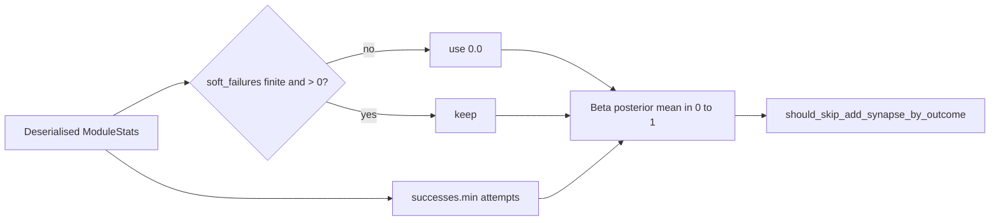

# PR Summary — Issue #2222

## Summary

`ModuleStats::success_rate()` is now total and bounded in [0, 1] for any
field values. `successes` is clamped to `attempts` before the `u32`
subtraction, so a deserialised `successes > attempts` can no longer underflow
(panic in debug, wrap to ~4.29e9 failures in release). A non-finite or
negative `soft_failures` counts as `0.0`, including in the no-data early
return, so NaN keeps the 0.5 prior and `-12.0` no longer produces `+inf`. Rates
for well-formed records are unchanged. `record()`, `record_candidates()` and
the gate signatures are untouched. Defence in depth under the FFI-boundary
validator (the next #2170 sub-issue). Closes #2222.

## Evidence

Backend-only change, no UI. Evidence is test output:

- `cargo test --test issue_2170_module_tracker_untrusted_stats` failed 3 of 4
  before the fix (`attempt to subtract with overflow`, `got inf`, `got NaN`)
  and passes 4/4 after.
- `cargo test --lib module_weights` passes 6/6. `cargo test --test analysis`
  passes 652/652, and `cargo test --lib add_synapse_gating` passes 19/19. The
  existing tests were not modified.

## Reproduction

- **symptom** — a deserialised tracker with `attempts: 10, successes: 20` panicked with `attempt to subtract with overflow` (and in release forced the add-synapse gate closed), and `soft_failures: -12.0` gave a `+inf` rate (NaN gave NaN), failing the gate open
- **status** — `verified` — the regression test was observed failing against the unfixed code (overflow panic, `+inf`, NaN) and passing after the fix
- **regression test** — `tests/issue_2170_module_tracker_untrusted_stats.rs::successes_above_attempts_matches_the_well_formed_record`, `::negative_soft_failures_are_ignored` and `::non_finite_soft_failures_are_ignored`. Each reproduces one fault.

## Acceptance Criteria

<!-- vibe-spec-review inputs="diff+issue-body" -->

- **met** — `success_rate()` never panics and always returns a finite value in [0, 1] for any `attempts`, `successes` and `soft_failures` — evidence: `src/analysis/module_weights.rs::tests::success_rate_clamps_successes_to_attempts` — reviewer: met
- **met** — (10, 20) and (10, 10) give identical rates and identical `should_skip_add_synapse_by_outcome` results at threshold `0.01` — evidence: `tests/issue_2170_module_tracker_untrusted_stats.rs::successes_above_attempts_matches_the_well_formed_record` — reviewer: met
- **met** — `soft_failures` of `-12.0`, NaN or `±inf` gives a finite rate in [0, 1] — evidence: `tests/issue_2170_module_tracker_untrusted_stats.rs::negative_soft_failures_are_ignored`, `::non_finite_soft_failures_are_ignored` — reviewer: met
- **met** — well-formed rates are unchanged, and the existing `module_weights` and `add_synapse_gating` tests pass unmodified — evidence: `src/analysis/module_weights.rs::tests::success_rate_well_formed_records_are_unchanged`, `cargo test --test analysis` 652 passed — reviewer: met
- **met** — `tests/issue_2170_module_tracker_untrusted_stats.rs` exists, fails against the pre-fix code and passes after — evidence: 3 failures observed pre-fix, 4/4 pass after — reviewer: met
- **met** — `cargo fmt --check`, `cargo clippy --all-targets -- -D warnings` and `cargo test` pass — evidence: `./quality.sh` run after the final edit — reviewer: met — reason: the reviewer could not run cargo and judged from the code. The gate was run here.

## Standards Review

<!-- vibe-standards-review inputs="diff+CODING-STANDARDS.md" -->

- **clean** — `CODING-STANDARDS.md` is absent, so the reviewer used `CONTRIBUTING.md`/`AGENTS.md`. It checked the underflow fix, NaN/inf/negative handling, the unchanged well-formed rates, outcome-style tests with well-formed twins, no test-only public API, Australian English, and no new `unsafe`/`unwrap` or dependency, CI or FFI changes. Optional notes: it suggested dropping the inline unit tests as duplicates, which were kept because the issue asks for them in `module_weights.rs`. It also doubted the FFI wording in the test helper comment, which was kept because `src/ffi_types/requests.rs` carries `module_outcome_tracker`.

## Test Plan

- Added `tests/issue_2170_module_tracker_untrusted_stats.rs` (4 tests: the (10, 20) parity check, negative, `f64::MAX` and non-finite `soft_failures`). With `f64::MAX` the rate is recorded below `0.01`, so the gate closes.
- Added an inline `#[cfg(test)] mod tests` in `src/analysis/module_weights.rs` (5 tests: well-formed rates unchanged, the clamped subtraction, and negative, NaN/`±inf` and `f64::MAX` `soft_failures`).
