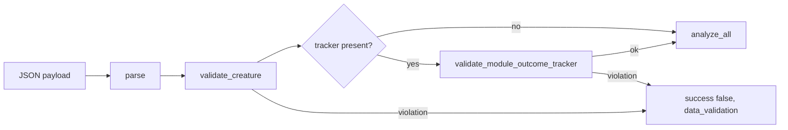

# PR Summary — Issue #2223

## Summary

`analyze_parallel_internal` now validates the caller-supplied
`ModuleOutcomeTracker` straight after `validate_creature` and before any
analysis. The payload is rejected with `success: false` and
`errorKind: "data_validation"` when any module has `successes > attempts`, or a
`softFailures` that is non-finite, negative or above `u32::MAX`. The tracker is
never silently repaired. The error names the field and echoes at most 64
characters of the attacker-controlled module name, cut on a `char` boundary.
The docs and the chunk-8b audit ledger are updated to match. Closes #2223.

- `src/ffi_types/module_tracker_validation.rs` (new): `validate_module_stats`,
  `validate_module_outcome_tracker`, `MODULE_NAME_DETAIL_MAX_CHARS`. It is wired
  in `src/ffi_types/mod.rs` and `src/lib.rs` the same way as
  `validate_creature`.
- `src/ffi_internal/analysis.rs`: the tracker check is chained onto the
  existing `validate_creature` failure branch, so it returns the same failure
  shape.
- `docs/FFI_API.md`: new `#### Module Outcome Tracker (Issue #2170)`
  subsection, and the `analyze_parallel` validation-table row now lists the
  check.
- `docs/audits/security-sweep-chunk-08b-synapse-scoring-recommendation.md`: the
  two #2170 rows now read bounded or fixed.

## Evidence

This is a backend-only change with no UI. Evidence comes from
`tests/issue_2170_module_tracker_untrusted_stats.rs` (14 tests pass, 4
pre-existing and 10 new) and a clean `./quality.sh` run.

## Reproduction

- **symptom** — `analyze_parallel_internal` returned `success: true` and
  computed the gate from a corrupt tracker (`attempts: 10, successes: 20`,
  `softFailures: -12.0`, `softFailures: 1.797e308`).
- **status** — `verified` — the three `analyze_parallel_rejects_*` tests were
  run against the unwired boundary and failed with `success: true`. The
  truncation test failed too. All four pass after the fix.
- **regression test** —
  `tests/issue_2170_module_tracker_untrusted_stats.rs::analyze_parallel_rejects_successes_above_attempts`,
  `::analyze_parallel_rejects_negative_soft_failures`,
  `::analyze_parallel_rejects_soft_failures_above_u32_max`,
  `::error_detail_truncates_a_long_module_name`

## Acceptance Criteria

<!-- vibe-spec-review inputs="diff+issue-body" -->

- **met** — `analyze_parallel_internal` rejects each invalid tracker case with
  `success: false` and `errorKind: "data_validation"`, before any analysis runs
  — evidence:
  `tests/issue_2170_module_tracker_untrusted_stats.rs::analyze_parallel_rejects_successes_above_attempts`,
  `::analyze_parallel_rejects_negative_soft_failures`,
  `::analyze_parallel_rejects_soft_failures_above_u32_max`,
  `::validate_module_stats_rejects_non_finite_soft_failures` — reviewer: met
- **met** — well-formed and absent trackers behave exactly as before, and
  existing FFI tests pass unmodified — evidence:
  `::analyze_parallel_accepts_a_well_formed_tracker`,
  `::analyze_parallel_is_unaffected_by_a_missing_tracker`, and the full
  `./quality.sh` pass — reviewer: met
- **met** — the error detail truncates the module name, and no unbounded caller
  string is echoed — evidence: `src/ffi_types/module_tracker_validation.rs`
  (`char_prefix`), `::error_detail_truncates_a_long_module_name` — reviewer: met
- **met** — `docs/FFI_API.md` documents the tracker rules and lists the check in
  the validation table — evidence: `docs/FFI_API.md`
  `#### Module Outcome Tracker (Issue #2170)` and the `analyze_parallel` row —
  reviewer: met
- **met** — the chunk-8b ledger row reads bounded or fixed for #2170, and the
  pinned tokens stay in the section — evidence:
  `docs/audits/security-sweep-chunk-08b-synapse-scoring-recommendation.md`, and
  `tests/issue_2105_chunk_08b_synapse_post_processing_sweep.rs` passes
  unmodified — reviewer: met
- **met** — `cargo fmt --check`, clippy `-D warnings`, `cargo test` and the
  markdown lint pass — evidence: `./quality.sh` reported "All quality checks
  passed!" after the code change, and `cargo fmt --check` plus the touched
  tests were re-run after the final comment edit — reviewer: partial — reason:
  the reviewer only saw the diff and could not run cargo ("partial
  (unverified)"). The gate was run here and passed.
- **partial** — step 1, a new `iter()` accessor on `ModuleOutcomeTracker` —
  evidence: `src/analysis/module_weights.rs:164` `all_stats()` — reviewer:
  partial — reason: the issue says the map cannot be walked today, but the
  existing `pub fn all_stats(&self) -> &HashMap<String, ModuleStats>` already
  does this read-only. The validator reuses it rather than adding a duplicate
  accessor (DRY).
- **unrequested** — crate-root re-export of `validate_module_outcome_tracker`,
  `validate_module_stats` and `MODULE_NAME_DETAIL_MAX_CHARS` in `src/lib.rs` —
  reviewer: unrequested — reason: the issue specifies `pub fn` wired "like
  `creature_validation`", which is re-exported at the crate root, and the
  integration tests call `validate_module_stats` directly.
- **unrequested** — extra boundary tests (`validate_module_stats_accepts_the_boundaries`,
  `validate_module_stats_rejects_soft_failures_just_above_u32_max`,
  `validate_module_outcome_tracker_checks_every_module`) — reviewer:
  unrequested — reason: they pin the exact edges of the stated rules (a value
  exactly at `u32::MAX` passes, just above fails) and check that every module
  in the tracker is validated.

## Standards Review

<!-- vibe-standards-review inputs="diff+CODING-STANDARDS.md" -->

This repo has no `CODING-STANDARDS.md`, so the reviewer was given
`CONTRIBUTING.md` and `AGENTS.md` instead.

- **violation** — "Do not make APIs public just for testing": the validator
  functions and constant are `pub` and re-exported at the crate root — evidence:
  `src/lib.rs:102`, `src/lib.rs:152-153`, `src/ffi_types/mod.rs:28-30` —
  reason: stands. Issue #2223 explicitly asks for `pub fn` wired with
  `pub use` like `creature_validation` (itself crate-root public), and for the
  NaN and `inf` cases to be tested in Rust from
  `tests/issue_2170_module_tracker_untrusted_stats.rs`.
- **violation** — no `pr-summary-2223.md` in the diff — evidence:
  `docs/archive/pr-summaries/` — reason: fixed. This file is that summary.
- **clean** — Australian English; validation runs before business logic
  (before `build_analyze_all_input_from_parallel`, `AnalysisActiveGuard` and
  `analyze_all`); fail-loud with no silent repair; same `AnalyzeParallelOutput`
  failure shape; no unbounded caller string echoed; tests drive real code and
  assert on response fields; well-formed trackers from `record()` and
  `record_soft_failures()` pass; docs table updated; no CI or config changes.
  Optional note acted on: the `MAX_SOFT_FAILURES` comment wrongly said
  candidate counts were `u32`, and it is now corrected.

## Test Plan

Tests appended to `tests/issue_2170_module_tracker_untrusted_stats.rs`:

- `analyze_parallel_rejects_successes_above_attempts`
- `analyze_parallel_rejects_negative_soft_failures`
- `analyze_parallel_rejects_soft_failures_above_u32_max`
- `analyze_parallel_accepts_a_well_formed_tracker`
- `analyze_parallel_is_unaffected_by_a_missing_tracker`
- `validate_module_stats_accepts_the_boundaries`
- `validate_module_stats_rejects_non_finite_soft_failures` (NaN, `+inf`, `-inf`)
- `validate_module_stats_rejects_soft_failures_just_above_u32_max`
- `validate_module_outcome_tracker_checks_every_module`
- `error_detail_truncates_a_long_module_name`

Also run: `tests/issue_2105_chunk_08b_synapse_post_processing_sweep.rs`,
`tests/issue_2103_chunk_08b_ledger_scaffold.rs`,
`tests/issue_1256_public_api_surface.rs`, `cargo clippy --all-targets -- -D
warnings`, and `./quality.sh`.

🤖 Generated with [Claude Code](https://claude.com/claude-code)
