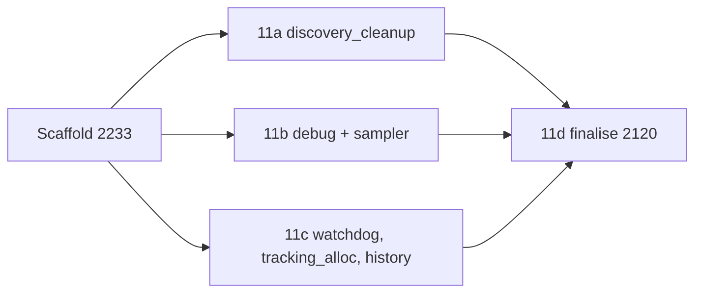

# PR summary — Issue #2233

## Summary

Sets up the shared chunk 11 sweep record so that the audit sub-issues #2117,
#2118, #2119 and #2120 can each write into their own part of it without their
PRs conflicting. Closes #2233.

- **Record.** Adds `docs/audits/security-sweep-chunk-11-filesystem-lifecycle.md`,
  built from the template.
  - Record fields: chunk `11`, sweep date `2026-09-27`, full baseline
    `b85a551ed2521ed327469b20eb88aeda828357d2`, exposure `local` and tracker
    `#2095`.
  - The seven defect classes the issue lists.
  - Three `###` file sections holding eight rows, every one `pending`.
  - Two finding tables with header rows only. Each is followed by the three
    `<!-- section: … -->` markers in order.
  - An "Issues filed" placeholder that defers to #2120, and one line each for
    #1902–#1906 under "Related remediations".
- **Index.** The chunk `11` line in `docs/audits/lib-sweep-coverage.json` now
  sets `last_swept`, `baseline_commit` and `record`. It is still one line and
  the keys are in their original order.
- **Test.** Adds `tests/issue_2233_chunk_11_ledger_scaffold.rs`, which checks:
  - the record exists and contains the full SHA;
  - each of the eight paths appears exactly once, under its own heading;
  - both tables carry the markers in order;
  - the index entry names the record.

  It deliberately does not check for `pending`.
- **Deliberate departure.** The issue asked for `file:line` columns. The
  tables use `file.rs::symbol` instead, because CONTRIBUTING.md says to cite
  code by symbol, never by line number (Issue #1942). The chunk 8b record
  already does this, and the new record explains why.

## Evidence

This change is docs and a test, with no UI.

- **Test first.** All four tests failed before the record existed and the
  index was updated. After the change, all four pass, and the ledger contract
  test `tests/issue_2088_sweep_ledger_contract.rs` still passes 9/9.
- **Mutation checks for acceptance criterion 3.** These were run locally, and
  the record was restored after each one:
  - With the `src/debug/sample_dir.rs` row deleted,
    `each_in_scope_file_has_exactly_one_row_under_its_owning_section` fails.
  - With the second `<!-- section: debug + sampler -->` marker deleted,
    `both_finding_tables_carry_the_section_markers_in_order` fails. The failure
    names `## Re-verified remediations`.
  - With the first table's `discovery_cleanup` and `debug + sampler` markers
    swapped, the same test fails. The failure names
    `## Filesystem mutation sites`.
- **Gate.** The first `./quality.sh` run failed on `clippy::map_unwrap_or` in
  the new test. I changed that call to `map_or_else` and re-ran the gate.

## Acceptance Criteria

<!-- vibe-spec-review inputs="diff+issue-body" -->

- Record at the exact path, built from the template, with no edit to the
  README or the template — reviewer: met
- Record fields: chunk id, name, ISO date, full SHA, exposure `local` and
  tracker #2095 — reviewer: met
- Seven defect classes, with #1902–#1906 as related remediations —
  reviewer: met
- "Issues filed" placeholder citing #2120, and no `negative-result` —
  reviewer: met
- Three `###` headings with eight `pending` rows — reviewer: met
- Header for the filesystem mutation sites table — reviewer: partial —
  reason: deliberate. `file.rs::symbol` replaces `file:line`, following
  CONTRIBUTING.md's rule to cite by symbol (Issue #1942), and the record
  explains why.
- Header for the re-verified remediations table — reviewer: partial —
  reason: the same deliberate `file.rs::symbol` departure as above.
- Both tables have no data rows and the three markers in order — reviewer: met
- Index line for chunk 11: one line, keys in order, with the date, full SHA
  and record — reviewer: met
- Test checks the record exists and has the SHA, each path appears exactly
  once under its heading, the markers are in order and the index names the
  record, with no `pending` check — reviewer: met
- AC1, the record's shape — reviewer: partial — reason: the only gap the
  reviewer found is the column-header departure above, which is deliberate.
- AC2, the index is correct and the 2088 test passes — reviewer: met —
  reason: the reviewer needed runtime evidence, and the 2088 test passes 9/9
  locally.
- AC3, the test fails when a path row or marker is deleted — reviewer:
  partial — reason: the reviewer only saw the diff. The mutation checks under
  Evidence show the failure.
- AC4, `./quality.sh` passes — reviewer: partial — reason: needs runtime
  evidence. See Test Plan.
- `### Sweep status — IN PROGRESS` note — reviewer: unrequested — reason:
  kept, because it tells the sub-issues that `last_swept` marks when the
  scaffold was cut, not a finished sweep.
- `### Why the finding tables cite symbols` note — reviewer: unrequested —
  reason: kept, because it records the departure in the doc itself.
- Swept by, Outcome and Verify this record sections — reviewer: unrequested —
  reason: the template requires all three. The Swept by wording now names
  each sub-issue's chunk letter.
- One-line descriptions of each defect class, and the "line counts as at
  baseline" note — reviewer: unrequested — reason: kept, because they are
  short clarifications that help the auditors.
- Index test also pins `baseline_commit` — reviewer: unrequested — reason:
  kept, because it is a one-line check that the index and the record stay in
  step.

## Standards Review

<!-- vibe-standards-review inputs="diff+CODING-STANDARDS.md" -->

This repo has no `CODING-STANDARDS.md`, so the reviewer used `CONTRIBUTING.md`
and `AGENTS.md` instead.

Violations:

- `docs/archive/pr-summaries/pr-summary-2233.md:1` — CONTRIBUTING.md
  § PR Summary File — the reviewed diff had no PR summary yet. This file
  resolves it.

Clean:

- Australian English: finalisation, finalised and deserialisation are spelled
  that way.
- Code is cited by symbol, never by line number.
- Testing doctrine:
  - the tests are in `tests/`;
  - they check observable content;
  - they have no timing assertions.
- No `NEAT_AI_DISCOVERY_*` or config surface is added.
- `.github/workflows/ci.yml` is untouched.
- No dependency changes.
- The version bump is left to CI's `version-increment` job.

## Test Plan

- [x] `cargo test --test issue_2233_chunk_11_ledger_scaffold --test
      issue_2088_sweep_ledger_contract`
- [x] Mutation checks on a row deletion, a marker deletion and a marker
      reorder
- [x] `cargo clippy --all-targets --all-features -- -D warnings`
- [x] `./quality.sh`
