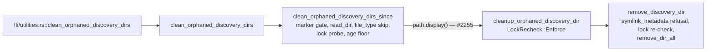

## Summary

Chunk 11a-2 of the #2095 security sweep: read all 798 lines of
`src/discovery_cleanup.rs` and filled its `discovery_cleanup` rows in
`docs/audits/security-sweep-chunk-11-filesystem-lifecycle.md`. That covers the
per-file outcome, the eleven listed mutation sites plus the lossy
`display()` hand-off, probes (a)–(d), the `discovery.lock` writer disposition
and the #1903 re-verification. Canary tests pin probes (a) and (c). Two
findings were filed and linked in the ledger and on #2095. `src/` is
untouched. Closes #2234.

- **#2255** — the orphan sweep passes `path.display().to_string()` to the
  removal step. A non-UTF-8 name becomes U+FFFD, so the removal hits a
  literal-U+FFFD sibling that the #1903 age floor never checked, and the real
  orphan is reported as `already_gone`. Reproduced.
- **#2256** — `discovery.lock` has no in-tree writer, and NEAT-AI's
  `DiscoveryCleanup.ts` writes `.discovery.lock`. The FFI sweep would therefore
  delete live NEAT-AI sessions. NEAT-AI does not bind the FFI sweep today.
  Reproduced.

Probe (a), the symlinked root, is **accepted**. The root defaults to
`.discovery` in the caller's own working directory, and the blast radius is
limited to lock-less children of the link target.

## Evidence

Backend and docs only, so there is nothing to screenshot. The new tests drive
the public cleanup API against `tempfile` trees and assert that every canary
still exists:

## Acceptance Criteria

<!-- vibe-spec-review inputs="diff+issue-body" -->

- **met** — `src/discovery_cleanup.rs` row non-`pending` with a reason; all eleven mutation sites have symlink-safe verdicts inside the `discovery_cleanup` section only — evidence: `docs/audits/security-sweep-chunk-11-filesystem-lifecycle.md` (`### discovery_cleanup`, `<!-- section: discovery_cleanup -->` rows), `tests/issue_2233_chunk_11_ledger_scaffold.rs` passes — reviewer: met — reason: the reviewer noted that the `remove_discovery_dir` and gate rows named only `temp_dir` as the root. They now also name the swept `<base_dir>/<child>`
- **met** — #1903 row records its citing references and a live-path verdict — evidence: `## Re-verified remediations` #1903 row — reviewer: met — reason: it cites `file.rs::symbol` rather than `file:line`, per CONTRIBUTING.md § Cite Code by Symbol (#1942) and the record's own stated rule, which the reviewer accepted as a documented choice
- **met** — `discovery.lock` writer disposition recorded with evidence — evidence: ledger `discovery.lock` writer bullet, finding #2256 — reviewer: met
- **met** — probe (a) and probe (c) tests assert the canary outside the root still exists — evidence: `tests/issue_2095_cleanup_symlinked_root.rs::symlinked_root_sweeps_only_orphans_under_its_target`, `tests/issue_2095_cleanup_entry_names.rs::crafted_orphan_names_are_removed_and_the_canary_beside_the_root_survives` — reviewer: met
- **met** — probe (d) cites its existing test and names its canary — evidence: ledger probe (d) bullet citing `tests/issue_1903_orphan_sweep_lock_recheck.rs::dangling_symlink_lock_is_not_orphaned` — reviewer: met
- **met** — probe (b) has a written disposition citing the std doc — evidence: ledger probe (b) bullet — reviewer: met — reason: the reviewer's misquote nit is fixed, and the quote is now verbatim
- **met** — L449 lossy-path case filed as a finding — evidence: #2255, the ledger's `display()` mutation row — reviewer: met
- **met** — surviving findings filed with `security`, `lang:rust`, `severity:*`, `confidence:*` and a failing-first test, and linked in the ledger and on #2095 — evidence: #2255, #2256, and the comment on #2095 — reviewer: met
- **met** — `./quality.sh` passes — evidence: full gate run locally after the final edit — reviewer: missing — reason: the reviewer saw only the diff and could not run the gate. It was run here and passed
- **unrequested** — the probe (c) test also covers `...`, dash-led, newline and bidi-override names — reviewer: unrequested — reason: these are the crafted names probe (c) is about, and they are cheap to add beside the required unicode name
- **unrequested** — `tests/issue_2095_cleanup_symlinked_root.rs::symlinked_root_still_skips_symlinked_children` — reviewer: unrequested — reason: it pins that accepting a followed root (probe a) does not widen to following child links. The existing in-module test covers only a plain root
- **unrequested** — the scope of finding #2256 includes the NEAT-AI `.discovery.lock` mismatch — reviewer: unrequested — reason: the mismatch is the evidence that the ownership signal is unenforced, which the issue asked to decide. It was checked against NEAT-AI `src/discovery/DiscoveryCleanup.ts` via `gh api`

## Standards Review

<!-- vibe-standards-review inputs="diff+CODING-STANDARDS.md" -->

- **violation** — PR summary file missing from the reviewed diff (CONTRIBUTING.md § PR Summary File) — evidence: `docs/archive/pr-summaries/pr-summary-2234.md` — reason: fixed. This file is committed with the PR
- **clean** — symbol citations with no line numbers (#1942); edits confined to the `discovery_cleanup` section and markers; tests drive the public API with non-vacuous positive preconditions and no timing; no `src/`, CI or dependency change; Australian English; clippy, fmt and markdownlint clean. The optional `#![cfg(unix)]` for the entry-names test is applied

## Test Plan

- Added `tests/issue_2095_cleanup_symlinked_root.rs`: a symlinked `.discovery` root sweeps only the target's orphan, and the canary outside the link and target, the target, a locked session and the link all survive. A child link behind a followed root is still skipped, and its canary survives.
- Added `tests/issue_2095_cleanup_entry_names.rs`: crafted-name orphans (unicode, `...`, `-rf`, newline, bidi override) are removed, and a lock-less canary beside the root survives.
- Existing guards still pass: `tests/issue_2233_chunk_11_ledger_scaffold.rs`, `tests/issue_2088_sweep_ledger_contract.rs`, `tests/issue_1903_orphan_sweep_lock_recheck.rs`.
- `./quality.sh < /dev/null` passes.

🤖 Generated with [Claude Code](https://claude.com/claude-code)
