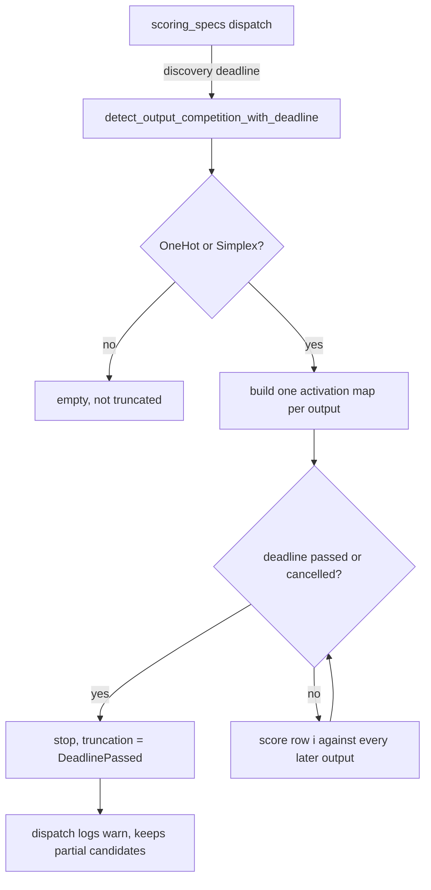

# PR Summary — Issue #2236

## Summary

Closes #2236.

`detect_output_competition` (in `src/analysis/recommendation/output_competition.rs`) ran an O(outputs²) pair
scan with no deadline and no cancellation check (SEC-a18ba35740ab, CWE-834).
Dispatch checks the deadline only before a module starts (#1029), so a wide
`OneHot`/`Simplex` creature could hold an analysis worker past its budget and
ignore host cancellation (#1047). The scan also rebuilt the second output's
`obs_index → activation` map once per pair.

- [x] Add `detect_output_competition_with_deadline`, returning the existing
      `BoundedScan` (from #2190). It checks `deadline_passed` (deadline or
      cancellation) at the top of every outer row, stops there, and reports
      `ScanTruncation::DeadlinePassed`.
- [x] Build each output's activation map once, before the pair loop.
      `co_activation` now takes the prebuilt map.
- [x] The `scoring_specs.rs` dispatch passes the discovery deadline in and logs
      a `warn!` when the scan stops early, so a partial scan never reads as
      complete.
- [x] `detect_output_competition` stays as a deadline-free wrapper.
      #2185 behaviour is unchanged: a non-finite score is `None` and the gain
      is clamped to `[0, COMPETITION_GAIN_SCALE]`.
- [x] Ledger entry in
      `docs/audits/security-sweep-chunk-08b-synapse-scoring-recommendation.md`.
      Version bumped to `0.74.265`.

## Evidence

This is a backend-only change, so there is no visual evidence. The behaviour is
pinned by `tests/issue_2236_output_competition_deadline.rs`, which runs
alongside the existing `tests/recommendation/issue_1321_*` and
`tests/recommendation/issue_2185_*` suites.

## Security-Fix Evidence

- **Test file changed in the diff:** `tests/issue_2236_output_competition_deadline.rs`
  (new).
- **Regression test:**
  `tests/issue_2236_output_competition_deadline.rs::elapsed_deadline_returns_without_scanning_and_reports_truncation`.
  On a 64-output creature, where all 2,016 pairs are candidates, an elapsed
  deadline returns no candidates and reports `ScanTruncation::DeadlinePassed`.
  Companion tests:
  - `far_future_deadline_yields_every_candidate_and_no_truncation`: a live
    deadline still yields every candidate and matches the deadline-free entry
    point.
  - `non_competing_topology_is_not_reported_as_truncated`.
  - All three are deterministic: `UNIX_EPOCH` and now + 24h, with no sleeps or
    timing thresholds.
- **Fails before the fix, passes after:** on the unfixed code the test file
  does not compile (`error[E0432]: unresolved import
  …::output_competition::detect_output_competition_with_deadline`), because
  there was no way to bound the scan. After the fix, all 3 tests pass.
- **Trigger closed, no trivial bypass:**
  - The only production caller, the `scoring_specs.rs` dispatch, now always
    passes the discovery deadline.
  - The check runs on every outer row, so the overrun after the deadline is
    bounded to one row of O(outputs) pairs.
  - `deadline_passed` also reports global cancellation, so a host cancel stops
    the scan too.
  - The deadline-free wrapper is left only for existing tests, and it still
    honours cancellation through the same check.

## Test Plan

- [x] `cargo test --test issue_2236_output_competition_deadline`: 3 passed.
      It failed to compile before the fix.
- [x] `cargo test --test recommendation`: 249 passed, including the 1321 and
      2185 output-competition suites.
- [x] `cargo test --lib -- output_competition module_dispatch_specs`: 9 passed.
- [x] `cargo clippy --all-targets --all-features -- -D warnings`: clean.
- [x] `./quality.sh`: passed (exit 0, 5,730 tests, 0 failed).
      - The first run hit one failure in the unrelated timing-ratio test
        `issue_2161_test::locality_grouping_cost_does_not_grow_quadratically`,
        which lives in `src/analysis/synapse` and is untouched by this change.
      - That test passed 3/3 in isolation, and the full gate passed on the
        rerun.
