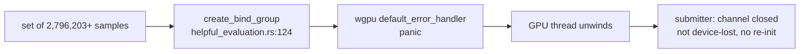

## Summary

This PR sweeps `src/analysis/gpu/helpful_evaluation.rs` and
`src/analysis/gpu/harmful_evaluation.rs` against checks 1–7 of #2112. It writes
the verdicts into the `evaluation` region of
`docs/audits/security-sweep-chunk-9-gpu-wgsl.md`:

- a shared dispatch/binding-limit and queue-classification verdict, which #2238
  will cite;
- one check table per module;
- the `copy_size` readback chain;
- the ledger and refuted rows;
- final `## Files swept` outcomes for both files.

Two findings survive, and each is filed as its own issue in house format:

- **#2313** — `SEC-d3bf886bc1d3`, CWE-248, medium. When a map wait times out,
  the `?` return drops `map_receivers` before the staging buffers. Dropping a
  buffer whose map is still pending runs its `map_async` callback inline with
  `MapAborted`. The callback's `.expect("Failed to send map_async result")`
  then panics. With two or more mappings outstanding, the second callback panics
  during unwind, and the host process aborts. The routine trigger is
  `remaining_secs()` flooring a budget under one second to a 0 s wait.
- **#2314** — `SEC-1a9af762e205`, CWE-1284, low. The 48-byte
  `HelpfulContribution` binding exceeds the 128 MiB
  `max_storage_buffer_binding_size` at 2,796,203 samples (harmful: 8,388,609),
  far before the 16,776,961-sample dispatch limit. wgpu 30's default handler
  **panics** instead of returning `Err`, so `is_device_lost_error` is never
  consulted and nothing re-initialises the device.

Everything else is refuted with a `file:line`: the `usize as u32` casts, the pool
and staging readback ranges, output initialisation, map-wait `Err` propagation,
and `merge_batch_results`. Each fix, with its failing-first test, ships through
its finding's own issue.

Closes #2237.

## Evidence

This is a documentation and audit change with no UI.
`tests/issue_2237_chunk_09_evaluation_sweep.rs` pins the record to real code:

- It recomputes each first-failing set length from `wgpu::Limits::default()`
  and the host struct sizes.
- It calls `cap_gpu_batch_size_by_bytes` to show that an oversized set is still
  admitted on its own.
- It feeds the messages the record quotes to `is_device_lost_error`.

All 7 tests failed against the pre-change record and pass now. `./quality.sh`
passed.

## Acceptance Criteria

<!-- vibe-spec-review inputs="diff+issue-body" -->

- **met** — The helpful and harmful sub-sections each have a verdict for checks 1–6 (finding `#N`, or refuted with a `file:line`) — evidence: `tests/issue_2237_chunk_09_evaluation_sweep.rs::helpful_and_harmful_tables_give_checks_1_to_6_a_verdict` — reviewer: met — reason: the reviewer's wording nits on harmful check 3's cast order and on check 6's verdict were fixed in this diff
- **met** — The `partial_sums_size` → `used.push` → `copy_buffer_to_buffer` → `slice(0..copy_size)` chain is written out with line numbers and a verdict — evidence: `tests/issue_2237_chunk_09_evaluation_sweep.rs::copy_size_chain_is_written_out_with_line_numbers` — reviewer: met
- **met** — The dispatch/binding-limit verdict names the limit that trips first, says wgpu 30 panics rather than returning `Err`, and says whether `is_device_lost_error` matches, citing the pattern — evidence: `tests/issue_2237_chunk_09_evaluation_sweep.rs::limit_table_matches_wgpu_default_limits_and_struct_strides`, `::queue_classification_verdict_matches_is_device_lost_error` — reviewer: met
- **met** — Every surviving finding has its own issue linked from a `## Ledger` row, and every refuted candidate is in the refuted table — evidence: #2313, #2314; `tests/issue_2237_chunk_09_evaluation_sweep.rs::ledger_and_refuted_regions_carry_the_slice_rows` — reviewer: met
- **met** — Neither file's `## Files swept` row still reads `pending` — evidence: `tests/issue_2237_chunk_09_evaluation_sweep.rs::helpful_and_harmful_inventory_rows_are_no_longer_pending` — reviewer: met
- **met** — `./quality.sh` passes — evidence: full gate run after the final edit, "All quality checks passed!" — reviewer: partial — reason: the reviewer ran only the targeted suites and could not run the gate itself; the gate was run here and passed
- **unrequested** — the new contract test file `tests/issue_2237_chunk_09_evaluation_sweep.rs` — reviewer: unrequested — reason: the issue names `tests/` as a file area and relies on per-slice contract tests for failure detection; this follows the #2288/#2291 slice pattern
- **unrequested** — three extra refuted candidates (`merge_batch_results` fallback, `pool[slot_idx]` range, readback copy overrun) — reviewer: unrequested — reason: these fall under check 7's rule that every refuted candidate goes in the refuted table
- **unrequested** — updates to the `## Outcome` and `## Issues filed` sections of the record — reviewer: unrequested — reason: house convention; each slice records its outcome and filed issues there

## Standards Review

<!-- vibe-standards-review inputs="diff+CODING-STANDARDS.md" -->

The repository has no `CODING-STANDARDS.md`, so the reviewer was given
`CONTRIBUTING.md` and `AGENTS.md` instead.

- **violation** — Test outcomes, not implementation: a test pinned fixed live source line numbers — evidence: `tests/issue_2237_chunk_09_evaluation_sweep.rs::copy_size_chain_cites_the_real_source_lines` — reason: fixed in this diff. The live-source read is removed, because line numbers are baseline-relative and "Verify this record" is the drift check. The test is renamed `copy_size_chain_is_written_out_with_line_numbers` and checks the record's chain order and citations. The tautological `cap >= 1` and 100 GB assertions were also removed
- **violation** — PR summary file missing — evidence: `docs/archive/pr-summaries/pr-summary-2237.md` — reason: fixed; this file
- **clean** — Australian English, the Mermaid syntax (quoted labels, no bare `;`), no hidden files, region markers respected in all four tables, ledger ids of the form `SEC-` plus 12 lowercase hex, every refuted row citing a `file:line`, line citations spot-checked against the baseline, and tests calling real code (`wgpu::Limits::default`, `size_of`, `cap_gpu_batch_size_by_bytes`, `is_device_lost_error`)

## Test Plan

- Added `tests/issue_2237_chunk_09_evaluation_sweep.rs`, 7 tests. All failed
  against the pre-change record and pass now.
- Re-ran `tests/issue_2088_sweep_ledger_contract.rs`,
  `tests/issue_2288_chunk_09_ledger_scaffold.rs` and
  `tests/issue_2291_chunk_09a_2b_shader_layer_sweep.rs`: all pass.
- Ran `./quality.sh < /dev/null`: passed.

🤖 Generated with [Claude Code](https://claude.com/claude-code)
