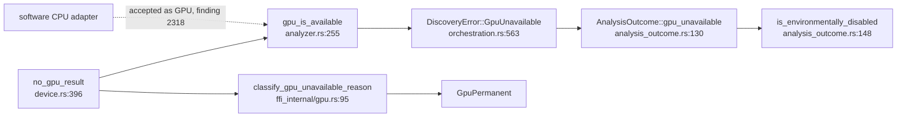

## Summary

Chunk 9c-1 (first slice of #2113). This fills in the `device` region of the
chunk-9 ledger (`docs/audits/security-sweep-chunk-9-gpu-wgsl.md`) with two
records, and adds the chunk-9c contract test that pins them to the source.
Closes #2240.

- **SEC-fe0b268a3799 — verdict: remediated (by #1873), no finding.**
  - The ledger traces all eight `setup_gpu_environment` sites and the write
    path `set_env_if_unset` → `platform.rs:62`, the only non-test
    `env::set_var` in `src/`.
  - The guard is `may_mutate_environment`: `setup_gpu_environment` writes only
    when `/proc/self/task` counts exactly one thread.
  - The original trigger was `GpuAnalyzer::new` running on the spawned GPU
    thread or during recovery. That path now always sees at least two threads,
    so it skips the write.
- **CPU-fallback cross-check.** When no GPU is present, every hop is loud and
  typed:
  - `no_gpu_result` → `gpu_is_available` → `DiscoveryError::GpuUnavailable`
    → `AnalysisOutcome::gpu_unavailable` / `is_environmentally_disabled` →
    `classify_gpu_unavailable_reason` (`GpuPermanent`).
  - **One finding survives, filed as #2318** (`SEC-2b0c59cc73d5`, CWE-754,
    low). A software wgpu adapter (`DeviceType::Cpu`, e.g. lavapipe) passes the
    capability gate, and `gpu_info_to_json` drops its device type.
- `analysis_outcome.rs`, `ffi_internal/gpu.rs` and `ci.yml` are unchanged.

## Evidence

This is a documentation and contract-test change; there is no UI. The new test
fails against the unmodified record: 4 of its 5 tests fail until the device
region is written. It also fails when the #2318 ledger row is deleted.
`./quality.sh` passed.

## Acceptance Criteria

<!-- vibe-spec-review inputs="diff+issue-body" -->

- **met** — Ledger `device` section has a SEC-fe0b268a3799 row with verdict and file:line evidence covering all eight `setup_gpu_environment` call sites — evidence: `tests/issue_2113_chunk_09c_device_sweep.rs::the_ledger_device_region_carries_a_verdict_for_sec_fe0b268a3799`, `::the_disposition_cites_every_setup_gpu_environment_site` — reviewer: met
- **met** — Ledger has a CPU-fallback cross-check row naming each hop with file:line — evidence: `tests/issue_2113_chunk_09c_device_sweep.rs::the_cpu_fallback_cross_check_row_names_every_hop`, `::every_cited_symbol_still_exists_in_its_cited_file` — reviewer: met
- **met** — `tests/issue_2113_chunk_09c_device_sweep.rs` exists and passes under `./quality.sh` — evidence: the full `./quality.sh` run passed (exit 0, "All quality checks passed!") — reviewer: met — reason: the reviewer judged this from the diff alone and did not run the gate; the gate was run here and passed
- **met** — Every surviving finding is filed as its own house-format issue and linked; "no finding" is stated explicitly when none survive — evidence: #2318 (`SEC-2b0c59cc73d5`, labels `security`, `lang:rust`, `severity:low`, `confidence:medium`), linked from the ledger row, the audit region and `## Issues filed`, and pinned by `::every_device_finding_is_open_linked_and_named_in_the_audit_region` — reviewer: met
- **met** — No change to `src/analysis/analysis_outcome.rs`, `src/ffi_internal/gpu.rs` or `.github/workflows/ci.yml` — evidence: the diff touches only the ledger, the new test and this summary — reviewer: met
- **unrequested** — Three extra refuted rows cover the check-then-write race, the `pub unsafe fn` re-exports, and "no other non-test `set_var`" — reviewer: unrequested — reason: they support item 1's question of whether *every* reachable `set_var` is sound
- **unrequested** — The `## Outcome` paragraph and the `## Issues filed` entry for #2318 are updated — reviewer: unrequested — reason: sibling slices record the same bookkeeping, and it follows from filing #2318

## Standards Review

<!-- vibe-standards-review inputs="diff+CODING-STANDARDS.md" -->

- **violation** — CONTRIBUTING.md "An Assertion That Holds Either Way Is Not Coverage": `every_device_finding_is_open_linked_and_named_in_the_audit_region` passed on an empty set of findings — evidence: `tests/issue_2113_chunk_09c_device_sweep.rs:340` — reason: fixed in this diff. The test now pins `SURVIVING_FINDINGS = ["SEC-2b0c59cc73d5"]` and requires each finding under `## Issues filed`. It was confirmed to fail when the #2318 row is deleted
- **violation** — PR summary file missing (CONTRIBUTING.md "PR Summary File") — evidence: `docs/archive/pr-summaries/pr-summary-2240.md` — reason: fixed; this file is it
- **clean** — Australian English, no hidden files, no Mermaid `;` hazards, no `src/` or `ci.yml` change, file:line citations spot-checked against the baseline and HEAD, test placement and fail-loud messages. Optional nit taken: the `warn!` citation corrected from L377 to L382. The repository has no `CODING-STANDARDS.md`, so the reviewer was given `CONTRIBUTING.md` and `AGENTS.md` instead

## Test Plan

- Added `tests/issue_2113_chunk_09c_device_sweep.rs` (5 tests): the SEC-fe0b268a3799 verdict row, all eight call sites, every cited symbol still defined in its cited file, the CPU-fallback cross-check row, and each device finding open, linked and listed.
- Re-ran the sibling chunk-9 record tests: `issue_2288_chunk_09_ledger_scaffold`, `issue_2237_chunk_09_evaluation_sweep`, `issue_2291_chunk_09a_2b_shader_layer_sweep`, `issue_2112_gpu_dispatch_bounds`, `issue_2289_gpu_struct_layout` and `issue_2088_sweep_ledger_contract`. All pass.
- The runtime guard stays covered by `test_may_mutate_environment_requires_single_thread` and `tests/gpu/issue_1873_gpu_env_setup_thread_guard.rs`.

🤖 Generated with [Claude Code](https://claude.com/claude-code)
