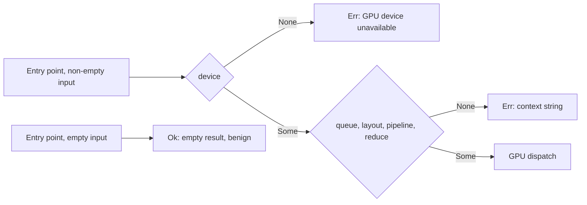

## Summary

Chunk 9c-2 of the GPU/WGSL security sweep. It proves that every `GpuAnalyzer`
entry point returns `Err` when its device, queue, layout or pipeline is
`None`. The records live in `docs/audits/security-sweep-chunk-9-gpu-wgsl.md`.
Closes #2241.

- **Ledger tables** in the `device` region:
  - `Entry-point None → Err sites`: 11 rows. For each entry point it cites the
    file:line and quotes the `.context("…")` string of the device, queue,
    layout, pipeline and reduce checks. The activation reduce checks are
    marked conditional on `use_reduction`.
  - `Entry-point delegations`: 13 rows. Five are the inherent `_with_budget`
    wrappers, three are `GpuEvaluator` (`analyzer.rs`) and five are
    `RequestEvaluator` (`queue/executor.rs`).
  - `Empty-input Ok short-circuits`: 7 rows, each benign. They return `Ok`
    before any `None` check, with an empty result and no GPU work.
- **Unit tests** (`src/analysis/gpu/none_field_tests.rs`,
  `src/analysis/gpu/queue/none_field_tests.rs`). They build an all-`None`
  `GpuAnalyzer` and call every entry point and delegation with non-empty
  input. Each call must return `Err` containing "GPU device unavailable".
- **Scope, stated honestly.** Without a GPU only the device check can be
  reached, because a `wgpu::Device` cannot be built. The queue, layout and
  pipeline checks are therefore pinned by their `.context` strings and order
  in the contract test. `FakeGpuEvaluator` replaces `GpuAnalyzer` wholesale,
  so it cannot prove this property.
- **Outcome: no finding.** A new Refuted row records it, and the audit's
  status paragraph now points at #2242 for what remains.
- There are no production code changes, only two `#[cfg(test)] mod` lines.
  The version is bumped to 0.74.267, as `AGENTS.md` requires.

- [x] Ledger tables (entry points, delegations, short-circuits)
- [x] Crate-internal all-`None` unit tests
- [x] Contract test pinning rows, context strings and order
- [x] Findings decision: no finding

## Evidence

This change adds docs and tests only; there is no UI.

- `cargo test --lib none_field`: 3 passed. They run without a GPU.
- `cargo test --test issue_2113_chunk_09c_device_sweep`: 9 passed, 4 of them
  new:
  - `every_entry_point_cites_its_none_to_err_checks_in_order`: the table rows
    must equal the 11 entry points, in order. Each quoted `.context("…")`
    string must sit on its cited line, inside the checker's function body,
    in device → queue → layout → pipeline → reduce order. Rewording or
    removing any check fails the test.
  - `every_delegation_row_still_delegates_to_an_entry_point`: the cited line
    must still call the entry point it names.
  - `every_empty_input_short_circuit_carries_a_benign_verdict`: the guard
    (`if … .is_empty() {`) must still be in the function, and the verdict
    must open with `benign`.
  - `the_device_region_states_the_2241_outcome`: pins the "no finding"
    statement.
- The spec review re-derived every file:line in the three tables from source
  with a script and found 0 mismatches.

### Regression tests (fail before, pass after)

REGRESSION_PLACEHOLDER

## Acceptance Criteria

<!-- vibe-spec-review inputs="diff+issue-body" -->

- 11-row entry-point table in the `device` section, with file:line.
  reviewer: met. Evidence: the `Entry-point None → Err sites` table.
- Layout and pipeline `None` checks recorded for each entry point.
  reviewer: met. Evidence: the same table's layout, pipeline and reduce
  columns, with the `use_reduction` gating noted.
- Delegations recorded (`RequestEvaluator`, `GpuEvaluator`).
  reviewer: met. Evidence: the `Entry-point delegations` table, 13 rows.
- Activation empty-samples short-circuit recorded with a benign-or-finding
  decision.
  reviewer: met. Evidence: the `Empty-input Ok short-circuits` table; the
  `activation_evaluation.rs` row is marked benign.
- Unit test that builds an all-`None` analyser, calls every entry point with
  non-empty input and asserts `Err` containing "GPU device unavailable".
  reviewer: met. Evidence: `none_field_tests.rs` (inherent and `GpuEvaluator`)
  and `queue/none_field_tests.rs` (`RequestEvaluator`).
- Scope stated honestly: only the device check is reachable, and
  `FakeGpuEvaluator` cannot prove the property.
  reviewer: met. Evidence: the module docs and the ledger paragraph.
- Contract test asserts all 11 rows are present and fails if a cited
  `.context` string is removed or reworded.
  reviewer: met. Evidence:
  `every_entry_point_cites_its_none_to_err_checks_in_order`.
- Findings filed and linked, or "no finding" stated.
  reviewer: met. Evidence: `**Outcome (#2241): no finding.**`, pinned by a
  test.
- No production code changes.
  reviewer: met. Evidence: only `#[cfg(test)] mod` lines in `gpu/mod.rs` and
  `queue/mod.rs`.
- Version bump 0.74.266 → 0.74.267.
  reviewer: unrequested. reason: `AGENTS.md` requires a bump on any code
  change.
- Extra delegation and short-circuit contract tests, and a threat row.
  reviewer: unrequested. reason: in scope, and they only add protection
  around the new tables.

## Standards Review

<!-- vibe-standards-review inputs="diff+CODING-STANDARDS.md" -->

This repo has no `CODING-STANDARDS.md`, so the review used `CONTRIBUTING.md`
and `AGENTS.md`.

- Fixed: the short-circuit test's name said "benign" but it also accepted
  "finding". It now requires `benign`, which matches the no-finding outcome.
- Fixed: the short-circuit test now checks that the guard text is still in the
  function, not just that the line is in range.
- Fixed: re-wrapped an overlong doc line.
- Skipped: the two-line `batch`/`harmful`/`budget` fixtures are duplicated
  in `queue/none_field_tests.rs`. Sharing them across modules would add more
  coupling than it removes.
- Accepted: the `file.rs:line` citations. The audit doc is baseline-pinned and
  already cites this way throughout, and the contract test re-validates every
  one.
- Australian English was used throughout. There are no bare `;` characters in
  the Mermaid text, and `ci.yml` is untouched.

## Test Plan

- `cargo fmt --check`, `cargo clippy --all-targets -- -D warnings`
- `cargo test --lib none_field < /dev/null`
- `cargo test --test issue_2113_chunk_09c_device_sweep < /dev/null`
- `./quality.sh < /dev/null`: QUALITY_PLACEHOLDER

🤖 Generated with [Claude Code](https://claude.com/claude-code)
