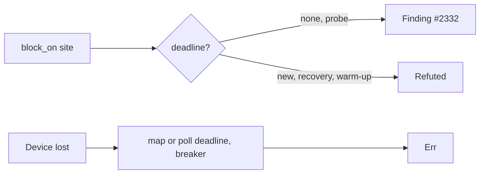

## Summary

Chunk 9c-3 of the GPU/WGSL security sweep. It audits `device.rs`, the device
requests in `analyzer.rs`, `budget.rs` and `breaker.rs`, and records each
verdict with file:line evidence in the `device` region of
`docs/audits/security-sweep-chunk-9-gpu-wgsl.md`. Closes #2242.

- **Init timeout: one finding, #2332** (`SEC-d6747980489b`, CWE-1088, low).
  - The capability probe's `pollster::block_on` calls have no deadline:
    `request_adapter` at `analyzer.rs:276`, `request_device` at `:288` and
    `device.rs:445`. The `OnceLock` at `analyzer.rs:255` caches the probe, so
    a wedged driver hangs every caller.
  - `GPU_INIT_TIMEOUT_SECS` bounds only the warm-up.
  - Refuted: the `new()` requests (`:361`, `:391`), the recovery re-init and
    the warm-up.
- **Limits: refuted.** `Limits::default()` at `:291` and `:394` is the
  conservative portable floor. The dispatch and buffer size checks are tracked
  in #2237 and #2238, and #2314.
- **Device loss: refuted.** There is no device-lost callback and no
  `on_uncaptured_error`, and `is_device_lost_error` works by string matching.
  Even so, a lost device still reaches an `Err`: through the map and poll
  deadlines, the breaker and the recovery path. The classification gap is
  #2115.
- **`device.rs`, `budget.rs` and `breaker.rs`:** each path returns `Err` or a
  typed outcome, and each has a `Symbol | Cited at | Failure outcome` table.
  The shared `parse_env` silent default is #2122.
- **Files swept:** all four rows are flipped. `analyzer.rs` and `device.rs`
  read `finding filed — #2332`, and `budget.rs` and `breaker.rs` read
  `audited, no finding`. There are six new `## Refuted / not findings` rows.
  #2332 is linked from the ledger, the audit region and `## Issues filed`.
- Docs and tests only. There are no production code or `ci.yml` changes, and
  no version bump.

- [x] Init-timeout, limits and device-loss verdicts
- [x] `device.rs`, `budget.rs` and `breaker.rs` path tables
- [x] Four Files swept rows flipped, refuted rows added
- [x] Finding #2332 filed and linked
- [x] Contract test extended

## Evidence

This change adds docs and tests only; there is no UI.

- `cargo test --test issue_2113_chunk_09c_device_sweep`: 12 passed, 3 of them
  new:
  - `no_device_files_swept_row_is_still_pending`: the rows must equal the four
    files. None may still read `pending — #2113`, and each must open with
    `audited, no finding` or `finding filed — #`.
  - `the_device_region_carries_the_2242_subsections_and_outcome`: the
    init-timeout, limits and device-loss subsections must exist and be
    non-empty, and so must `**Outcome (#2242):`.
  - `every_2242_cited_symbol_still_exists`: the five cited symbols
    (`pollster::block_on`, `Limits::default`, `GPU_INIT_TIMEOUT_SECS`,
    `GPU_BUFFER_MAP_TIMEOUT_SECS`, `gpu_wedged_error`) must still exist in
    their files. Every row of the three `Symbol | Cited at` tables must cite a
    line in range and must still be defined.
  - `SURVIVING_FINDINGS` now includes `SEC-d6747980489b`.
- `cargo test --test issue_2288_chunk_09_ledger_scaffold`: 4 passed.
- The spec review checked about 60 cited lines against the source and found
  all of them accurate.

### Regression tests (fail before, pass after)

REGRESSION_PLACEHOLDER

## Acceptance Criteria

<!-- vibe-spec-review inputs="diff+issue-body" -->

- Each verdict is recorded with a file:line citation.
  reviewer: met. reason: about 60 citations were spot-checked against the
  source with no mismatch. The one wording nit (the const-assert span) is
  fixed.
- Init timeout: every `block_on` site.
  reviewer: met. reason: all six sites have a verdict. The probe sites are
  #2332, and the rest are refuted with evidence.
- Limits, cross-referenced to #2237 and #2238.
  reviewer: met. reason: refuted, with the cross-references and #2314.
- Device loss, cross-referenced to #2115.
  reviewer: met. reason: refuted, with an explanation of why a lost device
  still ends in an `Err`.
- The `device.rs` paths, `budget.rs` and `breaker.rs`.
  reviewer: met. reason: each has a symbol table, and #2122 is cited for
  `parse_env`.
- All four Files swept rows flipped, refuted candidates moved.
  reviewer: met. reason: four rows flipped and six refuted rows added.
- Contract test: no row pending, the three rows exist, the symbols exist.
  reviewer: met. reason: three new tests. The symbol test now also resolves
  every table row, which the standards review asked for.
- Findings filed and linked.
  reviewer: met. reason: #2332 is in house format and is linked from the
  ledger, the audit region and `## Issues filed`.
- No production code or `ci.yml` changes.
  reviewer: met. reason: only the audit doc, the test and this summary are
  touched.
- Status-paragraph and `## Outcome` updates.
  reviewer: unrequested. reason: in scope. They keep the record from saying
  the rows "stay pending".

## Standards Review

<!-- vibe-standards-review inputs="diff+CODING-STANDARDS.md" -->

This repo has no `CODING-STANDARDS.md`, so the independent reviewer judged the
diff against `CONTRIBUTING.md`, the canonical coding conventions, and
`AGENTS.md`.

- **violation** (minor) — DRY / test gap — evidence:
  `tests/issue_2113_chunk_09c_device_sweep.rs` `SWEEP_SYMBOLS` — reason:
  fixed. `every_2242_cited_symbol_still_exists` now runs the existing
  `symbol_rows` + `defines` + `assert_in_range` helpers over the three #2242
  tables. The five hand-listed pins remain because the issue names them.
- **violation** (nit) — Cite code by symbol, never by line number (Issue
  #1942) — evidence: the #2242 additions to
  `docs/audits/security-sweep-chunk-9-gpu-wgsl.md` — reason: stands. The issue
  asks for file:line evidence, and the record's methodology and test parsers
  are built on `path.rs:line`. Moving the whole record to symbol citations is
  a separate change.
- **violation** (nit) — DRY — evidence: the Files swept outcome cells repeat
  line spans — reason: stands. The neighbouring #2240 and #2241 rows use the
  same shape.
- **violation** (nit) — the `## Outcome` paragraph was not re-wrapped —
  evidence: `docs/audits/security-sweep-chunk-9-gpu-wgsl.md` `## Outcome` —
  reason: fixed.
- **clean** — Australian English (`analyzer` and `GpuAnalyzer` are proper
  names), no Mermaid blocks in the record diff, scope limited to the device
  regions, and concise comments. The contract checks on source text are the
  symbol-existence use that `CONTRIBUTING.md` allows.

## Test Plan

- `cargo fmt --check`
- `cargo test --test issue_2113_chunk_09c_device_sweep < /dev/null`
- `cargo test --test issue_2288_chunk_09_ledger_scaffold < /dev/null`
- `./quality.sh < /dev/null`: QUALITY_PLACEHOLDER

🤖 Generated with [Claude Code](https://claude.com/claude-code)
