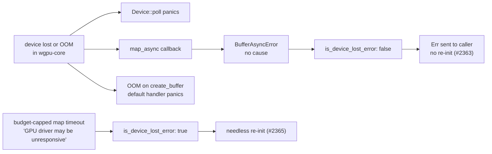

# PR summary — Issue #2245

## Summary

This slice audits `src/analysis/gpu/queue/recovery.rs` and the device-lost retry loop it feeds. The results are recorded in the `queue-lifecycle` regions of `docs/audits/security-sweep-chunk-9-gpu-wgsl.md`, and the classification is pinned in a CPU-only test. Closes #2245.

- **Substring table.** 12 `is_device_lost_error` rows plus 2 `is_memory_exhaustion_error` rows. Each row gives the wgpu 30.0.1 / naga 30 producer (by source file), any crate-internal producer, whether the text can reach the classifier as an `Err`, and a verdict: `device-lost`, `over-broad` or `no known producer`.
- **wgpu 29 → 30 check.** Every `MapRangeError` producer is listed. None of them means device loss, and none matches, so there is no regression. `BufferAsyncError` and `PollError` are traced from source.
- **Validation errors.** Verdict: unreachable — validation errors take the uncaptured-error path. `src/` installs no error scope and no handler, and wgpu 30's default handler panics (`wgpu_core.rs:692`–`:694`). The retry-loop cost is recorded with its `execution.rs` lines: 1 to `retry_limit` re-initialisations, 10 ms to 4.27 s of back-off, and a batch halving only on a memory match.
- **Forged matches.** Refuted. Every interpolating error site in `src/analysis/gpu/**` is listed with its lines, and none carries caller text.
- **Retry-limit parsing.** `""`, `"abc"` and `"999999"` all give 3, and `"0"` gives 0. None of them logs anything at read time. Each result cites its `user_facing.rs` / `helpers.rs` line and is cross-linked to #2122 and the #2213 → #2276 class.
- **Inventory.** The `recovery.rs` row in `## Files swept` now reads `finding filed`.
- **Findings filed.** Three house-format issues, each linked from a `queue-lifecycle` `## Ledger` row:
  - #2363 `SEC-19ddcad53b91` (CWE-754, low). wgpu 30 reports a lost device to the evaluators only as the cause-free `BufferAsyncError` or as a `Device::poll` panic, and GPU OOM only as an uncaptured-error panic. Neither classifier ever matches, so the #647 recovery and the #1083 batch halving never run.
  - #2364 `SEC-c01db5943e3c` (CWE-778, low). `NEAT_AI_DISCOVERY_GPU_RETRY_LIMIT` silently falls back to 3 on invalid or out-of-range input, and `0` silently disables recovery. The class issue does not exist yet (#2276 is still to file it), so this is filed on its own and cross-referenced on #2276.
  - #2365 `SEC-6f84944cf02b` (CWE-754, low). A budget-capped map-wait timeout matches `gpu driver`. That drives needless device re-initialisations: up to `retry_limit` of them for ReLU and activation requests, which can end in a caller-side breaker trip.
- **Also updated.** `## Outcome` and `## Issues filed` each gained the slice's entries, following the convention every earlier chunk-9 slice used.

No findings are fixed in this PR.

## Evidence

- Added the regression test `tests/issue_2245_gpu_device_lost_classification.rs::device_loss_reported_through_the_map_callback_is_not_classified`. It reproduces finding #2363 using the real `wgpu::BufferAsyncError` and `DeviceError::OutOfMemory` values. It pins today's behaviour: it passes on the unfixed code, and the fix for #2363 must flip its assertions.
- `tests/issue_2245_gpu_device_lost_classification.rs::every_producer_bearing_ledger_row_classifies_as_recorded` builds each wgpu 30 producer from its public constructor and wraps it exactly as the production site does. The test fails if the substring list changes, or if a wgpu bump rewords a producer.
- The original trigger for this audit slice was the `pending — #2115` `recovery.rs` row and the unswept classifier. That trigger is now closed, with no trivial bypass: every one of the 14 substrings has a row, and every interpolating error site is listed. The three findings stay open for their own fixes.
- `./quality.sh < /dev/null` passed on the final commit ("✅ All quality checks passed!"). The chunk-9 ledger tests (`issue_2088`, `issue_2288`, `issue_2113`, `issue_2237`, `issue_2243`, `issue_2291`) pass, and markdownlint reports 0 issues.

## Acceptance Criteria

<!-- vibe-spec-review inputs="diff+issue-body" -->

- **met** — The `queue-lifecycle` section has a table with 12 `is_device_lost_error` rows plus 2 `is_memory_exhaustion_error` rows — evidence: `docs/audits/security-sweep-chunk-9-gpu-wgsl.md` (substring table, rows 1–12, M1, M2) — reviewer: met
- **met** — Each row names its wgpu 30 producer(s) with a source file, or says `no known producer` — evidence: `docs/audits/security-sweep-chunk-9-gpu-wgsl.md` (substring table) — reviewer: met
- **met** — The `MapRangeError` variants are explicitly listed — evidence: `docs/audits/security-sweep-chunk-9-gpu-wgsl.md` (wgpu 29 → 30 regression check table), `tests/issue_2245_gpu_device_lost_classification.rs::map_range_error_texts_never_match` — reviewer: met
- **met** — The validation-error verdict takes one of the three stated forms, cites `execution.rs` lines, and says whether validation errors can reach the classifier — evidence: `docs/audits/security-sweep-chunk-9-gpu-wgsl.md` ("Validation-error mis-classification"), `tests/issue_2245_gpu_device_lost_classification.rs::workgroup_limit_validation_error_is_not_matched` — reviewer: met
- **met** — The forged-match verdict lists every interpolating error site in `src/analysis/gpu/**`, with lines — evidence: `docs/audits/security-sweep-chunk-9-gpu-wgsl.md` ("Forged-match verdict" table), `tests/issue_2245_gpu_device_lost_classification.rs::caller_text_containing_a_pattern_matches_but_is_unreachable` — reviewer: met
- **met** — Retry-limit results for `""`, `"abc"`, `"0"` and `"999999"` are recorded with their lines and cross-linked to #2122 and the #2213 class issue — evidence: `docs/audits/security-sweep-chunk-9-gpu-wgsl.md` ("Retry-limit parsing") — reviewer: partial — reason: the reviewer questioned why the cross-link goes to #2276 rather than #2213. #2213 is closed as a planning issue, and its class finding is to be filed by #2276. The record names both ("the class that #2213 planned and #2276 is to file"), and the site is commented on #2276.
- **met** — The test file has one case per producer-bearing ledger row plus the two named cases, and each expected value equals the ledger verdict — evidence: `tests/issue_2245_gpu_device_lost_classification.rs::every_producer_bearing_ledger_row_classifies_as_recorded` — reviewer: met
- **met** — Every surviving finding has its own house-format issue, linked from a `## Ledger` row — evidence: `## Ledger` queue-lifecycle rows → #2363, #2364, #2365 — reviewer: met
- **met** — The `recovery.rs` inventory row is no longer `pending` — evidence: `## Files swept` → `### queue-lifecycle` — reviewer: met
- **met** — `./quality.sh` passes — evidence: the full gate ran on commit `6ff0624` and passed — reviewer: partial — reason: the reviewer saw only the diff and could not run the gate. It was run here and passed.
- **unrequested** — a Mermaid flowchart of the wgpu error routing in the audit section — reviewer: unrequested — reason: the repo's documentation rules favour a diagram for a data-flow explanation, and this one shows why no wgpu 30 device loss reaches the classifier.

## Standards Review

<!-- vibe-standards-review inputs="diff+CODING-STANDARDS.md" -->

- **violation** — "Cite Code by Symbol, Never by Line Number" (CONTRIBUTING.md, Issue #1942): the audit prose and ledger rows cite `file:line` — evidence: `docs/audits/security-sweep-chunk-9-gpu-wgsl.md` (queue-lifecycle section, `## Ledger` and `## Refuted` rows) — reason: this stands. The sweep ledger contract requires `file:line` cells, pinned to the record's baseline commit (`a7c3f65`) so they cannot rot. The sibling tests assert this format (`cites_file_line` in `tests/issue_2237_chunk_09_evaluation_sweep.rs`), and every earlier chunk-9 slice uses it.
- **clean** — Australian English throughout; the test lives in `tests/`, calls the real exported classifiers, and makes no timing assertions; no new env var, dependency or CI change; no hidden files staged.

## Test Plan

- Added `tests/issue_2245_gpu_device_lost_classification.rs` (5 tests, CPU-only): `every_producer_bearing_ledger_row_classifies_as_recorded`, `device_loss_reported_through_the_map_callback_is_not_classified`, `map_range_error_texts_never_match`, `workgroup_limit_validation_error_is_not_matched` and `caller_text_containing_a_pattern_matches_but_is_unreachable`.
- Re-ran the chunk-9 ledger contract and scaffold tests, then the full `./quality.sh`.

🤖 Generated with [Claude Code](https://claude.com/claude-code)
