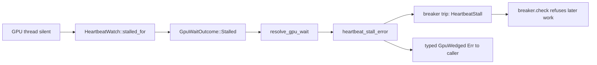

# PR Summary — Issue #2246

## Summary

This PR audits `src/analysis/gpu/queue/staleness.rs`, `src/analysis/gpu/heartbeat.rs` and `src/analysis/gpu/inflight.rs`, plus the test-only `queue/stale_skip_tests.rs`, at the chunk-9 baseline `a7c3f65`. The results are recorded in the `queue-lifecycle` regions of `docs/audits/security-sweep-chunk-9-gpu-wgsl.md`, below #2245's `recovery.rs` sub-section. Closes #2246.

- **`staleness.rs` — CWE-362 refuted.** Each submission creates its own `bounded(1)` channel (`submission.rs:202`, `:263`, `:325`, `:390`, `:449`, `:524`) and its own `Arc`/`Weak` liveness pair. A stale result therefore cannot reach a later caller.
  - A guard dropped after the dequeue check ends in a harmless late send.
  - `Shutdown` being always live is the fail-safe direction.
  - `BudgetExpired` sends an `Err`, not an empty `Ok`.
  - Gap named: a guard dropped after dequeue, during a successful or non-device-lost evaluation.
- **`heartbeat.rs`.** A missed heartbeat produces a `warn` line, a breaker trip with `GpuTripReason::HeartbeatStall`, and a typed `GpuWedged` `Err` to the caller.
  - The `AtomicU64` wrap is unreachable.
  - Progress on another `GpuWorkQueue` can mask a wedge, but only down to the absolute-timeout backstop. The wait still ends in an `Err` and a trip.
  - The wedge fail-loud verdict holds.
  - The `0` and 301–600 s windows are silent opt-outs. They were added to the #2276 class issue (planned by #2213) as a comment, not re-filed.
- **`inflight.rs`.** The registry is a `parking_lot::Mutex<Vec<Entry>>`, not a pair of counters.
  - Nothing can under- or overflow.
  - No entry leaks when the GPU worker panics or a caller panics mid-wait: the default unwind applies because `Cargo.toml` sets no `panic` key.
  - The lock does not poison.
  - The read path returns `None` after 50 ms rather than an empty list.
- **Leaked-thread / wedge lifecycle.** Every waiter and every in-flight entry resolves to `Err` within the stall window or the batch-timeout bound (at most 300 s). The two existing findings cover the rest: #2339 (send phase) and #2361 (panic path, cited from #2244).
- **Findings.** No new finding. Eleven refuted candidates are added to the `queue-lifecycle` region of `## Refuted / not findings`. The four inventory rows are no longer `pending`.

## Evidence

This is a backend documentation audit, so there is no UI to screenshot.

I added the regression test file `tests/issue_2246_chunk_09e_queue_lifecycle_sweep_test.rs`. It reproduces the unswept state: its record-contract tests fail against the unfixed record and pass after the fix. I checked this by running it against the pre-change record from `9c1f9d4`, where 5 of 6 tests failed:

- `tests/issue_2246_chunk_09e_queue_lifecycle_sweep_test.rs::no_queue_lifecycle_row_for_the_2246_files_is_still_pending`
- `tests/issue_2246_chunk_09e_queue_lifecycle_sweep_test.rs::the_queue_lifecycle_region_carries_the_2246_subsections_and_outcome`
- `tests/issue_2246_chunk_09e_queue_lifecycle_sweep_test.rs::every_test_the_coverage_map_names_is_declared_in_its_file`
- `tests/issue_2246_chunk_09e_queue_lifecycle_sweep_test.rs::the_cwe_362_verdict_cites_every_per_request_channel_and_names_the_gap`
- `tests/issue_2246_chunk_09e_queue_lifecycle_sweep_test.rs::the_stall_window_opt_out_links_the_class_issue_instead_of_refiling`

At HEAD all 6 pass.

`tests/issue_2246_chunk_09e_queue_lifecycle_sweep_test.rs::a_missed_heartbeat_trips_the_breaker_and_returns_a_typed_err` pins the missed-heartbeat verdict through the public API: a `HeartbeatStall` trip, a `GpuWedged` classification, and refusal of the next submission. It passes before and after the change, because no code changed.

The original trigger was that these three files were unswept and still read `pending — #2115`. That trigger is now closed, with no trivial bypass: every row carries a verdict, and the contract test fails if a row reverts to `pending` or a cited coverage test is renamed away. This PR fixes nothing in `src/`. The findings it references (#2339, #2361, #2276) stay open.

## Acceptance Criteria

<!-- vibe-spec-review inputs="diff+issue-body" -->

- **met** — `staleness.rs`, `heartbeat.rs` and `inflight.rs` each have a sub-section with verdicts and a "covered by" note naming the existing test files and test functions — evidence: `tests/issue_2246_chunk_09e_queue_lifecycle_sweep_test.rs::every_test_the_coverage_map_names_is_declared_in_its_file` — reviewer: met
- **met** — The CWE-362 verdict cites the `submission.rs` channel-creation lines and names the `stale_skip_tests.rs` interleaving gap — evidence: `tests/issue_2246_chunk_09e_queue_lifecycle_sweep_test.rs::the_cwe_362_verdict_cites_every_per_request_channel_and_names_the_gap` — reviewer: met
- **met** — The missed-heartbeat outcome (log / breaker trip / `Err`) and the wedge fail-loud verdict are stated with lines — evidence: `docs/audits/security-sweep-chunk-9-gpu-wgsl.md` heartbeat sub-section; `tests/issue_2246_chunk_09e_queue_lifecycle_sweep_test.rs::a_missed_heartbeat_trips_the_breaker_and_returns_a_typed_err` — reviewer: met
- **met** — The in-flight under/overflow-on-panic verdict is stated with lines — evidence: `docs/audits/security-sweep-chunk-9-gpu-wgsl.md` inflight sub-section (`inflight.rs:61`–`:66`, `Cargo.toml:232`–`:238`) — reviewer: met
- **met** — Every surviving finding has its own house-format issue linked from the ledger — evidence: no new finding survives; #2339 and #2361 are already on the ledger, and the stall-window opt-out was added to #2276 as a comment (`the_stall_window_opt_out_links_the_class_issue_instead_of_refiling`) — reviewer: met
- **met** — The three inventory rows are no longer `pending` — evidence: `tests/issue_2246_chunk_09e_queue_lifecycle_sweep_test.rs::no_queue_lifecycle_row_for_the_2246_files_is_still_pending` — reviewer: met
- **met** — `./quality.sh` passes — evidence: full gate run after the final edit, "All quality checks passed!" — reviewer: missing — reason: the reviewer said it "cannot verify by review alone" and treated it as met by assumption; I ran the gate here and it passed.

## Standards Review

<!-- vibe-standards-review inputs="diff+CODING-STANDARDS.md" -->

`CODING-STANDARDS.md` does not exist in this repository. The first Standards review returned no verdict for that reason, so the review was re-run against `CONTRIBUTING.md`, which `AGENTS.md` names as the canonical coding conventions.

- **violation** — CONTRIBUTING.md "Cite Code by Symbol, Never by Line Number" (Issue #1942): the new audit prose and refuted rows cite `file.rs:NNN` — evidence: `docs/audits/security-sweep-chunk-9-gpu-wgsl.md` (the #2246 sub-sections and rows) — reason: stands. The issue explicitly requires line citations ("Re-verify line numbers at the recorded baseline", "cites the `submission.rs` lines", "stated with lines"). The record pins baseline commit `a7c3f65` with a `## Verify this record` diff command, and every sibling chunk-9 slice uses the same convention. Symbol names are given beside the lines throughout.
- **clean** — Australian English in the added prose; the new test lives under `tests/`; tests assert observable outcomes (`trip_reason()`, `classify_anyhow_error()`, `breaker.check()`) with no timing assertions; no API was made public for testing; CI workflow untouched.

## Test Plan

- Added `tests/issue_2246_chunk_09e_queue_lifecycle_sweep_test.rs` (6 tests: the record contract plus one behavioural heartbeat-trip pin).
- Ran the new test and the sibling chunk-9 contract tests (`issue_2243_…`, `issue_2288_…`, `issue_2245_…`, `issue_2088_…`, `issue_2113_…`, `issue_2237_…`, `issue_2291_…`): 54 passed.
- `./quality.sh < /dev/null`: passed.

🤖 Generated with [Claude Code](https://claude.com/claude-code)
