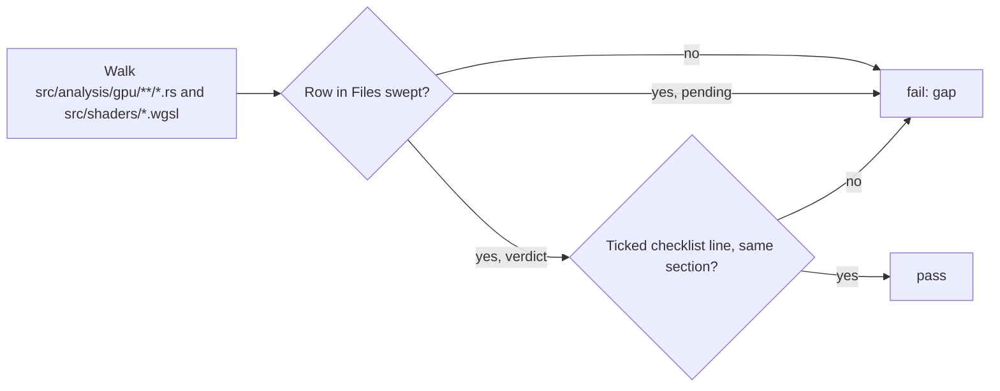

# PR Summary — Issue #2249: reconcile the chunk-9 inventory and pin ledger completeness

## Summary

This change reconciles the chunk-9 (GPU dispatch + WGSL) sweep ledger,
`docs/audits/security-sweep-chunk-9-gpu-wgsl.md`, against the 34 files on disk.
A new CPU-only test pins that completeness. Closes #2249.

- **Precondition.** All eleven dependency sub-issues are closed, #2246 last,
  and no `## Files swept` row reads `pending`. Nothing was blocked.
- **Gap audit.** Four files were added after the baseline and had no row. They
  were read in full at `3f103b9`, since they have no text at the baseline:
  - `src/analysis/gpu/sample_limits.rs` goes to **evaluation**. It is the #2314
    pre-allocation guard. Audited, no finding. Two candidates were refuted in
    the evaluation refuted region, each with the refuting line: truncation when
    widening to `u64`, and a guard that checks default limits or only one
    sample set.
  - `src/analysis/gpu/none_field_tests.rs` and
    `src/analysis/gpu/queue/none_field_tests.rs` go to **device**. They are the
    evidence for the #2241 verdict. Audited, test-only.
  - `src/analysis/gpu/queue/empty_vs_zero_tests.rs` goes to **queue-core**. It
    is the evidence for #2243 check 1. Audited, test-only.
- **`## Reconciliation`.** A new section lists one ticked
  ``- [x] `<path>` — <section> — <verdict>`` line per file, 34 in all, plus the
  gap-audit sentence.
- **Header.** `## Record` now cross-references #2088 (the ledger contract) and
  #2096 (chunk 13, the residual `env::set_var` sweep).
- **Test.** `tests/issue_2249_chunk9_ledger_complete.rs` is new.
  - It walks `src/analysis/gpu/**/*.rs` recursively and `src/shaders/*.wgsl`.
  - It pins that walk before trusting it: at least 34 files, including
    `queue/mod.rs` and `helpful.wgsl`.
  - It compares full repo-relative paths in both directions against
    `## Files swept`.
  - It checks the checklist: one ticked line per file, a valid section that
    matches the file's `## Files swept` group, and a verdict that is not
    `pending`.
  - It checks that the `## Record` header cites #2088 and #2096.
- **Adjusted test.** `tests/issue_2113_chunk_09c_device_sweep.rs` required the
  `### device` table to hold exactly the four #2242 files. It now also accepts
  the two #2241 test-only rows. The four #2242 files must still appear in the
  same order with the same outcome checks, and any other device row must be
  one of the two named test files with an `audited, test-only` outcome.

Deviation: the issue pins `src/shaders/matching.wgsl`, but #2309 deleted it,
so the enumerator pins `src/shaders/helpful.wgsl` instead. A comment in the
test says why.

Left to #2250, whose scope is to finalise the tables and the Outcome:

- `### Sweep status — IN PROGRESS` and `## Outcome`.
- `## Issues filed`.
- The `open — #2314` status of `SEC-1a9af762e205`. #2314 is now closed and
  `sample_limits.rs` is its fix.

## Evidence

This is a backend and docs change with no UI. The new test was run against the
ledger as it was at `3f103b9`, before reconciliation, and against the
reconciled ledger:

| Test | Ledger at `3f103b9` | Reconciled ledger |
| --- | --- | --- |
| `the_enumerator_is_pinned_before_trusting_it` | ok | ok |
| `every_files_swept_row_cites_a_real_in_scope_file` | ok | ok |
| `every_on_disk_file_has_exactly_one_files_swept_row_with_a_settled_outcome` | FAILED — `src/analysis/gpu/none_field_tests.rs must carry exactly one` row, found 0 | ok |
| `the_reconciliation_checklist_is_fully_ticked_and_matches_the_on_disk_inventory` | FAILED — the ledger must carry `## Reconciliation` | ok |
| `the_record_section_references_the_related_sweeps` | FAILED — `## Record` must reference #2088 | ok |

A worker checkpoint commit captured the test and the ledger together, so the
branch has no separate "test only" commit. The red run above was reproduced by
restoring the `3f103b9` ledger in the working tree.

## Acceptance Criteria

<!-- vibe-spec-review inputs="diff+issue-body" -->

- **met** — `tests/issue_2249_chunk9_ledger_complete.rs` exists, failed before the reconciliation and passes after it — evidence: `tests/issue_2249_chunk9_ledger_complete.rs` and the table in Evidence (3 failed at `3f103b9`, 5 pass after) — reviewer: met — reason: the reviewer noted it could not run the test; the red and green runs were done here. There is no separate test-only commit because of the worker checkpoint.
- **met** — every one of the 34 files has a non-pending `## Files swept` outcome, and `## Reconciliation` lists all 34 with a section name each — evidence: `tests/issue_2249_chunk9_ledger_complete.rs::every_on_disk_file_has_exactly_one_files_swept_row_with_a_settled_outcome`, `::the_reconciliation_checklist_is_fully_ticked_and_matches_the_on_disk_inventory` — reviewer: met
- **met** — any gap file is audited here, with findings filed and ledger rows added, or refutations recorded with the refuting line — evidence: the three `gap audit (Issue #2249)` subsections and the two evaluation refuted rows in `docs/audits/security-sweep-chunk-9-gpu-wgsl.md` — reviewer: met
- **met** — the ledger header references #2088 and #2096 — evidence: `tests/issue_2249_chunk9_ledger_complete.rs::the_record_section_references_the_related_sweeps` — reviewer: met
- **met** — `tests/issue_2088_sweep_ledger_contract.rs` and the #2231 layout test still pass — evidence: `cargo test --test issue_2088_sweep_ledger_contract --test issue_2288_chunk_09_ledger_scaffold` (plus the 2112, 2113, 2237, 2243, 2246 and 2291 chunk-9 tests), all pass — reviewer: partial — reason: the reviewer could not execute them; they were run here and pass. The #2231 layout lives in `issue_2288_chunk_09_ledger_scaffold.rs`.
- **met** — `./quality.sh < /dev/null` passes — evidence: full gate run on the final tree — reviewer: partial — reason: the reviewer saw only the diff and could not run the gate; it was run here and passed.

## Standards Review

<!-- vibe-standards-review inputs="diff+CODING-STANDARDS.md" -->

- **violation** — "Cite Code by Symbol, Never by Line Number" (CONTRIBUTING.md, Issue #1942); the repo has no CODING-STANDARDS.md, so the reviewer used CONTRIBUTING.md — evidence: `docs/audits/security-sweep-chunk-9-gpu-wgsl.md` new rows and gap-audit prose (for example `sample_limits.rs:33`, `:39`) — reason: stands. Audit ledgers are a documented exception in practice. The issue asks for refutations "with its refuting `file:line`". `tests/issue_2237_chunk_09_evaluation_sweep.rs` asserts `cites_file_line` on every evaluation refuted row. The Methodology section pins line numbers to a commit, and every new cite names `3f103b9`, so `## Verify this record` can falsify them.
- **clean** — Australian English, integration test under `tests/`, the test asserts on ledger outcomes rather than on implementation, no new env vars, no CI, dependency or `src/` changes. Optional notes (not chased): the `splitn(3, " — ")` parse is tied to the documented checklist format, and the gap-audit prose repeats the per-row evidence, which is the ledger's convention.

## Test Plan

- Added `tests/issue_2249_chunk9_ledger_complete.rs` (5 tests).
- Updated `tests/issue_2113_chunk_09c_device_sweep.rs::no_device_files_swept_row_is_still_pending`
  to accept the two #2241 post-baseline test-only rows. The four #2242 files
  keep their order and outcome checks, and the full inventory is now pinned by
  the new test.
- Ran the chunk-9 ledger tests: 2088, 2112, 2113, 2237, 2243, 2246, 2249, 2288
  and 2291. All pass.
- Ran `./quality.sh < /dev/null`.

🤖 Generated with [Claude Code](https://claude.com/claude-code)
