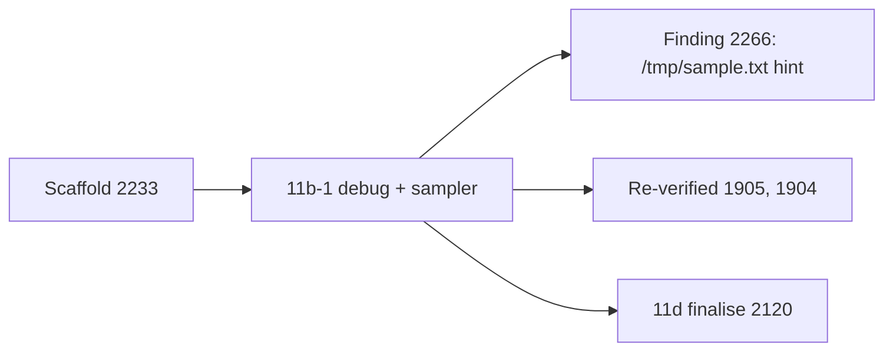

# PR summary — Issue #2251

## Summary

Fills in the `debug + sampler` section of the chunk 11 sweep record,
`docs/audits/security-sweep-chunk-11-filesystem-lifecycle.md`. Closes #2251.

The attacker model is a local co-tenant with a different uid. No production
code changes.

- **Inventory.** Each of the four rows now reads `<outcome> — <reason>`:
  - `src/debug.rs`: no finding.
  - `src/debug/sample_capture.rs`: finding filed, #2266.
  - `src/debug/sample_dir.rs`: no finding.
  - `src/debug/process_state.rs`: no finding.

  The `debug.rs` and `process_state.rs` rows record that neither file mutates
  the filesystem or spawns a process.
- **Probes.** The record gives a disposition for each probe:
  - the external-process spawn;
  - output handling;
  - the `/tmp/sample.txt` hint;
  - signal/lifecycle;
  - the tmp-directory and stat→read TOCTOU;
  - test-only predictable names.
- **Filesystem mutation sites.** Five rows, each with a symlink-safe verdict:
  - `create_private_dir`
  - `SampleDir::create`
  - `Drop::drop`, including the same-uid swap
  - `read_guarded`, including the stat→read window
  - `run_external_command_with_timeout`
- **Re-verified remediations.** #1905 is still in place, and so is #1904. The
  sampler mirrors `platform.rs::prepare_runtime_dir` but does not call it.
- **Finding.** #2266 (`SEC-c6f3abf33c8c`), filed in the house format of #2078:
  `sample_capture.rs::write_manual_hint` still tells the operator to run the
  sampler with `-file /tmp/sample.txt`, the predictable shared-tmp path that
  #1905 removed. Tracker #2095 has a comment about it.
- **Test.** Adds `tests/issue_2251_chunk_11b_debug_sampler_test.rs`.

## Evidence

This change is docs and a test, with no UI.

The regression test is
`tests/issue_2251_chunk_11b_debug_sampler_test.rs::no_debug_sampler_row_reads_pending_and_each_has_an_outcome_and_a_reason`.
It fails against the unfixed code and passes after the fix. "Unfixed" here
means the scaffold record, whose rows read `pending`.

Two sibling tests check the finding tables:

- `tests/issue_2251_chunk_11b_debug_sampler_test.rs::the_debug_sampler_mutation_region_cites_all_five_sites`
  needs all five sites cited, and fails if any cited symbol is gone from its
  source file (Issue #1942).
- `tests/issue_2251_chunk_11b_debug_sampler_test.rs::the_debug_sampler_reverification_region_has_1905_and_1904_rows`
  needs a #1905 row and a #1904 row, and each guard surface they cite must
  exist.

The trigger is closed with no trivial bypass:

- The test finds each inventory row by its path.
- It rejects `pending`.
- It needs both an outcome and a reason on each side of ` — `.
- It matches headings as whole lines, the same way the scaffold test does.

Other points:

- **Scope.** The branch touches two files, the record and the new test.
  `src/debug*` is unchanged. The scaffold's markers are unchanged and in the
  same order.
- **Review fixes.** The spec review found three overstatements in the record.
  All three are fixed:
  - The hint prints only once a sampler program has resolved; otherwise
    `capture` prints a `gdb` hint.
  - A same-uid swap inside `Drop::drop` is the same principal, not a boundary
    crossing.
  - `tests/issue_1934_sample_fallback.rs` is described as a fallback-text
    surface.

## Acceptance Criteria

<!-- vibe-spec-review inputs="diff+issue-body" -->

- **Inventory rows read `<outcome> — <reason>`, and the `debug.rs` and
  `process_state.rs` rows record no mutation and no spawn.** reviewer:
  partial. Reason: deliberate. The rows cite `file.rs::symbol`, not
  `file:line`, per CONTRIBUTING.md § Cite Code by Symbol (Issue #1942). The
  record's "Why the finding tables cite symbols" note explains this, and the
  baseline SHA is pinned.
- **Five mutation rows, each with a symlink-safe verdict.** reviewer: met.
- **External-process probe, cross-referencing #2096, #2123 and #2124.**
  reviewer: partial. Reason: it cites `config::sample_program_override`
  rather than `user_facing.rs` L1086, for the same symbol-citation rule.
- **Output probe and signal/lifecycle probe.** reviewer: met.
- **`/tmp/sample.txt` hint filed in house format and linked from tracker
  #2095.** reviewer: met. Filed as #2266.
- **#1905 and #1904 re-verification rows.** reviewer: partial. Reason: the
  rows cite symbols, not line ranges (Issue #1942).
- **Ledger test.** reviewer: partial. Reason: the file is named
  `issue_2251_chunk_11b_debug_sampler_test.rs`, because the security-fix gate
  only picks up `*_test.rs`. The issue's
  `--test issue_2251_chunk_11b_debug_sampler` therefore does not resolve; run
  `--test issue_2251_chunk_11b_debug_sampler_test` instead.
- **The 2233 scaffold test passes with marker order unchanged.** reviewer:
  met. It passes 4/4.
- **`cargo test --test issue_1905_sample_temp_dir --test
  issue_1934_sample_fallback` is green.** reviewer: met. The suites pass 4/4
  and 5/5.
- **No production code changes.** reviewer: met.
- **`./quality.sh` passes.** reviewer: met. See Test Plan.

## Standards Review

<!-- vibe-standards-review inputs="diff+CODING-STANDARDS.md" -->

This repo has no `CODING-STANDARDS.md`, so the reviewer used `CONTRIBUTING.md`
and `AGENTS.md` instead. It found nothing blocking.

Three non-blocking notes, all addressed:

- The test's `section` helper now matches whole heading lines, the same way as
  `tests/issue_2233_chunk_11_ledger_scaffold.rs`.
- The `REVERIFIED` comment now says "guard surface", because the #1904 entry
  is a source file.
- The `sample_capture.rs` row is looked up by path, not by index.

Clean:

- Australian English.
- Code is cited by symbols that exist, not by line numbers.
- No hidden files staged.
- No Mermaid `;`.
- `.github/workflows/ci.yml` is untouched.
- No dependency or config-surface changes.

## Test Plan

- [x] `cargo test --test issue_2251_chunk_11b_debug_sampler_test --test
      issue_2233_chunk_11_ledger_scaffold --test issue_2088_sweep_ledger_contract
      --test issue_1905_sample_temp_dir --test issue_1934_sample_fallback`
      (3, 4, 9, 4 and 5 passing)
- [x] `markdownlint-cli2` on the record
- [x] `./quality.sh`

🤖 Generated with [Claude Code](https://claude.com/claude-code)
