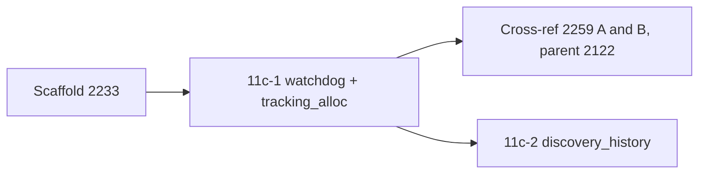

# PR summary — Issue #2252

## Summary

Audits `src/watchdog.rs` and `src/tracking_alloc.rs` for chunk 11c-1 in
`docs/audits/security-sweep-chunk-11-filesystem-lifecycle.md`. Closes #2252.
No production code changes.

- **Inventory.** The `src/watchdog.rs` and `src/tracking_alloc.rs` rows now
  read `audited — <reason>`. The `src/discovery_history.rs` row stays
  `pending`, because 11c-2 owns it.
- **Probe dispositions (Issue #2252):**
  - no PID or filesystem surface, with the grep evidence;
  - the SIGUSR1 handler verdict;
  - the discarded `raise` result;
  - the abort delay and the stall-timeout truncation, both cross-referenced
    to #2122 and #2259;
  - the watchdog lifecycle;
  - the allocator hooks;
  - counter-wrap reachability;
  - both `TrackingAlloc::allocated` consumers.
- **Filesystem mutation sites.** One `none` row for both files.
- **Re-verified remediations.** Not applicable. The #1903 guards belong to
  #2234.
- **Findings.** No new ones. The two defects in `watchdog.rs::watchdog_loop`
  are already tracked by open #2259, under #2122. That issue lists the uncapped
  abort delay as its finding A and the `as_millis() as u64` stall truncation as
  its finding B. Refiling either would duplicate it, and the issue says not to
  refile the abort delay.
- **Observation.** The `debug.rs::install_signal_handler` doc comment says
  SIGUSR1 has "no default action". Its POSIX default action is to terminate
  the process. The ledger records this, and it is not a security defect.
- **Test.** Adds `tests/issue_2252_chunk_11c1_watchdog_tracking_alloc_test.rs`.

## Acceptance Criteria

<!-- vibe-spec-review inputs="diff+issue-body" -->

- **met.** The two rows are `audited`, each with a one-line reason.
  reviewer: met. The rows read `audited — no PID, process-spawn or filesystem
  surface …` and `audited — the GlobalAlloc hooks cannot panic …`.
- **met.** The "no PID, no filesystem" outcome is recorded with its evidence,
  the SIGUSR1 verdict is explicit, and #2122 is cross-referenced, not refiled.
  reviewer: met. The ledger has "PID and filesystem — none" with the grep
  result, "SIGUSR1 — a handler is installed on the FFI path", and "Abort delay
  — cross-referenced, not refiled".
- **met.** The ledger records counter-wrap reachability, the hooks verdict,
  and why no test exercises the wrap. reviewer: met. It says "no sound test
  can exercise the wrap — which is why none does".
- **met.** Both `allocated()` consumers are named, each with a verdict.
  reviewer: met. The `.unwrap_or(0)` fallback is dead code, and
  `is_memory_budget_exceeded` → `analyze_all` has no spurious cancel.
- **met.** No `file.rs:<line>` citation appears. reviewer: met. A grep for
  `\.rs:[0-9]` on the diff is empty, and the new test enforces it.
- **met.** Each surviving finding has one issue. There are none new: both
  surviving defects are already tracked by open #2259. Tracker #2095 has a
  comment saying so. reviewer: met, with no new findings. The reviewer
  judged this justified, because refiling would duplicate #2259.
- **met.** No other ledger section changes, and `./quality.sh` passes.
  reviewer: partial. The reviewer confirmed that only the watchdog section and
  its mutation-marker region changed, but did not run the gate.
  `./quality.sh` has since passed. See the Test Plan.

Review fix: the reviewer caught the phrase "filed as #2259 finding A/B", which
is wrong because #2259 is still open. It now reads "tracked by open #2259 as
its finding A/B".

## Standards Review

<!-- vibe-standards-review inputs="diff+CODING-STANDARDS.md" -->

This repo has no `CODING-STANDARDS.md`, so the review used `CONTRIBUTING.md`
and `AGENTS.md` instead. Verdict: pass-with-notes.

- **Fixed.** The new test file was not rustfmt-clean. `cargo fmt --all` has
  now been applied.
- **Fixed.** Two over-long ledger lines have been rewrapped.
- **Noted, not changed.** The test helpers are copied from the 2251 sibling
  test, which matches the existing pattern. A shared `tests/common` helper is
  a possible follow-up.
- **Passed:** Australian English, `file.rs::symbol` citations, no hidden
  files, scope, and no edits to `ci.yml`.

## Test Plan

- [x] `cargo test --all-features --test issue_2252_chunk_11c1_watchdog_tracking_alloc_test`
  passes all 4 tests. Against the scaffold, where the rows read `pending`, all
  4 failed.
- [x] `cargo test --all-features --test issue_2233_chunk_11_ledger_scaffold`
  passes all 4 tests.
- [x] `cargo test --all-features --test issue_2251_chunk_11b_debug_sampler_test`
  passes all 3 tests.
- [x] `./quality.sh` passes.

The new test checks four things:

- both rows are `audited` with a reason, and the `discovery_history.rs` row is
  still present;
- the section names SIGUSR1, #2122, #2259, #2234 and both consumers;
- the mutation region has a `none` row for both files;
- every cited `file.rs::symbol` still exists in source, and no `.rs:<line>`
  citation is used.
