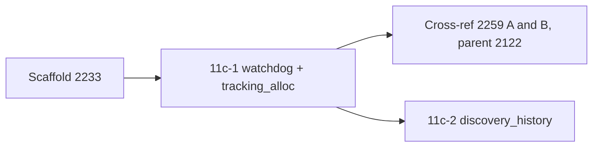

# PR summary — Issue #2252

## Summary

Audits `src/watchdog.rs` and `src/tracking_alloc.rs` for chunk 11c-1 in
`docs/audits/security-sweep-chunk-11-filesystem-lifecycle.md`. Closes #2252.
No production code changes.

- **Inventory.** The `src/watchdog.rs` and `src/tracking_alloc.rs` rows now
  read `audited — <reason>`. The `src/discovery_history.rs` row stays
  `pending`, because 11c-2 owns it.
- **Probe dispositions (Issue #2252):**
  - no PID or filesystem surface, with the grep evidence;
  - the SIGUSR1 handler verdict;
  - the discarded `raise` result;
  - the abort delay and the stall-timeout truncation, both cross-referenced
    to #2122 and #2259;
  - the watchdog lifecycle;
  - the allocator hooks;
  - counter-wrap reachability;
  - both `TrackingAlloc::allocated` consumers.
- **Filesystem mutation sites.** One `none` row for both files.
- **Re-verified remediations.** Not applicable. The #1903 guards belong to
  #2234.
- **Findings.** No new ones. The two defects in `watchdog.rs::watchdog_loop`
  are already tracked by open #2259, under #2122. That issue lists the uncapped
  abort delay as its finding A and the `as_millis() as u64` stall truncation as
  its finding B. Refiling either would duplicate it, and the issue says not to
  refile the abort delay.
- **Observation.** The `debug.rs::install_signal_handler` doc comment says
  SIGUSR1 has "no default action". Its POSIX default action is to terminate
  the process. The ledger records this, and it is not a security defect.
- **Test.** Adds `tests/issue_2252_chunk_11c1_watchdog_tracking_alloc_test.rs`.

## Acceptance Criteria

<!-- vibe-spec-review inputs="diff+issue-body" -->

- **met** — The `src/watchdog.rs` and `src/tracking_alloc.rs` rows are
  `audited`, each with a one-line reason — evidence: `docs/audits/security-sweep-chunk-11-filesystem-lifecycle.md § watchdog + tracking_alloc + discovery_history` (inventory table),
  `tests/issue_2252_chunk_11c1_watchdog_tracking_alloc_test.rs::watchdog_and_tracking_alloc_rows_are_audited_with_a_reason` —
  reviewer: met
- **met** — The ledger records the "no PID, no filesystem" outcome with its
  evidence, an explicit `SIGUSR1` verdict, and the abort delay
  cross-referenced to #2122, not refiled — evidence: `docs/audits/security-sweep-chunk-11-filesystem-lifecycle.md § watchdog + tracking_alloc + discovery_history` ("PID and
  filesystem — none.", "SIGUSR1 — a handler is installed on the FFI path.",
  "Abort delay — cross-referenced, not refiled."),
  `tests/issue_2252_chunk_11c1_watchdog_tracking_alloc_test.rs::the_section_records_the_signal_verdict_cross_references_and_consumers`
  — reviewer: met
- **met** — The ledger records counter-wrap reachability, the no-panic,
  no-allocate, no-recurse verdict for the hooks, and why no test exercises the
  wrap — evidence: `docs/audits/security-sweep-chunk-11-filesystem-lifecycle.md § watchdog + tracking_alloc + discovery_history` ("Allocator hooks — no panic, no allocation, no
  recursion.", "Counter wrap — reachable only through undefined behaviour.")
  — reviewer: met
- **met** — Both `allocated()` consumers are named, each with a
  spurious-cancel verdict — evidence: `docs/audits/security-sweep-chunk-11-filesystem-lifecycle.md § watchdog + tracking_alloc + discovery_history` ("Consumer
  `ffi/utilities.rs::discovery_memory_usage_bytes` — no spurious zero.",
  "Consumer `analysis/utils/memory.rs::is_memory_budget_exceeded` →
  `analysis/orchestration.rs::analyze_all` — no spurious cancel.", "No other
  consumers."),
  `tests/issue_2252_chunk_11c1_watchdog_tracking_alloc_test.rs::the_section_records_the_signal_verdict_cross_references_and_consumers`
  — reviewer: met
- **met** — No `file.rs:<line>` citation appears in this section — evidence:
  `tests/issue_2252_chunk_11c1_watchdog_tracking_alloc_test.rs::every_cited_symbol_exists_and_no_citation_uses_a_line_number`; a grep
  of the diff's added lines for `\.rs:[0-9]` is empty — reviewer: met
- **partial** — Each surviving finding has exactly one house-format issue,
  linked in the ledger and on #2095 — evidence: `docs/audits/security-sweep-chunk-11-filesystem-lifecycle.md § watchdog + tracking_alloc + discovery_history` (the `src/watchdog.rs`
  row and the "Abort delay" and "Stall-timeout truncation" bullets link open
  #2259, findings A and B); the "Chunk 11c-1 (#2252) — No new findings"
  comment on #2095 — reviewer: partial — reason: both defects are linked and
  tracked by open #2259, which will file them, but no house-format issue
  (`finding-id`/`cwe` markers, `security`/`severity:*` labels) exists yet;
  refiling here would duplicate #2259, and the issue forbids refiling the
  abort delay
- **partial** — No other ledger section changes, and `./quality.sh` passes —
  evidence: `git diff 85bdfec..HEAD -- docs/audits/security-sweep-chunk-11-filesystem-lifecycle.md`
  touches only the watchdog section and its `<!-- section: … -->` row in
  "Filesystem mutation sites";
  `tests/issue_2233_chunk_11_ledger_scaffold.rs` and `tests/issue_2252_chunk_11c1_watchdog_tracking_alloc_test.rs` pass 4/4 each —
  reviewer: partial — reason: the reviewer confirmed the ledger scope and ran
  both test targets but did not run `./quality.sh`; the worker re-runs the
  gate before raising the PR
- **unrequested** — The new contract test `tests/issue_2252_chunk_11c1_watchdog_tracking_alloc_test.rs` — reviewer: unrequested —
  reason: pins the ledger rows and citations so a later edit cannot silently
  regress them, matching the sibling chunk 11 ledger tests

Review fix: the reviewer caught the phrase "filed as #2259 finding A/B", which
is wrong because #2259 is still open. It now reads "tracked by open #2259 as
its finding A/B".

## Standards Review

<!-- vibe-standards-review inputs="diff+CODING-STANDARDS.md" -->

This repo has no `CODING-STANDARDS.md`, so the review used `CONTRIBUTING.md`
and `AGENTS.md` instead.

- **violation** — Cite code by symbol (Issue #1942): a test that claims to
  check every cited symbol should check them all — evidence:
  `tests/issue_2252_chunk_11c1_watchdog_tracking_alloc_test.rs::CITED` — reason: stands; `CITED` pins 11 of the 15 symbols the section
  cites (`lib.rs::log_version_once`, `debug.rs::init_debug_handlers`,
  `debug.rs::shutdown_debug_handlers` and `watchdog.rs::start_from_env` are
  unchecked). All four exist today, so nothing is stale; a follow-up can add
  them
- **violation** — DRY (CONTRIBUTING.md § Principles) — evidence:
  `tests/issue_2252_chunk_11c1_watchdog_tracking_alloc_test.rs::{repo_root, read, section, marker_region, table_rows, file_rows}`,
  copied from `tests/issue_2251_chunk_11b_debug_sampler_test.rs` — reason:
  stands; the same helpers are already copied into about 15 ledger tests, so
  this follows the existing pattern. Moving them into the existing
  `tests/common/mod.rs` is a possible follow-up
- **clean** — Australian English, `file.rs::symbol` citations (no
  `.rs:<line>`), `cargo fmt --all -- --check`, `cargo clippy` on the new test
  with `-D warnings`, the new and sibling tests (2233, 2251) passing, no hidden
  files, no `ci.yml` edits, no bare `;` in the Mermaid block, markdownlint on
  the ledger, the PR summary location check, ledger scope, and test doctrine

## Test Plan

- [x] `cargo test --all-features --test issue_2252_chunk_11c1_watchdog_tracking_alloc_test`
  passes all 4 tests. Against the scaffold, where the rows read `pending`, all
  4 failed.
- [x] `cargo test --all-features --test issue_2233_chunk_11_ledger_scaffold`
  passes all 4 tests.
- [x] `cargo test --all-features --test issue_2251_chunk_11b_debug_sampler_test`
  passes all 3 tests.
- [x] `./quality.sh` passes.

The new test checks four things:

- both rows are `audited` with a reason, and the `discovery_history.rs` row is
  still present;
- the section names SIGUSR1, #2122, #2259, #2234 and both consumers;
- the mutation region has a `none` row for both files;
- every `file.rs::symbol` in its `CITED` list still exists in source, and no
  `.rs:<line>` citation is used.
