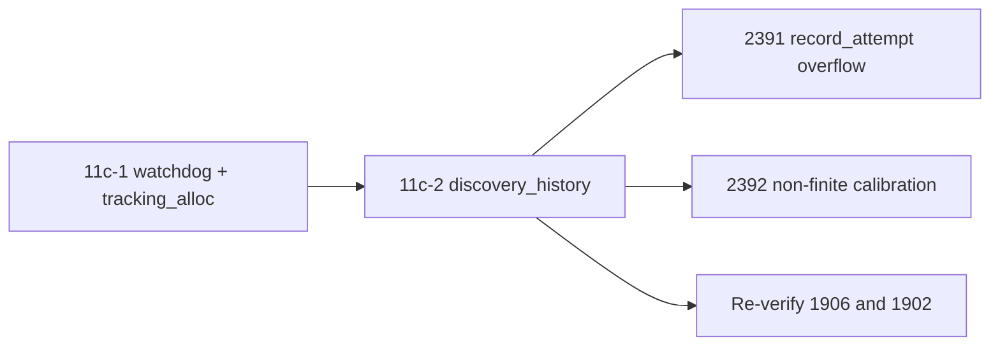

# PR summary — Issue #2253

## Summary

This PR audits `src/discovery_history.rs` for chunk 11c-2 in
`docs/audits/security-sweep-chunk-11-filesystem-lifecycle.md`, and
re-verifies #1906 and #1902 on the live path. Closes #2253. It changes no
production code. The only `src/` edits are tests in
`src/discovery_history.rs::tests`.

- **Inventory.** The `src/discovery_history.rs` row now reads
  `audited — <reason>`, so none of the three rows in the
  `watchdog + tracking_alloc + discovery_history` section is `pending`.
- **Probe dispositions (Issue #2253):**
  - The module does no filesystem I/O. Its one FFI entry point is
    `ffi/utilities.rs::get_calibration_summary` →
    `ffi_internal/analysis.rs::get_calibration_summary_internal`.
  - #1906 is re-verified and on the live path: `serde(try_from)` routes every
    deserialise through `NeuronDiscoveryHistory::try_from`, and
    `bayesian_score` saturates.
  - The `record_attempt` overflow can be reached only through the Rust API.
    Filed as #2391.
  - Finite observations can produce non-finite calibration metrics. These
    reach the FFI summary as `null` under `success: true`. Filed as #2392.
  - The `record_calibration` list has no bound. No finding, because the FFI
    path does not amplify the input.
  - `prune`: no finding.
  - #1902 is re-verified and on the live path:
    `streaming.rs::finish_session` sets `preserve_tmp_on_drop` before both
    fallible steps, and `streaming.rs::Drop::drop` honours the flag.
- **Filesystem mutation sites.** One `none` row for `src/discovery_history.rs`,
  and one row for the `streaming.rs::Drop::drop` `fs::remove_file` site.
- **Re-verified remediations.** One row each for #1906 and #1902.
- **Findings.** #2391 (CWE-190) and #2392 (CWE-682), both in house format.
  Each is linked in the ledger and in the 2026-10-05 comment on #2095.
- **Tests.**
  - Three ignored failing-first unit tests, for #2391 and #2392. The #2392
    summary test also drives `get_calibration_summary_internal`.
  - One passing unit test that pins serde_json's out-of-range rejection.
  - A new ledger contract test,
    `tests/issue_2253_chunk_11c2_discovery_history_test.rs`, built on the
    shared helpers in `tests/common/ledger.rs`.

## Spec

### Intent and Rationale

- The sweep records a verdict for every probe the issue names. A case that
  is not handled gets a failing-first test plus a filed finding, not a fix,
  because the fix belongs to that finding's own PR.

### Essential Design Decisions

- The failing-first tests are `#[ignore]`d with the finding number in the
  reason, so the gate stays green. Each finding's fix removes the
  `#[ignore]`.
- The ledger cites code by `file.rs::symbol`. The contract test checks that
  every cited definition still exists, and that no citation uses a line
  number.

### Undiscoverable Facts

- #2391 and #2392 were filed on 2026-10-05 in the #2078 house format: the
  `finding-id` and `cwe` markers, the five sections, and the labels
  `security`, `lang:rust`, `severity:low` and `confidence:high`. Each body
  names the `tests/issue_<n>_*.rs` that its fix ships, failing before the
  fix.
- Run with `-- --ignored`, the #2392 FFI check fails today. The response is
  `{"calibrationSummary":[{"bias":null,"calibrationFactor":0.1,…,"meanAbsoluteError":null,…}],"success":true}`.

## Evidence

This is a backend and documentation change only. Tests are listed below.

**Docs sweep** — grep: `record_attempt`, `compute_calibration_factor`, `record_calibration`, `preserve_tmp_on_drop`, `deserialize_rejects_non_finite`, `marker_region` over `README.md`, `*/README.md`, `docs/` (excluding `docs/archive/`) and source comment lines; section: `docs/audits/security-sweep-chunk-11-filesystem-lifecycle.md#watchdog--tracking_alloc--discovery_history`; updated: `docs/audits/security-sweep-chunk-11-filesystem-lifecycle.md`, which carries every hit in docs, each on a line this diff adds or changes; `src/streaming.rs:50` — still true because `finish_session` still sets `preserve_tmp_on_drop` before finishing, and this diff changes no production code; `docs/audits/security-sweep-chunk-11-filesystem-lifecycle.md:3` — still true because `docs/audits/README.md` and `docs/audits/lib-sweep-coverage.json` both still exist and remain the ledger rules and index entry, which this diff does not touch; `docs/audits/security-sweep-chunk-11-filesystem-lifecycle.md:95` — still true because it sits in the chunk 11a `discovery.lock` probe, outside this diff's section, and `docs/FFI_API.md` still carries the "Discovery Directory Cleanup" and "Orphaned Directory Sweep" sections it cites; `tests/common/mod.rs:302` — still true because §1 of `docs/COST_FUNCTION_NOTES.md` still tabulates the per-cost residual shapes the helper follows, and this diff only adds `pub mod ledger;` and a doc bullet to that file

## Acceptance Criteria

<!-- vibe-spec-review inputs="diff+issue-body" -->

- **met** — All three rows in the section are non-`pending`, each with a one-line reason — evidence: `docs/audits/security-sweep-chunk-11-filesystem-lifecycle.md` (inventory table), `tests/issue_2253_chunk_11c2_discovery_history_test.rs::discovery_history_row_is_audited_and_links_both_findings` — reviewer: met
- **met** — "Re-verified remediations" has one row for #1906 and one for #1902. Each names its guard as `file.rs::symbol` and records "On live path?" as yes or no, with evidence — evidence: `tests/issue_2253_chunk_11c2_discovery_history_test.rs::re_verified_region_has_one_live_row_each_for_1906_and_1902` — reviewer: met
- **met** — The ledger records an explicit verdict for each of these: `record_attempt` overflow, calibration NaN/inf, the `record_calibration` bound, and `prune` — evidence: `tests/issue_2253_chunk_11c2_discovery_history_test.rs::the_section_records_a_verdict_for_each_probe` — reviewer: met
- **met** — Every case that is not handled has a unit test in `src/discovery_history.rs::tests` and exactly one house-format finding issue, linked in the ledger and on #2095 — evidence: `src/discovery_history.rs::tests::test_record_attempt_keeps_successes_within_attempts_at_u32_max` (#2391); `src/discovery_history.rs::tests::test_calibration_summary_stays_finite_for_extreme_finite_observations` and `src/discovery_history.rs::tests::test_calibration_factor_is_never_nan_for_finite_observations` (#2392) — reviewer: partial — reason: the reviewer could not see the GitHub side from the diff. `gh issue view 2391` and `gh issue view 2392` show both open, each with the `finding-id`/`cwe` markers, the five sections, the four labels and the `tests/issue_<n>_*.rs` statement. `gh issue view 2095 --json comments` shows the 2026-10-05T02:32:23Z comment linking both.
- **met** — No `file.rs:<line>` citation appears in this section, and no other ledger section changes — evidence: `tests/issue_2253_chunk_11c2_discovery_history_test.rs::every_cited_symbol_exists_and_no_citation_uses_a_line_number`; all four ledger hunks fall inside this section or after its `<!-- section: … -->` markers — reviewer: met
- **met** — `./quality.sh` passes — evidence: full gate run on the final head (see Test Plan) — reviewer: missing — reason: the reviewer said it was "unverifiable from diff". The gate was run here.
- **unrequested** — The ledger contract test `tests/issue_2253_chunk_11c2_discovery_history_test.rs` — reviewer: unrequested — reason: it pins the ledger rows, verdicts and citations against silent regression, as the sibling chunk 11 ledger tests do
- **unrequested** — The shared helpers in `tests/common/ledger.rs` and the `tests/common/mod.rs` registration — reviewer: unrequested — reason: the contract test's Markdown helpers live here rather than as a fourth verbatim copy of the 2251/2252 helpers (DRY)
- **unrequested** — The passing unit test `src/discovery_history.rs::tests::test_deserialise_rejects_non_finite_json_numbers` — reviewer: unrequested — reason: it supports the #2392 verdict that a non-finite metric can come only from arithmetic, not from the JSON itself

## Standards Review

<!-- vibe-standards-review inputs="diff+CODING-STANDARDS.md" -->

This repository has no `CODING-STANDARDS.md`, so the reviewer used
`CONTRIBUTING.md` and `AGENTS.md`.

- **clean** — `file.rs::symbol` citations with no line numbers; Australian English (serialise, deserialise, finalise; the earlier `test_deserialize_*` name for the new test is now `test_deserialise_*`); no new public API (the test reuses the crate-internal `get_calibration_summary_internal`); the `[profile.release]` overflow-checks claim checked against `Cargo.toml`; no assertion removed from an existing test. Optional notes, not chased: the audit-only exception that leaves the failing-first tests ignored is intentional and recorded in each `#[ignore]` reason, and `tests/common/ledger.rs::section` does not handle `#` inside fenced code blocks.

The previous attempt's review recorded three findings in this diff's own
lines, and each is now fixed in this diff:

- The ledger helpers duplicated the 2251/2252 tests. They moved to
  `tests/common/ledger.rs`.
- A redundant `starts_with("| none")` assert in
  `the_mutation_region_cites_the_1902_drop_site_and_discovery_history_has_none`
  is removed. The `find(...).unwrap_or_else(panic!)` is the check.
- The test name `test_deserialize_rejects_non_finite_json_numbers` became
  `test_deserialise_rejects_non_finite_json_numbers`.

That review also flagged that the #2392 test bypassed the shipped entry
point. The test now asserts through `get_calibration_summary_internal` as
well.

## Test Plan

No assertion was removed from an existing test. Against the base branch,
`tests/issue_2253_chunk_11c2_discovery_history_test.rs`,
`tests/common/ledger.rs` and the new `src/discovery_history.rs` tests are all
additions. `tests/common/mod.rs` only gains `pub mod ledger;` and a doc
bullet.

- `cargo test --all-features --test issue_2253_chunk_11c2_discovery_history_test`:
  all 6 tests pass.
- `cargo test --all-features --test issue_2233_chunk_11_ledger_scaffold --test issue_2252_chunk_11c1_watchdog_tracking_alloc_test --test integration`:
  22 tests pass. Every test crate that uses `tests/common` still compiles.
- `cargo test --all-features --lib discovery_history`: 7 passed, 3 ignored.
  The passes include the #1906 regression tests and
  `test_deserialise_rejects_non_finite_json_numbers`.
- `cargo test --all-features --lib discovery_history -- --ignored`: all three
  failing-first tests fail as intended, with these messages:
  - `attempt to add with overflow`;
  - `mean_absolute_error must be finite, got inf`;
  - `calibration_factor must be finite, got NaN`.

  With the direct asserts commented out, the summary test still fails, on
  `FFI field meanAbsoluteError must be a finite JSON number, got null`. That
  shows the new FFI check carries weight; the direct asserts were then
  restored.
- `cargo test --all-features --lib streaming`: the #1902 regression tests
  `test_failed_finish_preserves_tmp` and
  `test_empty_session_finish_removes_tmp` pass.
- `./quality.sh`: QUALITY_RESULT

**Branch outcomes:** none added. The only code changes are test code: the new
tests in `src/discovery_history.rs::tests`, the contract test, and
`tests/common/ledger.rs`. No production condition, match arm or default is
added or changed.

🤖 Generated with [Claude Code](https://claude.com/claude-code)
