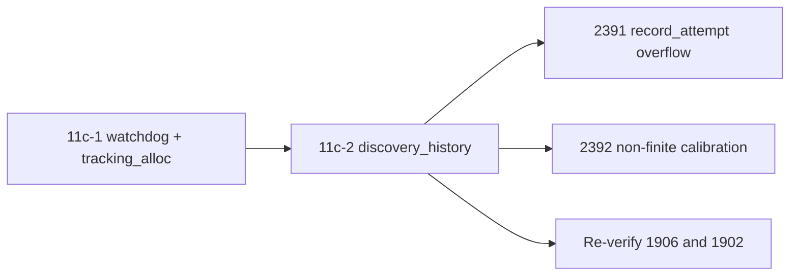

# PR summary — Issue #2253

## Summary

Audits `src/discovery_history.rs` for chunk 11c-2 in
`docs/audits/security-sweep-chunk-11-filesystem-lifecycle.md` and
re-verifies #1906 and #1902 on the live path. Closes #2253. No production
code changes: the only `src/` edits are unit tests in
`src/discovery_history.rs::tests`.

- **Inventory.** The `src/discovery_history.rs` row now reads
  `audited — <reason>`, so all three rows in the
  `watchdog + tracking_alloc + discovery_history` section are non-`pending`.
- **Probe dispositions (Issue #2253):**
  - no filesystem I/O; the one FFI entry point is
    `ffi/utilities.rs::get_calibration_summary` →
    `ffi_internal/analysis.rs::get_calibration_summary_internal`;
  - #1906 re-verified and on the live path (`serde(try_from)` routes every
    deserialise through `NeuronDiscoveryHistory::try_from`, and
    `bayesian_score` saturates);
  - `record_attempt` overflow is reachable through the Rust API only, and is
    filed as #2391;
  - calibration NaN/inf from finite observations reaches the FFI summary as
    `null` under `success: true`, and is filed as #2392;
  - the `record_calibration` bound is unbounded, with no finding (no
    amplification on the FFI path);
  - `prune` has no finding;
  - #1902 re-verified and on the live path (`streaming.rs::finish_session`
    sets `preserve_tmp_on_drop` before both fallible steps, and
    `streaming.rs::Drop::drop` honours it).
- **Filesystem mutation sites.** One `none` row for `src/discovery_history.rs`
  and one row for the `streaming.rs::Drop::drop` `fs::remove_file` site.
- **Re-verified remediations.** One row each for #1906 and #1902.
- **Findings.** #2391 (CWE-190) and #2392 (CWE-682), both in house format,
  linked in the ledger and in a comment on #2095.
- **Tests.** Three ignored failing-first unit tests (for #2391 and #2392), one
  passing unit test pinning serde_json's out-of-range rejection, and the new
  ledger contract test
  `tests/issue_2253_chunk_11c2_discovery_history_test.rs`.

**Docs sweep** — grep: `discovery_history`, `get_calibration_summary`, `calibration_summary`, `record_attempt`, `record_calibration`, `calibration_factor`, `bayesian_score`, `NeuronDiscoveryHistory` over `README.md`, `docs/` (excluding `docs/archive/` and `docs/audits/`) and `*/README.md`; section: `docs/FFI_API.md#-calibration-summary-issue-605` (plus the `README.md` FFI table row and the `docs/FFI_API.md` validated-surface row for `get_calibration_summary`), read through and still true because the diff changes no production behaviour; no names were removed or changed; no update needed

**Branch outcomes:** none added — the only code change is test code in
`src/discovery_history.rs::tests` (and the new integration test). No
production condition, match arm or default is added or changed.

## Acceptance Criteria

<!-- vibe-spec-review inputs="diff+issue-body" -->

- **met** — All three rows in the section are non-`pending`, each with a
  one-line reason — evidence:
  `docs/audits/security-sweep-chunk-11-filesystem-lifecycle.md § watchdog + tracking_alloc + discovery_history`
  (inventory table),
  `tests/issue_2253_chunk_11c2_discovery_history_test.rs::discovery_history_row_is_audited_and_links_both_findings`
  — reviewer: met
- **met** — "Re-verified remediations" has one row for #1906 and one for
  #1902, each naming its guard as `file.rs::symbol` with "On live path?"
  answered with evidence — evidence:
  `docs/audits/security-sweep-chunk-11-filesystem-lifecycle.md § Re-verified remediations`
  (the #1906 and #1902 rows under this section's marker),
  `tests/issue_2253_chunk_11c2_discovery_history_test.rs::re_verified_region_has_one_live_row_each_for_1906_and_1902`
  — reviewer: met
- **met** — The ledger records an explicit verdict for `record_attempt`
  overflow, calibration NaN/inf, the `record_calibration` bound and `prune` —
  evidence: the "Probe dispositions (Issue #2253)" bullets,
  `tests/issue_2253_chunk_11c2_discovery_history_test.rs::the_section_records_a_verdict_for_each_probe`
  — reviewer: met
- **met** — Every unhandled case has a unit test in
  `src/discovery_history.rs::tests` and exactly one house-format finding,
  linked in the ledger and on #2095 — evidence:
  `src/discovery_history.rs::tests::test_record_attempt_keeps_successes_within_attempts_at_u32_max`
  (#2391),
  `src/discovery_history.rs::tests::test_calibration_summary_stays_finite_for_extreme_finite_observations`
  and
  `src/discovery_history.rs::tests::test_calibration_factor_is_never_nan_for_finite_observations`
  (#2392); both issues carry the `finding-id`/`cwe` markers, the five
  sections and the `security`/`lang:rust`/`severity:low`/`confidence:high`
  labels; the 2026-10-05 comment on #2095 links them — reviewer: met (the
  reviewer notes the three tests are `#[ignore]`d until their fixes land, so
  plain `cargo test` skips them; all three fail under `-- --ignored`)
- **met** — No `file.rs:<line>` citation appears in this section, and no
  other ledger section changes — evidence:
  `tests/issue_2253_chunk_11c2_discovery_history_test.rs::every_cited_symbol_exists_and_no_citation_uses_a_line_number`;
  all four ledger hunks fall inside this section or after its
  `<!-- section: … -->` markers — reviewer: met
- **partial** — `./quality.sh` passes — evidence: the targeted tests pass
  (2253 contract 6/6, 2233 scaffold 4/4, 2252 3/3, 2251 4/4,
  `--lib discovery_history` 7 passed and 3 ignored, the #1902 streaming tests)
  — reviewer: partial — reason: the reviewer did not run `./quality.sh`; the
  worker re-runs the gate before raising the PR. The reviewer also saw the
  existing `streaming::tests::test_cleanup_skips_locked_session_then_reclaims_it`
  fail intermittently in full `--lib streaming` runs. `src/streaming.rs` is
  untouched here, so the flake predates this diff
- **unrequested** — The new contract test
  `tests/issue_2253_chunk_11c2_discovery_history_test.rs` — reviewer:
  unrequested — reason: pins the ledger rows, verdicts and citations against
  silent regression, matching the sibling chunk 11 ledger tests
- **unrequested** — The passing unit test
  `src/discovery_history.rs::tests::test_deserialize_rejects_non_finite_json_numbers`
  — reviewer: unrequested — reason: supporting evidence for the #2392
  verdict that a non-finite metric can only come from arithmetic, not from
  the JSON itself
- **unrequested** — The "Calibration key — observation only" note and the
  map-key/`uuid` mismatch observation — reviewer: unrequested — reason:
  documentation-only observations made during the probe, with no finding or
  code

## Standards Review

<!-- vibe-standards-review inputs="diff+CODING-STANDARDS.md" -->

This repo has no `CODING-STANDARDS.md`, so the review used `CONTRIBUTING.md`
and `AGENTS.md` instead.

- **violation** — Every PR includes
  `docs/archive/pr-summaries/pr-summary-<ISSUE>.md` — evidence: the summary
  was absent at review time — reason: fixed by this file
- **violation** — Test Organisation (prefer `tests/` when the public API
  reaches the behaviour) — evidence: the four new tests in
  `src/discovery_history.rs::tests` — reason: stands; the issue explicitly
  asks for the unit tests in `src/discovery_history.rs::tests`, beside the
  existing #1906 regression tests the ledger cites
- **violation** — Guard Wiring at the Shipped Entry Point (#1795/#1806) —
  evidence:
  `src/discovery_history.rs::tests::test_calibration_summary_stays_finite_for_extreme_finite_observations`
  calls `DiscoveryHistory::calibration_summary` directly instead of the
  `get_calibration_summary` FFI — reason: stands, for #2392's fix to address;
  the FFI only parses and calls that same method, so the risk is low
- **violation** — An Assertion That Holds Either Way Is Not Coverage (#1799) —
  evidence:
  `tests/issue_2253_chunk_11c2_discovery_history_test.rs::the_mutation_region_cites_the_1902_drop_site_and_discovery_history_has_none`
  (the final `starts_with("| none")` assert repeats the `find` predicate that
  produced the row) — reason: stands, minor; the preceding
  `unwrap_or_else(panic!)` is the real check, so no coverage is lost
- **violation** — DRY — evidence: the helper block in
  `tests/issue_2253_chunk_11c2_discovery_history_test.rs`
  (`repo_root`, `read`, `section`, `marker_region`, `table_rows`,
  `file_rows`) is identical to the ones in the 2251 and 2252 ledger tests —
  reason: stands; it follows the established per-file pattern, and moving
  the helpers into `tests/common/` is a possible follow-up
- **violation** — Australian English — evidence:
  `src/discovery_history.rs::tests::test_deserialize_rejects_non_finite_json_numbers`
  — reason: mitigated; the identifier matches serde's `Deserialize` and the
  module's existing `test_deserialize_*` names, and the prose uses
  "serialise"
- **clean** — `cargo fmt --all -- --check`,
  `cargo clippy --all-features --all-targets -- -D warnings`, markdownlint,
  codespell, no `.rs:<line>` citations, Australian English in prose and
  comments, failing-first tests that name their finding in `#[ignore]` and
  fail today, assertion messages that print actual values, no Mermaid in the
  diff, no `ci.yml` edits, no hidden files

## Test Plan

No assertion was removed from an existing test. Against the base branch,
`tests/issue_2253_chunk_11c2_discovery_history_test.rs` is a new file, and
the `src/discovery_history.rs` hunk only adds tests after the existing ones.

- [x] `cargo test --all-features --test issue_2253_chunk_11c2_discovery_history_test`
  passes all 6 tests.
- [x] `cargo test --all-features --test issue_2233_chunk_11_ledger_scaffold`
  passes all 4 tests.
- [x] `cargo test --all-features --lib discovery_history`: 7 passed,
  3 ignored. The 3 existing #1906 regression tests are among the passes.
- [x] `cargo test --all-features --lib discovery_history -- --ignored`: all
  3 failing-first tests fail as intended (`attempt to add with overflow`,
  `mean_absolute_error must be finite, got inf`,
  `calibration_factor must be finite, got NaN`).
- [x] `cargo test --all-features --lib streaming` passes all 27 tests,
  including the #1902 regression tests `test_failed_finish_preserves_tmp` and
  `test_empty_session_finish_removes_tmp`.
- [ ] `./quality.sh`. The worker re-runs it before raising the PR.
