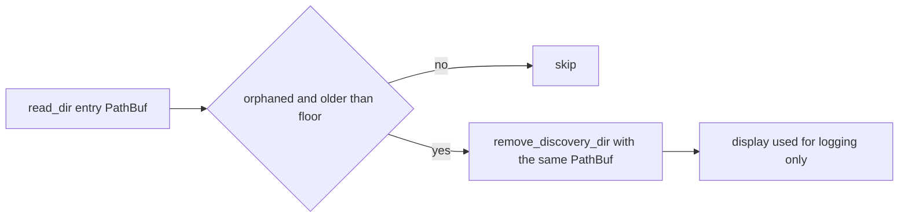

# PR Summary — Issue #2255

Closes #2255

## Summary

`clean_orphaned_discovery_dirs_since` vetted each entry's real `PathBuf`
against the orphan check and the #1903 age floor, then removed
`path.display().to_string()`. That rendering is lossy (CWE-176): a non-UTF-8
name such as `orphan-\xff` becomes `orphan-\u{FFFD}`. So the sweep deleted a
*different* sibling that the age floor had never vetted. The real orphan
survived and was counted as `already_gone`.

Fix (`src/discovery_cleanup.rs`):

- `remove_discovery_dir` and `assert_is_discovery_dir` now take `&Path`.
- The sweep passes the vetted `PathBuf` straight to removal, with no string
  round-trip.
- `cleanup_discovery_dir` / `cleanup_orphaned_discovery_dir` accept
  `impl AsRef<Path>`, so they remain thin adapters: the existing `&str` FFI
  caller compiles unchanged.
- `display()` is used only in log and error text.



## Security-fix evidence

- Regression test:
  `tests/issue_2255_orphan_sweep_non_utf8_entry.rs::sweep_removes_non_utf8_orphan_and_spares_lossy_sibling`.
  - **Fails against the unfixed code:** it panicked with "sibling touched after
    the scan started must survive the sweep", because the fresh
    `orphan-\u{FFFD}` sibling was deleted.
  - **Passes after the fix.**
- The original trigger is closed with no trivial bypass. Removal now acts on
  the exact `PathBuf` that the orphan and age-floor guards checked, with no
  string round-trip anywhere between the check and the delete. No rendering of
  one entry can name another.

## Evidence

This is a backend-only change, so there is no visual surface.

```text
$ cargo test --test issue_2255_orphan_sweep_non_utf8_entry --test issue_1903_orphan_sweep_lock_recheck --test issue_1866_cleanup_dir_path_guard
test orphaned_removal_accepts_non_utf8_path ... ok
test sweep_removes_non_utf8_orphan_and_spares_lossy_sibling ... ok
test result: ok. 2 passed; 0 failed
test result: ok. 5 passed; 0 failed   (issue_1903)
test result: ok. 10 passed; 0 failed  (issue_1866)
$ cargo test --lib discovery_cleanup
test result: ok. 16 passed; 0 failed
$ cargo clippy --all-targets -- -D warnings
cargo clippy: No issues found
```

## Reproduction

Status: `verified`.

1. Create a `.discovery` root holding two directories:
   - `orphan-\xff`, backdated to before `scan_started`;
   - `orphan-\u{FFFD}`, fresh.
2. Run `clean_orphaned_discovery_dirs_since`.

Before the fix, the fresh sibling is deleted and the orphan is left in place.
After the fix, only the orphan is removed, and the sibling is counted as
`claimed` by the age floor.

## Test Plan

- [x] New tests in `tests/issue_2255_orphan_sweep_non_utf8_entry.rs`, gated
      with `#[cfg(unix)]`:
  - the sweep regression test;
  - `cleanup_orphaned_discovery_dir` accepting a non-UTF-8 `Path`.
- [x] Existing #1866, #1903 and `discovery_cleanup` unit tests still pass.
- [x] `cargo fmt`, `cargo clippy -D warnings`, `./quality.sh`.
