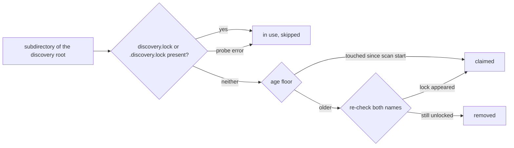

# PR Summary — Issue #2256

## Summary

Closes #2256

The orphan sweep judged liveness only by `discovery.lock`. NEAT-AI
(`src/discovery/DiscoveryCleanup.ts`) writes `.discovery.lock`, with a leading
dot, and nothing in this repo writes the undotted name. So every live NEAT-AI
session looked abandoned, and `clean_orphaned_discovery_dirs` could delete it
mid-run (CWE-706, finding SEC-bbe3f392d7aa).

The fix makes either spelling mark a directory as in use, at every place the
lock is probed:

- `is_directory_orphaned` — the sweep's orphan check. It stays fail-closed and
  uses `symlink_metadata` for both names.
- The #1903 `LockRecheck::Enforce` re-check. It calls `is_directory_orphaned`,
  so it inherits the fix.
- The `assert_is_discovery_dir` contents check. It now accepts
  `.discovery.lock` as well.

The new `HOST_LOCK_FILE_NAME` and `LOCK_FILE_NAMES` constants sit next to
`LOCK_FILE_NAME` and record the host's spelling. `docs/FFI_API.md` §
"Orphaned Directory Sweep" and the `clean_orphaned_discovery_dirs` FFI doc
comment now name both files.



## Security-Fix Evidence

- **Regression test:**
  `tests/issue_2256_orphan_sweep_host_lock_name.rs::host_spelled_lock_survives_orphan_sweep`.
  It creates a `.discovery/<uuid>/` that holds only `.discovery.lock`, then
  asserts the directory survives `clean_orphaned_discovery_dirs` with
  `removed == 0`. It also asserts `claimed == 0`, so the age floor cannot hide
  the result.
- **Fails before, passes after.** On the unfixed code all 5 tests in the file
  failed: 0 passed, 5 failed.
  `host_spelled_lock_survives_orphan_sweep` panicked on "a live NEAT-AI session
  must not be swept". `host_spelled_lock_identifies_discovery_dir` was rejected
  with `InvalidInput`: "must contain discovery.lock or discovery_data.parquet".
  After the fix all 5 pass.
- **The original trigger is closed, with no trivial bypass.**
  - All three lock probes check both names, so there is no second code path
    that still reads only `discovery.lock`.
  - The probe still fails closed: a dangling-symlink lock, or any error other
    than `NotFound`, counts as "in use".
  - `sweep_still_removes_unlocked_sibling` shows the sweep still removes a
    directory with no lock at all. The fix narrows what counts as an orphan
    and does not disable the sweep.

## Evidence

Tests in the new file:

- `host_spelled_lock_survives_orphan_sweep`
- `either_lock_spelling_marks_directory_in_use`
- `sweep_still_removes_unlocked_sibling`
- `recheck_honours_host_spelled_lock`
- `host_spelled_lock_identifies_discovery_dir`

```text
$ cargo test --test issue_2256_orphan_sweep_host_lock_name
test result: ok. 5 passed; 0 failed
$ cargo test --test issue_1903_orphan_sweep_lock_recheck
test result: ok. 5 passed; 0 failed
$ cargo test --test issue_1866_cleanup_dir_path_guard
test result: ok. 10 passed; 0 failed
$ cargo test --lib discovery_cleanup
test result: ok. 16 passed; 0 failed
```

## Quality Gate

<!-- vibe-quality-gate-skipped reason="a single ./quality.sh run exceeds the 600s Bash tool cap; every stage was run separately and passed" -->

`./quality.sh` cannot finish inside one 600-second tool call. Both full runs
passed shellcheck, `cargo deny` (advisories, bans, licences and sources ok),
the debug build, auto-format, clippy ("No issues found") and the type checks.
They then timed out in the test stage.

The remaining stages were run separately with the gate's own commands:

- **Integration tests** —
  `cargo test --test '*' --all-features -- --test-threads=2`: all 209 binaries
  passed, 0 failed.
- **Library unit tests** — `cargo test --lib --all-features`: 1612 passed and
  1 failed. The failure was
  `issue_2161_test::locality_grouping_cost_does_not_grow_quadratically`, a
  timing-ratio test in unrelated `analysis::synapse` code. It measured 80µs
  against 254µs on a loaded shared host, and it passes when run alone
  (`cargo test --lib issue_2161`: 2 passed).
- **Docs** — `RUSTDOCFLAGS="-D warnings" cargo doc --no-deps`: ok.
- **Release build** — `cargo build --release --lib`: ok.

## Test Plan

- [x] The new regression test fails on the unfixed code and passes after the
      fix.
- [x] The #1903 re-check tests and the #1866 path-guard tests still pass.
- [x] clippy, fmt, deny, doc and the release build are clean.
- [x] The integration suite passes: 209/209 binaries.
