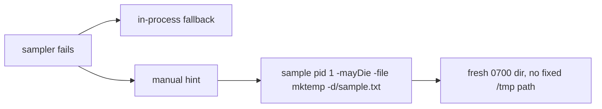

# PR Summary — Issue #2266

## Summary

Closes #2266

Every failure path of the SIGUSR1 thread-dump sampler prints a manual hint. The
hint told the operator to run `sample <pid> 1 -mayDie -file /tmp/sample.txt`.
That is the predictable shared-`/tmp` path #1905 removed from the automated
capture, and the hint offered it at exactly the moment an incident makes a
human copy it (CWE-377, finding SEC-c6f3abf33c8c). macOS has no
`fs.protected_symlinks`, so a local user can pre-plant `/tmp/sample.txt` as a
symlink, and a `sudo sample` run would then write through it.

- `write_manual_hint` in `src/debug/sample_capture.rs` now prints
  `Try manually: sample <pid> 1 -mayDie -file "$(mktemp -d)/sample.txt"`. That
  is a fresh, unpredictable, owner-only `0700` directory for each invocation,
  like the automated capture.
- `docs/GPU_GUIDE.md` § "Manual Thread Inspection" taught the same path. It
  now uses `dir="$(mktemp -d)"`.
- The `Try manually: sample` prefix is kept, so
  `tests/issue_1934_sample_fallback.rs::assert_fallback_present` still passes.
- The hint is still printed for every configured sampler, not only for
  `sample`. The issue suggested showing it only when the program is `sample`,
  but `assert_fallback_present` requires the hint when
  `NEAT_AI_DISCOVERY_SAMPLE_PROGRAM` points at a test script. Also, the
  security problem was the path, and the path is now safe whichever sampler
  is configured.

## Security-Fix Evidence

- **Regression test:**
  `tests/issue_2266_sample_manual_hint_private_dir_test.rs::failing_sampler_hint_points_at_a_fresh_private_dir`.
  It drives `render_thread_dump` with `NEAT_AI_DISCOVERY_SAMPLE_PROGRAM` set to
  a script that exits 3. It asserts that the dump still offers
  `Try manually: sample`, does **not** contain `/tmp/sample.txt`, and does
  contain `-file "$(mktemp -d)/sample.txt"`.
- **Fails before, passes after.** On the unfixed code, all 3 tests in the file
  failed at the `/tmp/sample.txt` assertion (0 passed, 3 failed). After the fix
  all 3 pass.
- **The original trigger is closed, with no trivial bypass.**
  - `write_manual_hint` is the only place the `sample` hint is written, and
    every failure path of `capture()` calls it. The paths are:
    - private-directory creation failure;
    - spawn error;
    - timeout with no output;
    - non-zero exit;
    - an empty or refused capture.

    The tests cover three of these paths: non-zero exit, empty capture and
    spawn failure.
  - A repo-wide grep for `/tmp/sample.txt` now finds it only in archived PR
    summaries.

## Evidence

Tests in `tests/issue_2266_sample_manual_hint_private_dir_test.rs`:

- `failing_sampler_hint_points_at_a_fresh_private_dir` (non-zero exit)
- `empty_capture_hint_points_at_a_fresh_private_dir` (exit 0, no capture)
- `unspawnable_sampler_hint_points_at_a_fresh_private_dir` (spawn error)

The existing `issue_1934_sample_fallback` (5 tests) and
`issue_1905_sample_temp_dir` (4 tests) suites still pass.

### Quality Gate

<!-- vibe-quality-gate-skipped reason="./quality.sh as a single call exceeds the 600s tool cap (timed out at exit 124 while compiling); each stage was run separately and passed" -->

Each stage of `./quality.sh` was run on its own, and all passed:

- `cargo deny check`
- `cargo fmt --check`
- `cargo clippy --all-targets --all-features -- -D warnings`
- `cargo test --lib --tests --all-features -- --test-threads=2` (211 result
  lines, 0 failures)
- `RUSTDOCFLAGS="-D warnings" cargo doc --no-deps`
- `cargo build --release --lib`

## Test Plan

- [x] New regression tests fail on the unfixed code and pass after the fix
- [x] `issue_1934_sample_fallback` and `issue_1905_sample_temp_dir` stay green
- [x] fmt, clippy, full lib and integration tests, doc and release build
- [x] `docs/GPU_GUIDE.md` no longer teaches `/tmp/sample.txt`
