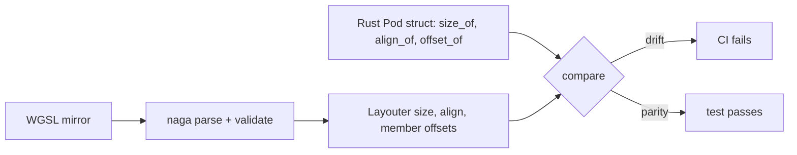

## Summary

Audits the 12 `#[repr(C)] bytemuck::Pod` structs in
`src/analysis/samples/gpu_types.rs` against all 23 of their WGSL mirrors in
`src/shaders/*.wgsl`. Adds a test that runs on the CPU only and fixes each
struct's layout in place, so any drift on either side fails CI. Closes #2289.

- **Result: negative.** Parity holds on all 12 structs. Member names, order,
  scalar types, offsets, size and alignment all match. No member is a `vec3`,
  so no ledger row or issue was needed.
- **28-byte decision: valid, no change needed.** `ActivationUniforms` is the
  top-level `var<uniform>` struct. WGSL's 16-byte rounding applies only to
  structs nested inside uniform space and to array elements there. The host
  uploads exactly 28 bytes with `min_binding_size: None`. `ActivationOutput`
  appears only in storage and workgroup arrays, whose stride is
  `roundUp(4, 28) = 28`. That matches the host's `size_of * n` buffer sizing.
  naga validation accepts both.
- The record `docs/audits/security-sweep-chunk-9-gpu-wgsl.md` now holds:
  - the struct-parity table, at the top of the `shaders` audit region;
  - the reasoning behind the 28-byte decision;
  - four refuted rows in the `shaders` region of `## Refuted / not findings`.

## Evidence

This change adds tests and docs only; there is no UI.
`cargo test --test issue_2289_gpu_struct_layout` passes 5/5. The WGSL layout
comes from naga 30's `Layouter`, not from hand calculation.

Two checks confirmed the test goes red when a shader drifts:

- **Two same-typed fields swapped** (`positive_improvement` and
  `negative_improvement` in `helpful.wgsl`): the test fails with
  `member (name, offset, scalar) order differs`.
- **A scalar type changed** (`positive_count` from `u32` to `f32` in
  `relu_reduce.wgsl`): naga validation fails.

Both shader edits were reverted afterwards.

## Acceptance Criteria

<!-- vibe-spec-review inputs="diff+issue-body" -->

- **met** — Struct-parity table covers all 12 structs with Rust and WGSL `file:line` references and a verdict for each — evidence: `docs/audits/security-sweep-chunk-9-gpu-wgsl.md` (`#### Host ↔ WGSL struct parity`) — reviewer: met
- **met** — 28-byte `ActivationUniforms`/`ActivationOutput` decision recorded with reasoning — evidence: `docs/audits/security-sweep-chunk-9-gpu-wgsl.md` ("Decision — …"); `tests/issue_2289_gpu_struct_layout.rs::uniform_bindings_accept_28_byte_activation_uniforms` — reviewer: met
- **met** — `tests/issue_2289_gpu_struct_layout.rs` asserts `size_of` and `align_of` for all 12 structs without a GPU — evidence: `tests/issue_2289_gpu_struct_layout.rs::rust_pod_structs_have_pinned_size_and_alignment`, `::every_wgsl_mirror_matches_its_rust_struct_layout` — reviewer: met
- **met** — Every surviving mismatch has a ledger row and a linked issue, and refuted suspicions have rows — evidence: no mismatch survived (negative result recorded); four rows in the `shaders` region of `## Refuted / not findings` — reviewer: met
- **met** — `cargo test --test issue_2088_sweep_ledger_contract` and `./quality.sh` pass — evidence: ledger contract 9/9 and `./quality.sh` run after the final edit — reviewer: partial — reason: the reviewer ran the ledger contract (9/9) but could not see the gate. The gate was run here and passed.

## Standards Review

<!-- vibe-standards-review inputs="diff+CODING-STANDARDS.md" -->

This repository has no `CODING-STANDARDS.md`, so the reviewer used
`CONTRIBUTING.md` and `AGENTS.md`.

- **violation** — PR summary file missing (CONTRIBUTING.md "PR Summary File") — evidence: `docs/archive/pr-summaries/pr-summary-2289.md` — reason: fixed here; this file was added.
- **clean** — Areas the reviewer checked and found compliant:
  - Australian English.
  - Tests call real code (`std::mem`, naga on the shipped shader constants) and never grep source.
  - No non-vacuous gaps: 23 mirrors are counted and the struct-array count is checked to be above zero.
  - The tests run on the CPU only and contain no timing assertions.
  - No new dependency (naga 30 was already a dev-dependency).
  - CI and `Cargo.toml` are untouched.
  - Every `file:line` citation was verified at the baseline.
  - The record edits stay inside the `shaders` regions.
  - No hidden files are staged.
- **clean** — Optional points the reviewer raised, all addressed here:
  - The `vec3` check no longer relies on naga's `Debug` text; it matches on `TypeInner::Vector` instead.
  - `bias.wgsl`'s `shared_samples` is now named in the stride paragraph.

## Test Plan

- Added `tests/issue_2289_gpu_struct_layout.rs`:
  - `rust_pod_structs_have_pinned_size_and_alignment`: `size_of`/`align_of` for all 12 structs.
  - `every_wgsl_mirror_matches_its_rust_struct_layout`: naga size, alignment and per-member name/offset/scalar for all 23 mirrors.
  - `host_shared_array_strides_equal_rust_size`: every struct-typed array's stride equals `size_of`.
  - `uniform_bindings_accept_28_byte_activation_uniforms`: the 28-byte uniform validates and has a span of 28.
  - `a_drifted_wgsl_mirror_is_detected`: error path; a `vec3` member changes size and alignment.
- Ran `cargo test --test issue_2088_sweep_ledger_contract --test issue_2288_chunk_09_ledger_scaffold`.
- Ran `./quality.sh`.

🤖 Generated with [Claude Code](https://claude.com/claude-code)
