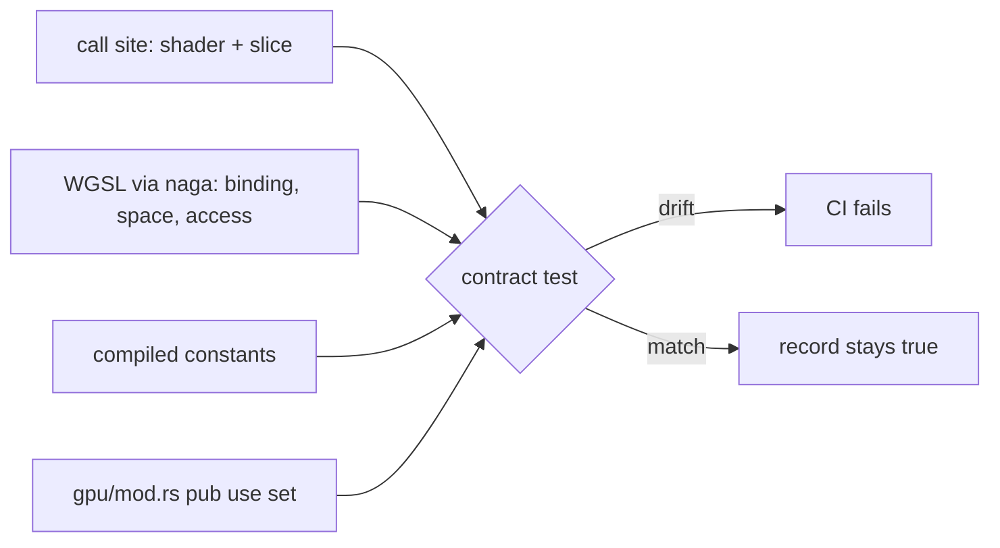

## Summary

Completes the `shaders` slice of the chunk 9 GPU/WGSL security sweep. It audits
the `build_compute_pipeline` binding order, the GPU constants and the
`gpu` module surface, and records the results in
`docs/audits/security-sweep-chunk-9-gpu-wgsl.md`. Closes #2291.

- **Binding order: match at all 8 call sites.** `binding: i as u32`
  (`pipeline_builder.rs`) assigns slots by position. Every `STANDARD_BINDINGS` /
  `BIAS_BINDINGS` slice agrees with its shader's `@binding` index, type and
  access. It also agrees with the entries of the matching `create_bind_group`
  call (10 bind groups). Refuted.
- **GPU constants: one finding.** `GPU_INIT_TIMEOUT_SECS` is defined twice:
  `shaders.rs:143` and `device.rs:54` are independent literals with no
  equality pin. This is recorded as CWE-1041 `SEC-4b2140a0cd91` and filed as
  **#2311** (severity:low, confidence:high), with a row in the Ledger's
  shaders region. `WORKGROUP_SIZE` is pinned by the naga test. The other
  constants are bounded by const asserts or derived from other constants.
  Refuted.
- **Mis-citation in the issue.** The issue cites `shaders.rs:324–325` as the
  `WORKGROUP_SIZE` asserts. Those lines actually bound
  `GPU_INIT_TIMEOUT_SECS`. The `WORKGROUP_SIZE` asserts are at L313–L316. The
  record gives the correct lines.
- **Module surface.** Each of the 56 `pub use` re-exports gets a verdict: 15
  are used through the module root and 41 are unused. The unused ones are
  redundant paths to items still reachable through their submodules. None
  reads env or config, so none is a dead operator lever. Refuted, and pruning
  them is left as out of scope.
- The inventory rows for `mod.rs`, `pipeline_builder.rs` and `shaders.rs` now
  read `<outcome> — <reason>`. The `pipeline_builder.rs` row notes that
  `min_binding_size: None` defers buffer-size validation to draw time. The
  size limits themselves belong to #2237 and #2238 and are not repeated here.

## Evidence

This change adds docs and tests only; there is no UI. The new contract test
`tests/issue_2291_chunk_09a_2b_shader_layer_sweep.rs` (7 tests) checks the
record against the real code:

- `binding_table_matches_every_call_site_shader_and_slice`: naga parses each
  `src/shaders/*.wgsl`, and each `@binding` index, address space and access
  mode must equal what the table claims for its slice.
- `constants_table_values_match_the_compiled_constants`: the table's values
  must equal the compiled `shaders` / `device` constants, and the
  `GPU_INIT_TIMEOUT_SECS` row must carry the verdict "finding" and link
  #2311.
- `module_surface_gives_every_pub_use_a_verdict`: the names are parsed from
  `gpu/mod.rs`. The table must cover exactly that set, and every "used" row
  must name an existing evidence file.
- `workgroup_size_matches_every_wgsl_file`: covers all 10 `.wgsl` files,
  including `matching.wgsl`, which the embedded-shader naga test never sees.
- The remaining tests check the Ledger row, the Refuted rows, the inventory
  outcomes, and that no `Pending — 9a-2b` line is left.

The existing tests that parse the same record still pass:
`issue_2088_sweep_ledger_contract` (9/9), `issue_2288_chunk_09_ledger_scaffold`
(4/4) and `issue_2289_gpu_struct_layout` (5/5).

## Acceptance Criteria

<!-- vibe-spec-review inputs="diff+issue-body" -->

- **met** — The pipeline binding-order table has 8 rows, each checked against the shader and the bind group, with a verdict — evidence: `#### Pipeline binding order`; `binding_table_matches_every_call_site_shader_and_slice` — reviewer: met
- **met** — The constants table covers every listed constant, and the `GPU_INIT_TIMEOUT_SECS` duplicate is recorded as a finding — evidence: `#### GPU constants`; `constants_table_values_match_the_compiled_constants`; #2311 — reviewer: met
- **met** — Every `pub use` in `mod.rs` has a used/unused verdict — evidence: `#### Module surface`; `module_surface_gives_every_pub_use_a_verdict` — reviewer: partial — reason: the prose totals said 57/42 where the table has 56/41, and seven breaker rows cited a non-existent `gpu::circuit_breaker` path. Both are now fixed (56/41, `gpu::breaker`), and the inventory row's "all 10 kernels" claim now reads "the 9 embedded kernels".
- **met** — Every surviving finding has its own issue, linked from a Ledger row — evidence: Ledger shaders row `SEC-4b2140a0cd91 … open — #2311`; #2311 carries the finding-id and cwe markers and the labels security, lang:rust, severity:low and confidence:high — reviewer: met
- **met** — None of the three `## Files swept` rows reads `pending` — evidence: `shaders_inventory_rows_record_an_outcome_and_reason` — reviewer: met
- **met** — `./quality.sh` passes, including `issue_2088_sweep_ledger_contract` — evidence: the full gate passed ("✅ All quality checks passed!"). The review fixes that followed changed only doc text and two test comments, and were re-verified with `cargo fmt --check`, the four tests that parse the record, and markdownlint (0 issues) — reviewer: partial — reason: the reviewer ran the contract tests but not the full gate, which was run here.
- **met** — Refutations are recorded with a `file:line` reason — evidence: three new rows in the shaders region of Refuted; `refuted_shaders_region_covers_bindings_constants_and_surface` — reviewer: met
- **met** — New contract test `tests/issue_2291_chunk_09a_2b_shader_layer_sweep.rs` — reviewer: unrequested — reason: the issue asked only for an audit record. The test keeps the record's tables in line with the code, following the pattern of the #2288/#2289 tests (the TDD requirement).
- **met** — Updates to `## Outcome` and `## Issues filed` — reviewer: unrequested — reason: ledger housekeeping to record #2311 and the finished shaders slice.

## Standards Review

<!-- vibe-standards-review inputs="diff+CODING-STANDARDS.md" -->

`CODING-STANDARDS.md` is absent from this repo. The review used
`CONTRIBUTING.md`, `AGENTS.md` and the fleet coding guidelines instead.

Violations:

- `docs/audits/security-sweep-chunk-9-gpu-wgsl.md` (the new tables) —
  CONTRIBUTING "Cite Code by Symbol, Never by Line Number" (#1942) — the
  tables cite code as `file:line`. Kept deliberately: the issue requires
  `file:line` reasons, the Ledger contract (#2088) requires a `file:line`
  location column, and the record is pinned to a baseline commit whose method
  section says line numbers are re-verified there. The new rows follow the
  record's existing style, and the symbol is named alongside each line.
- `tests/issue_2291_chunk_09a_2b_shader_layer_sweep.rs` (`STANDARD` / `BIAS`
  doc comments) — the same rule — **fixed**: the comments now cite
  `pipeline_builder::STANDARD_BINDINGS` / `BIAS_BINDINGS` only.

Clean:

- Australian English — clean — no American spellings in the added lines.
- Stay in scope — clean — only the #2291 record sections and their contract test. No `src/` change, and re-export pruning is deferred.
- Tests exercise real artefacts — clean — naga parses the WGSL, and the tests compare against compiled constants and the parsed `mod.rs`.
- Fast tests — clean — no sleeps or wall-clock thresholds.
- Fail loud — clean — every lookup panics with context when something is missing.
- No hidden files, no secrets, `ci.yml` untouched, no Mermaid bare `;` — clean.
- Version bump — clean — docs and tests only. CI's `version-increment` job handles the version.

## Test Plan

- [x] `cargo test --all-features --test issue_2291_chunk_09a_2b_shader_layer_sweep` — 7/7
- [x] `cargo test --all-features --test issue_2088_sweep_ledger_contract` — 9/9
- [x] `cargo test --all-features --test issue_2288_chunk_09_ledger_scaffold` — 4/4
- [x] `cargo test --all-features --test issue_2289_gpu_struct_layout` — 5/5
- [x] `npx markdownlint-cli2 docs/audits/security-sweep-chunk-9-gpu-wgsl.md` — 0 issues
- [x] `./quality.sh` — passed
