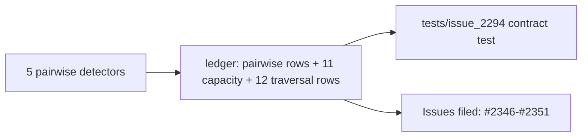

## Summary

Sweeps the first five chunk 8a pairwise detectors into the staged ledger `docs/audits/in-progress/security-sweep-chunk-08a-detection-neuron.md`: `correlated_error.rs`, `weight_coherence.rs`, `co_adaptation.rs`, `symmetry_breaking.rs` and `fanin_polarity_conflict.rs`. It also adds the pairwise-section contract test. Closes #2294.

- **Rows:** five pairwise rows filled, each stating all six #2092 defect classes as probed. The other four pairwise rows stay `pending` for #2150's second sub-issue.
- **Capacity and traversal table:** 11 capacity rows, one per production `with_capacity(` / `vec![_; n]` / `.reserve(` site (3/3/2/2/1). 12 traversal rows, all `no (module-level only)`; none of the five files calls `deadline_passed` or `is_cancelled`.
- **`correlated_error` matrix verdict — unbounded (#2346).** `n_outputs` counts `"output"`-typed neurons, which `validate_creature` never ties to the `1_000_000`-capped `creature.output`. So no numeric cap applies, and even at that cap the matrix would be about 4 TB.
- **Findings filed** in the #2078 shape (labels `security`, `lang:rust`, `severity:*`, `confidence:*`) and linked from `## Issues filed`. None is fixed here, per the issue.
  - #2346 (medium): `correlated_error` n² matrix plus an uncancellable pair scan.
  - #2347 (medium): `detect_symmetric_cancellation` runs a per-target O(k²) scan and rebuilds two record maps for every pair.
  - #2348 (medium): `co_adaptation` runs an O(E²·S) scan with no ceiling.
  - #2349 (medium): `symmetry_breaking` runs an O(S·H) membership scan and an O(E²) pair loop that rebuilds both weight vectors for every pair.
  - #2350 (low): `fanin_polarity_conflict` does a linear `find` over all neurons for every candidate.
  - #2351 (low): weights that overflow `f32` produce NaN or `+∞` gains, which get past fail-open gates in three detectors.
- **Shared helpers:** verdicts reused from #2281 (`build_record_map`, `pearson_correlation_hashmaps` → #2343, `pearson_correlation` → #2304, `CreatureTopologyCache`).
- **Deliberate departure from the issue text:** the two linear `fanin_polarity_conflict` passes (`incoming_by_target`, `synapses_to_move`) are recorded as Kind `traversal`, not `pairwise loop`, because they are not pairwise.

Docs and tests only: no `Cargo.toml` bump and no CI change.

## Evidence

This is an audit, so there is no UI. `tests/issue_2294_chunk_08a_pairwise_sweep.rs` pins the ledger against the source:

- `tests/issue_2294_chunk_08a_pairwise_sweep.rs::each_swept_file_has_exactly_one_filled_pairwise_row`
- `tests/issue_2294_chunk_08a_pairwise_sweep.rs::each_swept_row_states_all_six_defect_classes_probed`
- `tests/issue_2294_chunk_08a_pairwise_sweep.rs::capacity_row_count_per_file_matches_the_production_capacity_sites`
- `tests/issue_2294_chunk_08a_pairwise_sweep.rs::every_traversal_symbol_has_a_row_marked_module_level_only`
- `tests/issue_2294_chunk_08a_pairwise_sweep.rs::no_swept_file_checks_cancellation_itself`
- `tests/issue_2294_chunk_08a_pairwise_sweep.rs::every_issue_linked_from_a_swept_row_appears_under_issues_filed`

**Regression linkage:** `each_swept_file_has_exactly_one_filled_pairwise_row` fails against the unswept ledger, where the five rows read `pending`, and passes after this change. I confirmed this by flipping the `co_adaptation.rs` row back to `pending`: that test and the six-classes test both failed, then passed again once the row was restored.

**Original trigger closed:** the gap was an unswept section. Every swept row must now carry a non-`pending` outcome naming all six classes, and every capacity site and pairwise loop must have a matching row, so a new allocation or loop cannot land in these files unrecorded. The only bypass is editing `SWEPT` / `TRAVERSAL` in the test itself, which a reviewer sees in the diff.

The NaN/`+∞` behaviour behind #2351 was reproduced with a `rustc -O` copy of each expression: `cos=NaN lt=false`, `conflict=NaN lt=false`, `ratio=inf sev=inf`.

## Acceptance Criteria

<!-- vibe-spec-review inputs="diff+issue-body" -->

- **met** — Five pairwise rows filled (none `pending`) in the staged ledger; no edits outside the pairwise section, the capacity table and `## Issues filed` — evidence: `tests/issue_2294_chunk_08a_pairwise_sweep.rs::each_swept_file_has_exactly_one_filled_pairwise_row` — reviewer: met
- **met** — 11 capacity rows recorded for the five files, including an explicit verdict on the `correlated_error` `n_outputs²` matrix — evidence: `tests/issue_2294_chunk_08a_pairwise_sweep.rs::capacity_row_count_per_file_matches_the_production_capacity_sites` — reviewer: met
- **met** — Traversal rows for every pair/nested loop listed, each `no (module-level only)` — evidence: `tests/issue_2294_chunk_08a_pairwise_sweep.rs::every_traversal_symbol_has_a_row_marked_module_level_only` — reviewer: met
- **met** — All six defect classes stated as probed per file — evidence: `tests/issue_2294_chunk_08a_pairwise_sweep.rs::each_swept_row_states_all_six_defect_classes_probed` — reviewer: met
- **met** — Each surviving finding filed in the #2078 shape and linked from `## Issues filed` — evidence: #2346–#2351 on GitHub; `tests/issue_2294_chunk_08a_pairwise_sweep.rs::every_issue_linked_from_a_swept_row_appears_under_issues_filed` — reviewer: met
- **met** — `cargo test --test issue_2294_chunk_08a_pairwise_sweep` passes — evidence: 6 passed locally — reviewer: missing — reason: the reviewer saw only the diff and could not run tests; they were run here and passed
- **met** — `cargo test --test issue_2088_sweep_ledger_contract` passes and `lib-sweep-coverage.json` "8a" is still all-null — evidence: run alongside `issue_2280` / `issue_2281`, 19 passed; `lib-sweep-coverage.json` untouched — reviewer: missing — reason: the reviewer could not run commands and noted the diff does not touch the JSON or move the ledger; the tests were run here and passed
- **met** — `./quality.sh < /dev/null` passes — evidence: full gate run after the final code commit ended with "✅ All quality checks passed!" — reviewer: missing — reason: the reviewer could not run the gate; it was run here and passed

## Standards Review

<!-- vibe-standards-review inputs="diff+CODING-STANDARDS.md" -->

- **clean** — `CODING-STANDARDS.md` is absent from this checkout, so the reviewer checked against `CONTRIBUTING.md` / `AGENTS.md` instead. It found no violations: Australian English throughout; every code reference cites a symbol, never a line number; the test sits under `tests/` with no timing assertions; no `Cargo.toml`, CI or `src/` change. Optional notes only: the test's small Markdown parser, and the long ledger cells.

## Test Plan

- Added `tests/issue_2294_chunk_08a_pairwise_sweep.rs` (6 tests).
- Ran `cargo test --test issue_2294_chunk_08a_pairwise_sweep`, `--test issue_2280_chunk_08a_ledger_scaffold`, `--test issue_2281_chunk_08a_shared_sweep` and `--test issue_2088_sweep_ledger_contract`: all pass.
- Ran `cargo clippy --test issue_2294_chunk_08a_pairwise_sweep -- -D warnings`: clean.
- Ran `./quality.sh < /dev/null`: passes.
