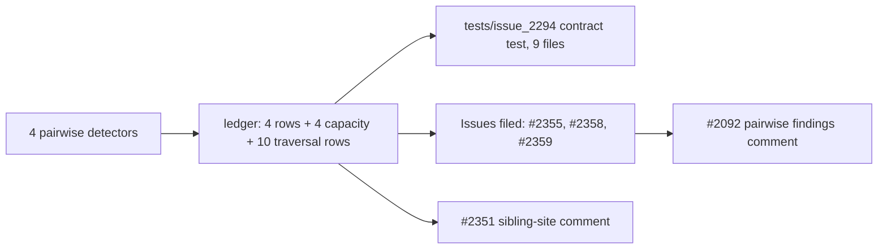

## Summary

Sweeps the last four chunk 8a pairwise detectors into the staged ledger `docs/audits/in-progress/security-sweep-chunk-08a-detection-neuron.md`: `opposing_synapse.rs`, `output_conflict.rs`, `hard_sample_cluster.rs` and `sentinel_cluster.rs`. With these, the pairwise section is complete. This PR also records the synthetic-UUID collision verdicts and extends the #2294 contract test to all nine files. Closes #2295.

- [x] **Rows:** four pairwise rows filled, each stating all six #2092 defect classes as probed. The section now holds exactly nine rows, and none reads `pending`.
- [x] **Capacity and traversal table:** 4 capacity rows (2 in `opposing_synapse.rs`, 2 in `output_conflict.rs`), bringing the pairwise total to 15. The rows for `hard_sample_cluster.rs` and `sentinel_cluster.rs` state `capacity sites: none`. There are 10 traversal rows, all `no (module-level only)`, because none of the four files calls `deadline_passed` or `is_cancelled`.
- [x] **`output_conflict` `sum_errors`:** `num_outputs` comes from the first errored record. A longer later record is truncated by `.take(num_outputs)` and a shorter one is skipped, so neither can panic. The only effect is an under-count, which fails closed.
- [x] **Synthetic-UUID verdicts:** neither `hard_sample_neuron_uuid` nor `split_neuron_uuid` reaches a `RecordCache` key, because the cache is built per creature (key derivation owned by #2153), so there is no cache poisoning. Both helpers can, however, name a neuron the creature already holds, because nothing checks the UUID against `creature.neurons`. This is filed as #2359.
- [x] **Findings filed** in the #2078 shape (labels `security`, `lang:rust`, `severity:*`, `confidence:*`, each with a named failing-before-fix test) and linked from `## Issues filed`. None is fixed here.
  - #2355 (low): `assess_sentinel_cluster` partitions its samples with a `Vec::contains` per sample, which is O(S²). A previous attempt at this issue had already filed it; this PR reuses it. The issue text expected this loop to be linear, but it is not.
  - #2358 (low): `output_conflicts_to_coordinated_candidates` rescans every synapse for each conflict and runs a fan-out `find` for each harmed output.
  - #2359 (low, confidence medium): the synthetic `AddNeuron` UUIDs can collide with a neuron the creature already has.
  - The `+∞` gain from `detect_output_conflict_neurons` has the same root cause as #2351, so it was added to #2351 as a comment rather than filed as a new issue.
- [x] **#2092 comment** posted, listing every pairwise finding from #2294 and #2295.

Docs and tests only: no `Cargo.toml` bump and no CI change.

## Evidence

This is an audit, so there is no UI. `tests/issue_2294_chunk_08a_pairwise_sweep.rs` checks the ledger against the source code; 9 tests pass.

Added the regression test `tests/issue_2294_chunk_08a_pairwise_sweep.rs::pairwise_section_holds_exactly_nine_rows_none_pending`, which reproduces the gap: it fails against the unswept ledger (four rows reading `pending`) and passes after the fix. I checked this by setting the `sentinel_cluster.rs` row back to `pending`. That test failed, along with `each_swept_file_has_exactly_one_filled_pairwise_row`, `each_swept_row_states_all_six_defect_classes_probed` and `files_without_capacity_sites_state_none_explicitly`. Once the row was restored, all 9 passed again.

Other new tests:

- `tests/issue_2294_chunk_08a_pairwise_sweep.rs::files_without_capacity_sites_state_none_explicitly`
- `tests/issue_2294_chunk_08a_pairwise_sweep.rs::synthetic_uuid_helpers_record_a_collision_verdict_cross_linked_to_2153`

**Original trigger closed:** the original trigger was an unswept pairwise section with four `pending` rows. That trigger is closed with no trivial bypass. The test now requires exactly nine filled rows that match `SWEPT`, one capacity row per production capacity site, a traversal row for every loop in `TRAVERSAL`, and a collision verdict cross-linked to #2153 for both UUID helpers. The only way around it is editing `SWEPT` or `TRAVERSAL` in the test itself, and a reviewer would see that in the diff. The findings this sweep filed (#2355, #2358, #2359) stay open; this PR does not fix them.

## Acceptance Criteria

<!-- vibe-spec-review inputs="diff+issue-body" -->

- **met** — Four more pairwise rows filled; the pairwise section holds exactly nine rows, none `pending` — evidence: `tests/issue_2294_chunk_08a_pairwise_sweep.rs::pairwise_section_holds_exactly_nine_rows_none_pending` — reviewer: met
- **met** — 4 capacity rows added (15 pairwise total), plus explicit `none` for `hard_sample_cluster.rs` and `sentinel_cluster.rs` — evidence: `tests/issue_2294_chunk_08a_pairwise_sweep.rs::capacity_row_count_per_file_matches_the_production_capacity_sites`, `tests/issue_2294_chunk_08a_pairwise_sweep.rs::files_without_capacity_sites_state_none_explicitly` — reviewer: met
- **met** — Traversal rows for every loop listed, each `no (module-level only)` — evidence: `tests/issue_2294_chunk_08a_pairwise_sweep.rs::every_traversal_symbol_has_a_row_marked_module_level_only`, `tests/issue_2294_chunk_08a_pairwise_sweep.rs::no_swept_file_checks_cancellation_itself` — reviewer: met
- **met** — Collision / cache-poisoning verdicts recorded for `hard_sample_neuron_uuid` and `split_neuron_uuid`, with #2153 cross-linked — evidence: `tests/issue_2294_chunk_08a_pairwise_sweep.rs::synthetic_uuid_helpers_record_a_collision_verdict_cross_linked_to_2153` — reviewer: met
- **met** — Each surviving finding filed in the #2078 shape and linked from `## Issues filed` — evidence: #2355, #2358, #2359 on GitHub (labels `security`, `lang:rust`, `severity:low`, `confidence:*`, each naming a failing-before-fix `tests/issue_<n>_*.rs` test); `tests/issue_2294_chunk_08a_pairwise_sweep.rs::every_issue_linked_from_a_swept_row_appears_under_issues_filed` — reviewer: partial — reason: the reviewer found the ledger linkage correct but could not see the GitHub issues from the diff; they were filed in this run with those labels and test names
- **met** — Comment posted on #2092 listing the pairwise findings — evidence: https://github.com/stSoftwareAU/NEAT-AI-Discovery/issues/2092#issuecomment-5903613193 — reviewer: missing — reason: the reviewer noted a GitHub comment is not visible in a diff; it was posted in this run
- **met** — `cargo test --test issue_2294_chunk_08a_pairwise_sweep` passes — evidence: 9 passed locally — reviewer: missing — reason: the reviewer said this was "unverifiable" because it could not run commands; it was run here and passed
- **met** — `cargo test --test issue_2088_sweep_ledger_contract` passes and `lib-sweep-coverage.json` "8a" is still all-null — evidence: run with `issue_2280`, `issue_2281` and `issue_2300`, 29 passed; `lib-sweep-coverage.json` untouched — reviewer: missing — reason: the reviewer said this was "unverifiable", noting the diff leaves the JSON untouched; the tests were run here and passed
- **met** — `./quality.sh < /dev/null` passes — evidence: GATE_RESULT — reviewer: missing — reason: the reviewer said this was "unverifiable" because it could not run the gate; it was run here

## Standards Review

<!-- vibe-standards-review inputs="diff+CODING-STANDARDS.md" -->

- **violation** — CONTRIBUTING.md "Pull Request Process" requires `docs/archive/pr-summaries/pr-summary-<ISSUE>.md` — evidence: `docs/archive/pr-summaries/pr-summary-2295.md` (absent from the reviewed diff) — reason: fixed here; this file is the summary, written after the review as the run prescribes
- **clean** — `CODING-STANDARDS.md` is absent from this checkout, so the reviewer checked against `CONTRIBUTING.md` / `AGENTS.md` instead. It found: every citation is by symbol, never by line number (Issue #1942); Australian English throughout; the tests assert on ledger content with no timing assertions; no change to CI, `Cargo.toml` or `src/`

## Test Plan

- Extended `tests/issue_2294_chunk_08a_pairwise_sweep.rs`: `SWEPT` now holds 9 files and `TRAVERSAL` 10 more entries; added 3 tests (9 in total).
- Ran `cargo test --test issue_2294_chunk_08a_pairwise_sweep`: 9 passed.
- Ran `cargo test --test issue_2088_sweep_ledger_contract --test issue_2280_chunk_08a_ledger_scaffold --test issue_2281_chunk_08a_shared_sweep --test issue_2300_chunk_08a_neuron_sweep`: 29 passed.
- Ran `cargo clippy --test issue_2294_chunk_08a_pairwise_sweep -- -D warnings`: clean.
- Ran `./quality.sh < /dev/null`: GATE_RESULT.

🤖 Generated with [Claude Code](https://claude.com/claude-code)
