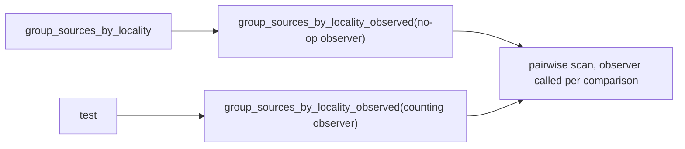

# PR Summary — Issue #2296

## Summary

Closes #2296

`locality_grouping_cost_does_not_grow_quadratically` timed two grouping runs and asserted `t_large <= t_small * 3`, so a load spike in the parallel test run could fail the gate. The test now counts work instead of measuring time:

- `group_sources_by_locality` delegates to a private `group_sources_by_locality_observed`, which calls an injected `impl FnMut()` once per pairwise overlap comparison. Production passes `|| {}`, which monomorphises to nothing, so behaviour is unchanged.
- The test asserts that the comparison count is **zero** at `MAX_SOURCES_FOR_LOCALITY_SCAN + 1` and at twice that. It first checks a positive precondition (Issue #1799): a 16-source disjoint fixture below the ceiling must record exactly `16·15/2` comparisons, which proves the counter is live.
- The `Cargo.toml` version is bumped from `0.74.265` to `0.74.266`.

The same wall-clock pattern remains in two tests in `issue_2169_structural_patterns_cancellation_test.rs`. It is tracked in follow-up #2320 to keep this change in scope.

## Evidence

This is a backend test change, so there are no screenshots. The evidence is the test itself, `src/analysis/synapse/issue_2161_locality_cancellation_test.rs::locality_grouping_cost_does_not_grow_quadratically`:

- **Before the seam existed:** the new test failed to compile (`unresolved import group_sources_by_locality_observed`).
- **After:** the test passes, and the count is identical on every run whatever the host load.
- **Regression detection:** with the ceiling check temporarily removed, the test fails deterministically: `524800 comparisons at 1025 sources, 2100225 at 2050`.

## Test Plan

- [x] `cargo test --lib issue_2161`: 2 passed
- [x] With the source-count ceiling removed, the test fails as expected; the change was reverted afterwards
- [x] `cargo clippy --all-targets -- -D warnings`: clean
- [x] `./quality.sh`
