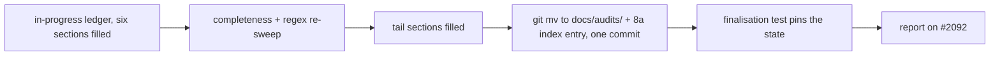

# PR summary — Issue #2302: finalise and promote the chunk-8a ledger

## Summary

Closes #2302 (part of #2154).

This finishes the chunk-8a security sweep. All six sections were filled by their sub-issues (#2281 to #2301). This PR checks the record is complete and promotes it:

- The ledger is `git mv`d from `docs/audits/in-progress/` to `docs/audits/security-sweep-chunk-08a-detection-neuron.md`. The same commit fills the `8a` entry of `docs/audits/lib-sweep-coverage.json` (`last_swept` `2026-09-30`, `baseline_commit` `b85a551…`, `record` the promoted path) under the #2088 contract.
- The tail sections are filled:
  - `## Outcome`: 21 findings, one paragraph per defect class.
  - `## Issues filed`: 21 findings, deduplicated, all open.
  - `## Related remediations (not sweep coverage)`: #2078, #1184 and #1906.
  - `## Verify this record`: uses the self-escaping `p[e]nding` grep.
- The #2280 scaffold test's staged-path, no-top-level and index-null assertions are retargeted to the promoted state.
- The five other section tests have their `RECORD` constant repointed to the new path.
- New finalisation contract test: `tests/issue_2154_chunk_08a_finalisation.rs`.

This is a docs/tests-only change: nothing under `src/`, no `.github/workflows/ci.yml` change, and no manual version bump.

## Evidence

Regex re-sweeps were recomputed at head `6e3ca6f`/`eb3fe9f` rather than taken from the checkpoint:

| Sweep | Command | Result |
| --- | --- | --- |
| Capacity | `grep -rnE 'with_capacity\(\|vec!\[[^\]]*;\|\.reserve\(' src/analysis/detection/ src/analysis/neuron/` | 76 hits (72 in detection, 4 in neuron), every file cited in `## Capacity and traversal table` |
| Traversal | `grep -rnE 'fn .*\(.*\) .*\{' … \| grep -E 'depth\|visited\|frontier\|queue'` | 1 hit: `skip_connection.rs::compute_depths_from_inputs`, cited by a `traversal` row |
| Word check | `grep -c 'p[e]nding' docs/audits/security-sweep-chunk-08a-detection-neuron.md` | `0` |

All 21 cited finding issues (#2343 to #2383) exist and are open.

Added the regression test `tests/issue_2154_chunk_08a_finalisation.rs::no_word_pending_survives_anywhere_in_the_record`. It reproduces the unfinished state: it fails against the unfixed staged record, which had no top-level file and a null index entry, and passes after the fix. Its sibling `tests/issue_2154_chunk_08a_finalisation.rs::the_index_entry_equals_the_record_date_baseline_and_path` fails the same way before the promotion and passes after it.

This PR fixes nothing under `src/`. The original trigger was chunk 8a being unswept, with a staged or partial record and an all-null index entry. That trigger is closed, and there is no trivial bypass: the finalisation test fails loudly in each of these cases:

- the staged copy reappears;
- any `pending` survives;
- a file row loses its outcome or reason;
- a recomputed capacity site or traversal hit is uncited;
- the index entry disagrees with the record.

The 21 findings the sweep filed stay open; this PR does not claim to fix them.

## Acceptance Criteria

<!-- vibe-spec-review inputs="diff+issue-body" -->

- **met** — The ledger exists only at `docs/audits/security-sweep-chunk-08a-detection-neuron.md`, and `docs/audits/in-progress/` no longer holds it — evidence: `tests/issue_2154_chunk_08a_finalisation.rs::the_record_is_promoted_out_of_in_progress` — reviewer: met
- **met** — `grep -c 'p[e]nding'` on the ledger prints `0` — evidence: `tests/issue_2154_chunk_08a_finalisation.rs::no_word_pending_survives_anywhere_in_the_record`; the grep printed `0` here — reviewer: met
- **met** — 52 file rows each carry an outcome and a reason, and the six markers are in order — evidence: `tests/issue_2154_chunk_08a_finalisation.rs::files_swept_has_52_rows_each_with_an_outcome_and_a_reason`, `tests/issue_2154_chunk_08a_finalisation.rs::the_six_section_markers_are_present_in_order` — reviewer: met
- **met** — Every capacity-regex hit and every traversal-command hit is cited or explicitly noted — evidence: `tests/issue_2154_chunk_08a_finalisation.rs::every_production_capacity_site_is_cited_in_the_capacity_table`, `tests/issue_2154_chunk_08a_finalisation.rs::every_traversal_regex_hit_is_cited_as_a_traversal_row` — reviewer: met
- **met** — The `8a` index entry is filled and `tests/issue_2088_sweep_ledger_contract.rs` passes — evidence: `docs/audits/lib-sweep-coverage.json`; `cargo test --test issue_2088_sweep_ledger_contract` passed (9 tests) — reviewer: partial — reason: the reviewer saw only the diff and could not run the test; it was run here and passed
- **met** — `tests/issue_2154_chunk_08a_finalisation.rs` exists and passes, and the retargeted #2280 scaffold test passes — evidence: `cargo test --test issue_2154_chunk_08a_finalisation --test issue_2280_chunk_08a_ledger_scaffold` passed, along with all six section tests — reviewer: partial — reason: the reviewer could not run `cargo test`; every chunk-8a test binary was run here and passed
- **met** — A comment on #2092 links the PR and the ledger, and `negative-result` is present if and only if there are zero findings — evidence: https://github.com/stSoftwareAU/NEAT-AI-Discovery/issues/2092#issuecomment-5918391738 links #2385, the ledger path and the 21 findings; `negative-result` is not applied — reviewer: missing — reason: the reviewer could not see this because the comment is posted after the PR is raised, outside the diff; it was posted and checked here
- **met** — `./quality.sh < /dev/null` passes — evidence: the full gate was run on the final tree and exited 0 ("All quality checks passed!") — reviewer: missing — reason: the reviewer judged this unverifiable from the diff; it was run here and passed
- **met** — No change to `.github/workflows/ci.yml` and no manual version bump — evidence: the diff touches only `docs/audits/` and `tests/` — reviewer: met
- **unrequested** — `RECORD` retargeted in the five other section tests (`tests/issue_2281_…`, `issue_2282_…`, `issue_2284_…`, `issue_2294_…`, `issue_2298_…`, `issue_2300_…`) — reviewer: unrequested — reason: these tests read the ledger by path and would fail once it moved, so the `git mv` forced the change

## Standards Review

<!-- vibe-standards-review inputs="diff+CODING-STANDARDS.md" -->

`CODING-STANDARDS.md` is absent from this checkout, so the reviewer checked against `CONTRIBUTING.md`, which `AGENTS.md` names as the canonical conventions.

- **clean** — The reviewer found no violations. It checked:
  - code is cited by symbol, never by line number (#1942);
  - the test lives under `tests/`;
  - Australian English is used throughout;
  - the "an assertion that holds either way is not coverage" rule: preconditions are pinned before each loop.
- **clean** — Optional note: the reviewer flagged the `baseline_commit` as 41 characters. Checked here: it is 40 characters and resolves to a commit (`git cat-file -t` prints `commit`).

## Test Plan

- Added `tests/issue_2154_chunk_08a_finalisation.rs` with eight tests: promotion, no `pending`, 52 rows with outcome and reason, markers in order, capacity citation, traversal citation, tail sections, and index equality.
- Retargeted `tests/issue_2280_chunk_08a_ledger_scaffold.rs` and repointed `RECORD` in the five other chunk-8a section tests.
- Ran `cargo test` on all nine chunk-8a and #2088 test binaries (all pass), then ran `./quality.sh < /dev/null` (pass).
