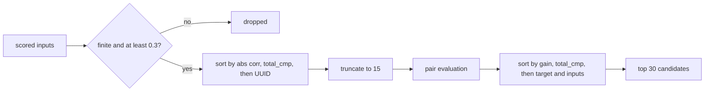

## Summary

`fan_in.rs::detect_fan_in_candidates` no longer lets a NaN input–error
correlation fill the `MAX_INPUTS_PER_TARGET` window, and its candidate set no
longer depends on the order the caller lists neurons in. Closes #2303.

- New `pub fn rank_input_scores` drops every input whose correlation is
  non-finite or below `INPUT_ERROR_CORRELATION_THRESHOLD`. It then sorts by
  descending `|corr|` with `f32::total_cmp`, breaks ties on the input UUID, and
  truncates to the window size.
- The final candidate sort uses a descending `estimated_improvement.total_cmp`,
  tie-broken on `(target_uuid, input_uuids)`. `fan_in.rs` no longer contains any
  `partial_cmp(..).unwrap_or(..)`.
- `MAX_INPUTS_PER_TARGET` is now `pub` so the window tests can size against it.
- Version bumped from 0.74.265 to 0.74.266.

**Not in this PR.** The issue also asks to rewrite the two #2181 tests in
`tests/issue_2108_chunk_08b_recommendation_core_sweep.rs` and to move the #2181
ledger rows to "since fixed". Neither exists on this PR's base
(`milestone/2181-…`, cut from `Develop`). They only exist on
`milestone/2083-security-scan-overflow-8-chunks-not-reached`, and on this base
the ledger still reads `fan_in.rs | 608 | pending`. Creating them here would
cause add/add conflicts with #2083. That work is tracked in follow-up issue
stSoftwareAU/NEAT-AI-Discovery#2322, filed against milestone #2083. The two 2108
tests there are *designed* to go red once this fix syncs in.

## Evidence

This is a backend-only change with no UI. The evidence is the new test file
`tests/issue_2181_fan_in_non_finite_correlation_ranking.rs`. Before the fix I
extracted `rank_input_scores` with the old fail-open filter and the
`partial_cmp` comparator unchanged. Against that code all four tests failed:

- (a) NaN and ±inf entered the window.
- (b) The ranking followed caller order.
- (c) The window held `n00…n14` (all NaN).
- End-to-end: poison-first returned `[]` against the 25-candidate honest-only
  baseline.

After the fix all four pass. The #2182 regression file still passes.

## Reproduction

- **symptom**: listing the `±2e30` inputs (whose correlation overflows to NaN)
  before the honest inputs returned 0 fan-in candidates. Listing them after
  returned 25.
- **status**: `verified`. The regression tests were observed failing against
  the unfixed filter and comparator logic and passing after the fix.
- **regression test**:
  `tests/issue_2181_fan_in_non_finite_correlation_ranking.rs::fan_in_candidates_agree_whichever_order_the_caller_lists_neurons_in`

## Acceptance Criteria

<!-- vibe-spec-review inputs="diff+issue-body" -->

- **met** — `fan_in.rs` contains no `partial_cmp(...).unwrap_or(...)`, and both
  sorts use `total_cmp` with a deterministic tie-break — evidence:
  `src/analysis/recommendation/fan_in.rs::rank_input_scores`,
  `detect_fan_in_candidates` — reviewer: met
- **met** — helper test (a) fails against the old logic and passes after, and no
  NaN or ±inf correlation ever reaches the ranked window — evidence:
  `tests/issue_2181_fan_in_non_finite_correlation_ranking.rs::ranking_drops_non_finite_and_weak_correlations_and_orders_by_strength`
  — reviewer: met
- **met** — the end-to-end test fails on the old tree (0 vs 25) and passes
  after, with identical sets equal to the honest-only baseline — evidence:
  `tests/issue_2181_fan_in_non_finite_correlation_ranking.rs::fan_in_candidates_agree_whichever_order_the_caller_lists_neurons_in`
  — reviewer: met — reason: the reviewer noted the keys also sort the input
  pair. Which input ranks first within a pair depends on ULP-level `|corr|`
  sums in `HashMap` order, but the pair itself is the candidate's identity.
- **missing** — the rewritten #2108 sweep tests pass, and the `FILED_FINDINGS`
  and #2103 ledger-scaffold tests still pass — reviewer: missing — reason:
  `tests/issue_2108_…` and the #2181 ledger rows exist only on milestone/2083,
  not on this PR's base. This is tracked in #2322. The #2103 scaffold tests
  on this base are untouched and pass under `./quality.sh`.
- **met** — `./quality.sh` (fmt, clippy, `cargo test`) passes — evidence: full
  gate run on this branch — reviewer: partial — reason: the reviewer did not
  run the gate. It was run here and passed.
- **unrequested** — `MAX_INPUTS_PER_TARGET` changed to `pub const` —
  reviewer: unrequested — reason: helper test (c) sizes the window against it
  rather than hard-coding 15.
- **unrequested** — the `Cargo.lock` version line changed — reviewer:
  unrequested — reason: a mechanical side effect of the requested patch bump.
- **unrequested** — `INPUT_ERROR_CORRELATION_THRESHOLD` changed to `pub` —
  reviewer: unrequested — reason: reverted after review. It is private again,
  and the doc comment names it without a link.

## Standards Review

<!-- vibe-standards-review inputs="diff+CODING-STANDARDS.md" -->

- **violation** — the CONTRIBUTING.md rule "do not make APIs public just for
  testing" is broken by `rank_input_scores` and the constants — evidence:
  `src/analysis/recommendation/fan_in.rs` (`pub fn rank_input_scores`,
  `pub const MAX_INPUTS_PER_TARGET`) — reason: stands. The issue explicitly
  asks for a `pub` helper so the ranking contract can be tested with NaN keys
  fed in directly, independent of whether #2304 later stops
  `pearson_correlation` producing one. `INPUT_ERROR_CORRELATION_THRESHOLD` was
  reverted to private.
- **violation** — the PR summary file was missing — evidence:
  `docs/archive/pr-summaries/pr-summary-2303.md` — reason: fixed. This is that
  file.
- **clean** — version bump with no dependency moves, no CI, `quality.sh` or FFI
  changes, Australian English throughout, no line-number citations, #1799
  non-vacuity preconditions present. The reviewer ran the new tests against the
  old `fan_in.rs` (all 4 failed) and ran the end-to-end test 200 times with no
  flakes. Optional notes it raised, both applied: the double-negated `retain`
  was simplified, and the "deterministic" comment was narrowed to "exact ties".

## Test Plan

- Added `tests/issue_2181_fan_in_non_finite_correlation_ranking.rs`: three
  `rank_input_scores` contract tests and one end-to-end
  `detect_fan_in_candidates` order-independence test.
- Re-ran `tests/issue_2182_recommendation_core_non_finite_gain_ranking.rs`
  (passes).
- `./quality.sh < /dev/null`.

🤖 Generated with [Claude Code](https://claude.com/claude-code)
