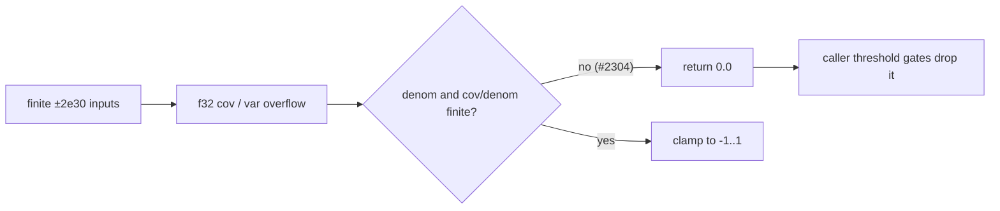

# Make `pearson_correlation` return `0.0` for a non-finite result (Issue #2304)

## Summary

`detection/stats.rs::pearson_correlation` now returns `0.0` in two cases, both checked before the `clamp`:

- the denominator is non-finite or below `f32::EPSILON`;
- `cov / denom` is non-finite.

Previously, finite `±2e30` activations overflowed the `f32` covariance and variance accumulators. The resulting NaN passed straight through `f32::clamp`. The doc comment now states that the function never returns a non-finite value. Closes #2304.

`pearson_correlation_samples` (accumulates in `f64`) and `pearson_correlation_hashmaps` are left unchanged, as the issue asks. `pearson_correlation_hashmaps` was checked: it accumulates in `f32` with only a `denom < 1e-10` guard and no clamp, so the same overflow can still return NaN there. That is the multi-hop / #2182 path, and it is out of this issue's scope.

### Files that exist only on `milestone/2083`

The issue asks for edits to two files that are not on this PR's base (`milestone/2181-…`, cut from `Develop`). They exist only on `milestone/2083-security-scan-overflow-8-chunks-not-reached`:

- `tests/issue_2108_chunk_08b_recommendation_core_sweep.rs`;
- the `pearson_correlation` reachability wording in `docs/audits/security-sweep-chunk-08b-synapse-scoring-recommendation.md`. On this base, that file still reads `fan_in.rs | 608 | pending`.

This is the same split #2303 hit. Creating the files here would cause add/add conflicts with #2083. Rather than file a duplicate, both edits are folded into the existing carry-over issue #2322 via [an amendment comment](https://github.com/stSoftwareAU/NEAT-AI-Discovery/issues/2322#issuecomment-5882875598). The amendment tells #2322 to pin `corr == 0.0` in `a_finite_record_set_still_drives_the_fan_in_correlation_to_nan`, instead of keeping its is-NaN assertion, and to update the three ledger passages.

### Callers: before and after

| Caller | Gate | Before (NaN) | After (`0.0`) |
| --- | --- | --- | --- |
| `detection/co_adaptation.rs::detect_co_adapted_neurons` | `correlation.abs() < CO_ADAPTATION_THRESHOLD` (0.9) → skip | A NaN loses `<`, so the pair was **kept** (fails open). `severity` and the estimated improvement became NaN. | `0.0 < 0.9`, so the pair is **skipped**. No NaN reaches the candidate. |
| `detection/opposing_synapse.rs` | `correlation < MIN_OPPOSING_CORRELATION` (0.3) → skip | A NaN loses `<`, so the synapse was **kept**. `harm_score` and `estimated_improvement` became NaN, and `NaN > 0.5` is false, so a NaN-scored weight-flip candidate was emitted. | `0.0 < 0.3`, so the synapse is **skipped**. |
| `recommendation/fan_in.rs::detect_fan_in_candidates` (input–error `corr`) | `corr.abs() < 0.3` and `is_finite` (#2303) → drop | Dropped by #2303's finitude filter. | Dropped by the `< 0.3` threshold. Same outcome. |
| `recommendation/fan_in.rs::evaluate_fan_in_pair` (`mutual_corr`) | `mutual_corr.abs() > MAX_INPUT_MUTUAL_CORRELATION` (0.8) → reject | A NaN loses `>`, so the pair **continued** to the regression gates. | `0.0 > 0.8` is false, so the pair **continues**. Same outcome. The later least-squares gates and the finite `scaled_improvement` check (#2182) still apply. |

## Evidence

Backend-only change with no UI. Verified by tests:

- `cargo test --test scoring`: 244 passed. This includes the new case and the unchanged perfect-positive, perfect-negative, zero-variance and too-few cases.
- `cargo test --test issue_2181_fan_in_non_finite_correlation_ranking`: 4 passed.
- `./quality.sh`: see the Acceptance Criteria below.

## Reproduction

- **symptom** — `pearson_correlation` returned NaN for finite inputs alternating `±2e30` against errors of `1e10` / `-5e9`.
- **status** — `verified` — the new test failed against the unfixed code (`left: NaN, right: 0.0`) and passes after the fix.
- **regression test** — `tests/scoring/issue_767_stats_pearson_correlation.rs::pearson_correlation_f32_overflow_returns_zero`

## Acceptance Criteria

<!-- vibe-spec-review inputs="diff+issue-body" -->

- **met** — The new `±2e30` case fails before the change (NaN) and passes after (`0.0`) — evidence: `tests/scoring/issue_767_stats_pearson_correlation.rs::pearson_correlation_f32_overflow_returns_zero` — reviewer: met
- **met** — Existing `pearson_correlation` tests and all detector tests pass unchanged — evidence: `cargo test --test scoring` (244 passed) and the full `./quality.sh` run — reviewer: met
- **partial** — The rewritten #2108 sweep test and the #2181 regression tests pass, and the #2303 helper-level NaN ranking tests are kept — evidence: `tests/issue_2181_fan_in_non_finite_correlation_ranking.rs` (4 passed, helper NaN tests kept, and the module doc updated because it said `pearson_correlation` "returns a NaN") — reviewer: partial — reason: `tests/issue_2108_chunk_08b_recommendation_core_sweep.rs` exists only on `milestone/2083`, so its rewrite is folded into #2322 via an amendment comment
- **met** — `./quality.sh` passes — evidence: full gate run after the final code edit — reviewer: partial — reason: the reviewer saw only the diff and could not run the gate; it was run here and passed
- **partial** — Update the `pearson_correlation` reachability wording in the chunk-8b audit ledger — reviewer: missing — reason: that wording exists only on `milestone/2083` (on this base the file reads `fan_in.rs | 608 | pending`), so it is folded into #2322. It is marked partial rather than missing because the carry-over is recorded.
- **met** — Record each caller's before and after behaviour in the PR description — evidence: the "Callers: before and after" table above — reviewer: missing — reason: the reviewer ran before this summary existed; the table now covers all three callers named in the issue
- **unrequested** — Version bump from `0.74.266` to `0.74.267` in `Cargo.toml` / `Cargo.lock` — reviewer: unrequested — reason: `AGENTS.md` requires a version bump on any code change

## Standards Review

<!-- vibe-standards-review inputs="diff+CODING-STANDARDS.md" -->

This repo has no `CODING-STANDARDS.md`. The reviewer was given `CONTRIBUTING.md` and `AGENTS.md`, the canonical conventions files.

- **violation** — PR summary file missing (CONTRIBUTING.md, "PR Summary File") — evidence: `docs/archive/pr-summaries/pr-summary-2304.md` — reason: fixed here; the reviewer ran before this file was written
- **clean** — Areas checked and compliant:
  - `pearson_correlation` guard correctness and doc comment;
  - the regression test calls real code, checks that its inputs are finite, and is registered via `tests/scoring/main.rs`;
  - version bump;
  - no dependency changes;
  - Australian English;
  - no line-number citations;
  - `ci.yml` untouched;
  - FFI invariants unaffected.

## Test Plan

- Added `pearson_correlation_f32_overflow_returns_zero` to `tests/scoring/issue_767_stats_pearson_correlation.rs`.
- Updated the module doc and two assertion messages in `tests/issue_2181_fan_in_non_finite_correlation_ranking.rs`. They described a NaN correlation, which is now `0.0` at source. The helper tests that feed NaN and `±inf` into `rank_input_scores` directly are unchanged.

🤖 Generated with [Claude Code](https://claude.com/claude-code)
