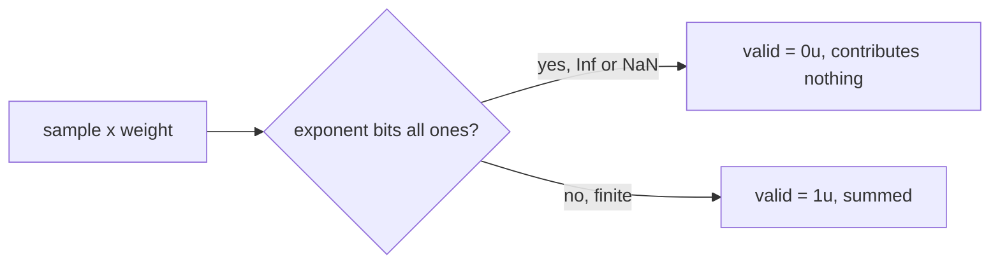

# PR Summary — Issue 2308

## Summary

Closes #2308.

The WGSL `is_finite_value` guard used a float self-comparison
(`value != value`, then `abs(value) <= MAX_F32`). Under fast-math (Metal's
default) the compiler may assume no NaN/Inf and fold that away, so an overflowed
`incoming_weight * activation` (or GELU's `x*x*x`) could be written back as
`valid = 1u` and poison the reduced sums.

The guard is now an integer exponent test that fast-math cannot fold:

```wgsl
fn is_finite_value(value: f32) -> bool {
    return (bitcast<u32>(value) & 0x7f800000u) != 0x7f800000u;
}
```

- Applied identically in every embedded shader that defines the guard:
  `src/shaders/activation.wgsl` and `src/shaders/relu.wgsl`. The now-unused
  `MAX_F32` constant is removed from both.
- `bias.wgsl` no longer exists on `Develop`. `matching.wgsl` is not embedded
  (no `include_str!` references it) and is deleted by PR 2325 (Issue 2309), so
  it is left untouched to avoid a modify/delete conflict.



## Evidence

Regression test:
`src/analysis/implementation_tests/issue_2308_finite_guard_test.rs::wgsl_is_finite_value_is_an_integer_exponent_test`

- It parses and validates every embedded shader with naga.
- It locates each `is_finite_value` function in the IR.
- It asserts the function bitcasts its argument to `u32` and contains no float
  comparison.
- It reads the mask literal from the shader and checks it against
  `f32::is_finite` over zeros, subnormals, `f32::MAX`/`MIN`, ±Inf and
  quiet/signalling NaNs.
- It requires both `relu` and `activation` to be covered.

Against the unfixed code this test **FAILS**
(`relu: is_finite_value must not compare floats (NotEqual) — fast-math may fold it`).
After the fix it **PASSES**.

The original trigger is closed with no trivial bypass:

- Every shader that defines the guard now uses the unfoldable integer test.
- The test fails if any embedded shader reintroduces a float comparison or the
  wrong mask.
- The test also fails if a live shader drops the guard.

GPU test:
`src/analysis/implementation_tests/issue_2308_finite_guard_test.rs::activation_shader_drops_overflowing_sample`

- It feeds an identity activation with scale `1e20`, so one sample overflows to
  `+Inf`.
- It asserts that sample is marked `valid == 0`: the sums stay finite and equal
  the finite sample's contribution.
- It is gated by `skip_if_no_gpu!()`. This container has no GPU, so it skipped
  locally.

## Test Plan

- [x] `cargo test --lib issue_2308_finite_guard` — 2 passed, with the GPU test skipped for
      lack of a GPU.
- [x] Reverted only the shader edits, re-ran: the naga test failed as expected.
- [x] `./quality.sh < /dev/null`
- [x] Version bumped 0.74.267 → 0.74.268.

## Security self-check

- [x] No new external input, dependencies, secrets or endpoints.
- [x] The change narrows what the GPU accepts as a valid sample (fail closed).
