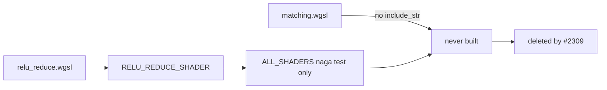

# PR Summary — Issue #2309

## Summary

Closes #2309.

Deletes the two WGSL shaders that no pipeline ever builds. `matching.wgsl` had
no `include_str!`. `relu_reduce.wgsl` was embedded as `RELU_REDUCE_SHADER` and
naga-validated through `ALL_SHADERS`, but no `build_compute_pipeline` call used
it. This PR also removes the constant and its `ALL_SHADERS` entry, and updates
the struct-layout test and the chunk-9 ledger to the 8 live shaders.

The PR targets `milestone/2083-security-scan-overflow-8-chunks-not-reached`. The
tests and audit record the issue names (`tests/issue_2289_gpu_struct_layout.rs`,
`docs/audits/security-sweep-chunk-9-gpu-wgsl.md`) exist only on that branch.

- [x] Delete `src/shaders/matching.wgsl`
- [x] Delete `src/shaders/relu_reduce.wgsl`, `RELU_REDUCE_SHADER` and its `ALL_SHADERS` entry
- [x] Drop the relu_reduce rows from the #2289 struct-layout test and the audit parity table
- [x] Update the chunk-9 ledger rows and the shader-count pins
- [x] Version bump 0.74.266 → 0.74.267

## Evidence

- `timeout 900 ./quality.sh < /dev/null` exited 0 with "✅ All quality checks passed!".
- A repo-wide grep finds no remaining `RELU_REDUCE_SHADER` and no Rust or test
  reference to either deleted file. The only remaining mention is a
  `#2309`-history note in a test assertion message.
- `tests/issue_2289_gpu_struct_layout.rs` passes with the mirror pin now at 21
  declarations (it was 23).
- The first gate run failed in two places:
  - `tests/issue_2288_chunk_09_ledger_scaffold.rs` requires every `## Files swept`
    row to name a file that exists. The two rows moved to a prose note under the
    baseline line-count sentence. Their audit rows in the shaders section are kept
    as baseline history.
  - `tests/issue_2291_chunk_09a_2b_shader_layer_sweep.rs` pinned 10
    `@workgroup_size` entry points. It is repinned to 8, and the matching
    constants-table row in the record is updated.

## Acceptance Criteria

<!-- vibe-spec-review inputs="diff+issue-body" -->

- Delete `src/shaders/matching.wgsl`. — reviewer: met
- Delete `src/shaders/relu_reduce.wgsl`, the `RELU_REDUCE_SHADER` constant and
  its `ALL_SHADERS` entry. — reviewer: met
- Drop the relu_reduce rows from `tests/issue_2289_gpu_struct_layout.rs` and the
  struct-parity table. — reviewer: met
- Update the chunk-9 ledger `## Files swept` rows for both files. — reviewer: met.
  The rows were removed because the #2288 scaffold test forbids rows for files
  that do not exist, and a prose note records the deletion.
- Update the #2249 reconciliation test's enumerator pin. — reviewer: met (n/a).
  That test does not exist yet because #2249 is still open, so there is no pin to
  update.
- Repin the `@workgroup_size` count in
  `tests/issue_2291_chunk_09a_2b_shader_layer_sweep.rs` from 10 to 8. —
  reviewer: unrequested. reason: the quality gate failed once the two shaders
  were deleted. This is a direct consequence of the requested deletion.
- Version bump in `Cargo.toml` and `Cargo.lock`. — reviewer: unrequested.
  reason: AGENTS.md requires a version bump on every code change.

## Standards Review

<!-- vibe-standards-review inputs="diff+CODING-STANDARDS.md" -->

- **Dead levers (AGENTS.md):** the component (both shader files) and its whole
  surface (the constant, the `ALL_SHADERS` entry and the test rows) are deleted
  in one change.
- **Tests exercise real code:** the struct-layout and workgroup-size tests still
  parse the live shaders with naga. No source-grep tests were added.
- **Docs follow code:** the audit record's inventory, parity table, constants
  table and dead-shader paragraph are updated. Baseline line citations
  (`shaders.rs` L91/L214/L280, "10 kernels" in the barrier section) are left as
  baseline history and are marked as such where edited.
- **Stay in scope:** no other shaders or modules were touched. No dependency
  bump on this milestone child run.
- **Australian English**, and no bare `;` in the Mermaid block.

## Test Plan

- [x] `cargo test --test issue_2289_gpu_struct_layout`
- [x] `cargo test --test issue_2288_chunk_09_ledger_scaffold`
- [x] `cargo test --test issue_2291_chunk_09a_2b_shader_layer_sweep`
- [x] `./quality.sh` (full gate, exit 0)
