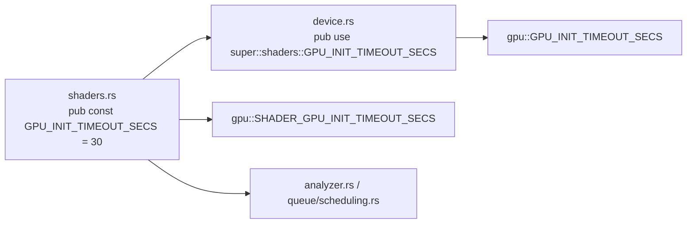

# PR Summary — Issue #2311

## Summary

Closes #2311

`GPU_INIT_TIMEOUT_SECS` was declared twice as independent `30` literals
(`src/analysis/gpu/shaders.rs` and `src/analysis/gpu/device.rs`), and nothing
pinned them equal. `device.rs` now re-exports the `shaders.rs` item
(`pub use super::shaders::GPU_INIT_TIMEOUT_SECS;`), so there is one definition.
Every existing path (`gpu::device::…`, `gpu::GPU_INIT_TIMEOUT_SECS`,
`gpu::SHADER_GPU_INIT_TIMEOUT_SECS`) still resolves, and all of them now name the
same item. The misleading `shaders.rs` doc comment, which claimed "both
locations reference the same value", now describes the single definition. The
version is bumped from `0.74.268` to `0.74.269`.

## Evidence

- **Regression test:**
  `tests/issue_2311_gpu_init_timeout_single_source.rs::gpu_init_timeout_has_a_single_source`
  (plus `::gpu_init_timeout_is_within_documented_range`).
- **How the pin works:** the check is structural, not a value check. The test
  glob-imports `gpu::device::*` and `gpu::shaders::*` into one module and uses
  `GPU_INIT_TIMEOUT_SECS`.
- **Fails on the unfixed code:** with the old independent literal restored in
  `device.rs`, the test target does not compile:
  `error[E0659]: `GPU_INIT_TIMEOUT_SECS` is ambiguous`. It fails even though both
  literals were `30`, so it catches the latent drift a value-equality test would
  miss.
- **Passes after the fix:** 2 passed.
- **Original trigger is closed:** there is no longer a second definition that
  could be edited on its own. If someone reintroduces a separate literal in
  either module, this test stops compiling, and there is no trivial bypass
  short of deleting the test.

## Test Plan

- [x] `cargo test --test issue_2311_gpu_init_timeout_single_source < /dev/null`: 2 passed
- [x] `cargo test --lib analysis::gpu < /dev/null`: 131 passed
- [x] `cargo clippy --all-targets --all-features -- -D warnings`: clean
- [x] `./quality.sh < /dev/null`
