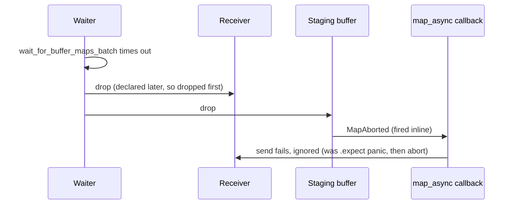

# PR Summary — Issue #2313

## Summary

Closes #2313

Every GPU `map_async` completion callback now forwards its result through the
new infallible `map_result_forwarder` helper (`src/analysis/gpu/device.rs`)
instead of `sender.send(result).expect(...)`. When a map wait times out or
fails, the `?` early return drops the receivers before the staging buffers.
wgpu then fires each pending callback inline with `MapAborted`, and the old
`.expect` panicked inside wgpu's buffer drop — a second panic during unwinding,
which aborts the host process. A dropped receiver only means the waiter has
already returned, so the send error is now ignored. The original timeout error
then flows to the device-lost recovery path as intended.

- [x] Add `map_result_forwarder` and re-export it from `analysis::gpu`
- [x] Use it at every `map_async` site in `src/analysis/gpu/`. There are six
      (activation ×2, bias, harmful, helpful, ReLU), not the seven the issue
      listed.
- [x] Regression test that reproduces the panic
- [x] Bump version `0.74.265` → `0.74.266`

## Security fix evidence

- **Regression test:**
  `tests/gpu/issue_2313_map_async_dropped_receiver_test.rs::forwarder_does_not_panic_when_receiver_dropped`
- **What it reproduces:** the original trigger. The receiver is dropped before
  the callback delivers an aborted mapping result.
- **Before and after:**
  - Against the unfixed callback body (`.expect("Failed to send map_async result")`),
    the test fails with `panicked at src/analysis/gpu/device.rs: Failed to send
    map_async result: SendError { .. }`.
  - After the fix it passes.
- **Companion test:**
  `forwarder_delivers_result_to_live_receiver` confirms that the live-waiter
  path still delivers both `Ok` and `Err` results unchanged.
- **Why there is no trivial bypass:**
  - All six `map_async` call sites share the one named helper.
  - `git grep "Failed to send map_async"` returns nothing.
  - No `map_async` callback in `src/` can still panic on a closed channel.

## Evidence

This is a backend-only change with no visual surface. The regression test
above, run first against the unfixed code and then against the fix, is the
evidence.

## Test Plan

- [x] `cargo test --test gpu issue_2313`: the test failed before the fix and
      both tests pass after it
- [x] `cargo clippy --all-targets -- -D warnings` is clean
- [x] `./quality.sh < /dev/null`
