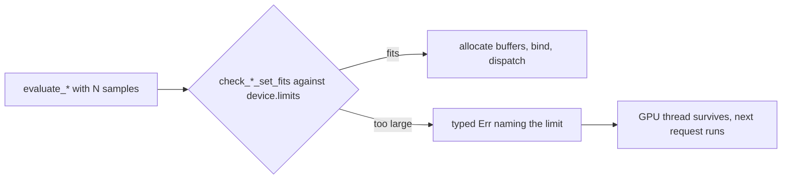

## Summary

A sample set larger than the device's wgpu limits used to reach `create_buffer*` and
`create_bind_group` unchecked. wgpu 30's default uncaptured-error handler then panicked,
which killed the dedicated GPU thread and left an unclassified "channel closed" error.

This PR adds a pure pre-allocation guard, `src/analysis/gpu/sample_limits.rs`. It checks
each sample set against the real `device.limits()`:

- `max_storage_buffer_binding_size` and `max_buffer_size`, for every per-sample binding.
- `max_compute_workgroups_per_dimension × WORKGROUP_SIZE`.

When a set is too large, the guard returns a typed `Err` that names the limit, the path,
the binding, N and the bytes needed. The byte arithmetic uses overflow-checked `usize`
multiplication, so it never panics. The guard is called before any allocation or
`as u32` cast in every path the issue and its widening comment list:

- `evaluate_helpful_batch_with_budget`: the longest set in the batch.
- `evaluate_harmful_batch_with_budget`: the longest set in the batch.
- `evaluate_relu_gpu_with_budget`.
- `evaluate_activation_gpu_with_budget` (single).
- `evaluate_activations_batched_gpu_with_budget`: guards N, then splits the configs into
  chunks. The combined `configs × 28 × N` output footprint stays within
  `GPU_MAX_BATCH_ALLOC_BYTES`, and the per-chunk results are concatenated in order.

`bias_evaluation.rs` is out of scope because it is unreachable; its removal is tracked
by #2316. The ledger file `docs/audits/security-sweep-chunk-9-gpu-wgsl.md` named in the
issue comment does not exist in this tree, so no ledger row was updated. The version is
bumped from 0.74.269 to 0.74.270.

Closes #2314.

## Evidence

This is a backend change with no UI.

**Regression tests:**

- `src/analysis/gpu/sample_limits.rs::helpful_set_at_binding_limit_boundary` uses the
  default limits. It asserts that helpful N = 2,796,202 is accepted and N = 2,796,203 is
  refused with an error naming `max_storage_buffer_binding_size`, which is the
  failing-first test the issue asks for. The test fails against the unfixed code, where no
  guard exists (the helpful path panics inside wgpu at that length), and passes after the
  fix.
- `tests/gpu/issue_2314_oversized_sample_set_test.rs::oversized_helpful_set_returns_err_and_gpu_survives`
  drives the real GPU path with 2,796,203 samples. It asserts `Err` rather than a panic,
  then asserts that a 1,024-sample batch on the same analyser still succeeds, which proves
  the GPU thread survived. This test fails against the unfixed code: the validation panic
  kills the GPU thread, so no `Err` comes back and the follow-up batch fails with "channel
  closed". It passes after the fix.
- `tests/gpu/issue_2314_oversized_sample_set_test.rs::oversized_harmful_set_returns_err_and_gpu_survives`
  runs the same scenario for harmful with 8,388,609 samples.

This container has no GPU adapter, so the two `tests/gpu` tests take their documented
skip path here. The pure-limit unit tests do not need a GPU and run everywhere.

**Trigger closed:** the original trigger was a single set of at least 2,796,203 helpful
samples (or the harmful, relu and activation equivalents). It is now refused with a typed
`Err` before any wgpu call. The check uses the device's own limits rather than constants.
It runs on the longest set in the batch, so every set is covered, and it runs before every
buffer or bind-group creation in each guarded function. There is no trivial bypass:
batching several sets does not skip it, and oversized `usize` values are caught by
overflow-checked arithmetic. The only extra allocation that multiplies with configs, the
batched activation outputs, is split into chunks bounded by `GPU_MAX_BATCH_ALLOC_BYTES`.

## Test Plan

- Added `src/analysis/gpu/sample_limits.rs` unit tests:
  - `gpu_struct_sizes_match_boundary_assumptions`
  - `helpful_set_at_binding_limit_boundary`
  - `harmful_set_at_binding_limit_boundary` (8,388,608 accepted, 8,388,609 refused)
  - `relu_set_at_binding_limit_boundary` (3,355,443 accepted, 3,355,444 refused)
  - `activation_set_at_binding_limit_boundary` (4,793,490 accepted, 4,793,491 refused)
  - `workgroup_limit_is_enforced`
  - `max_buffer_size_is_enforced`
  - `usize_max_samples_does_not_panic`
  - `zero_samples_is_always_ok`
- Added the GPU-gated `tests/gpu/issue_2314_oversized_sample_set_test.rs`, covering
  helpful and harmful.
- `cargo test --lib sample_limits`: 9 passed.
- `cargo clippy --all-targets --all-features -- -D warnings`: clean.
- Ran `./quality.sh` once, after the final edit.
